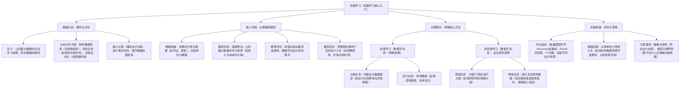

```mermaid
graph TD
    A[机械学习（机器学习核心入门）] --> B[基础认知：概念与定位]
    A --> C[核心流程：从数据到模型]
    A --> D[关键算法：两类核心方法]
    A --> E[实践基础：评估与落地]
    
    B --> B1[定义：让机器从数据中自动学习规律，而非硬编码规则]
    B --> B2[与会计的关联：财务数据预测（如营收趋势）、风险识别（如税务合规风险）、流程自动化（如报销审核）]
    B --> B3[核心价值：辅助会计决策，减少重复劳动，提升数据处理效率]
    
    C --> C1[数据准备：收集会计相关数据（如凭证、报表），完成清洗与整理]
    C --> C2[模型训练：选择算法，让机器从数据中学习规律（如收入与成本的关联）]
    C --> C3[模型评估：用指标验证模型准确性，确保符合会计场景需求]
    C --> C4[模型应用：将模型结果用于实际会计工作（如预算预测、异常交易检测）]
    
    D --> D1[监督学习：数据带“标签”（明确结果）]
    D1 --> D11[分类任务：判断会计数据类型（如区分正常报销与异常报销）]
    D1 --> D12[回归任务：预测数值（如季度销售额、成本支出）]
    D --> D2[非监督学习：数据无“标签”，自主发现规律]
    D2 --> D21[聚类任务：对客户/项目进行分类（如按财务风险等级分组）]
    D2 --> D22[降维任务：简化复杂财务数据（如压缩多维度报表指标，保留核心信息）]
    
    E --> E1[评估指标：衡量模型好坏（Accuracy准确率、Recall召回率、F1分数，适配不同会计场景）]
    E --> E2[基础实践：从简单会计场景入手（如用历史数据预测月度费用、识别发票异常）]
    E --> E3[注意事项：数据合规性（符合会计法规）、模型可解释性（便于会计人员理解决策依据）]
```