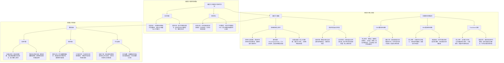

```mermaid
graph TD
    subgraph 深度学习核心框架
        A[深度学习基础] --> A1[神经网络核心组件]
        A1 --> A1a[神经元与感知机：模拟生物神经元的信息传递，是网络基本计算单元]
        A1 --> A1b[激活函数：ReLU/Sigmoid/Tanh，引入非线性，突破线性模型局限]
        A1 --> A1c[权重与偏置：核心可调参数，通过学习优化，决定网络输出结果]
        
        A --> A2[前向传播与反向传播]
        A2 --> A2a[前向传播：数据从输入层逐层传递至输出层，计算预测结果]
        A2 --> A2b[反向传播：从输出层反向传递误差，基于链式法则更新权重，核心训练机制]
        
        B[经典神经网络架构] --> B1[CNN卷积神经网络]
        B1 --> B1a[核心结构：卷积层（提取局部特征）、池化层（降维、保留关键信息）、全连接层（整合特征输出）]
        B1 --> B1b[通信关联：适配通信信号的局部相关性，可用于信号特征提取、信道估计等场景]
        
        B --> B2[RNN循环神经网络]
        B2 --> B2a[核心特性：具备时序记忆能力，可处理序列数据（如通信时序信号）]
        B2 --> B2b[典型局限：长序列易出现梯度消失/爆炸，难以捕捉长距离依赖]
        
        B --> B3[Transformer架构]
        B3 --> B3a[核心组件：自注意力机制（全局捕捉特征关联）、位置编码（保留序列顺序信息）]
        B3 --> B3b[通信关联：高效处理长序列数据，适用于通信协议解析、时序信号预测等任务]
    end

    subgraph 与通信工程的衔接要点
        C[深度学习在通信中的应用方向] --> C1[信号处理]
        C1 --> C1a[信道估计：利用神经网络拟合信道特性，提升估计精度与抗干扰能力]
        C1 --> C1b[信号检测：替代传统检测算法，高效识别复杂调制信号，降低误码率]
        
        C --> C2[网络优化]
        C2 --> C2a[资源分配：动态预测通信资源需求，实现带宽、功率的智能调度]
        C2 --> C2b[干扰管理：识别并抑制通信干扰，提升网络传输稳定性与效率]
    end

    subgraph 前置与关联知识
        D[数学基础] --> D1[线性代数]
        D1 --> D1a[向量与矩阵：神经网络参数、输入数据的数学表达形式，是计算核心载体]
        D1 --> D1b[特征值与特征向量：辅助理解数据降维、网络特征提取的底层逻辑]
        
        D --> D2[概率统计]
        D2 --> D2a[概率分布：用于建模数据噪声、模型预测的不确定性，支撑概率化推理]
        D2 --> D2b[贝叶斯思想：为深度学习的概率解释、不确定性分析提供理论基础]
        
        D --> D3[优化基础]
        D3 --> D3a[梯度下降：神经网络参数更新的核心优化算法，决定训练效率与收敛效果]
        D3 --> D3b[损失函数：衡量模型预测与真实值的偏差，引导参数优化方向]
    end

    A --> D
    C --> A
```