## 学习画像

- **专业/课程**：计算机科学与技术 / 人工智能导论
- **知识基础**：具备专业基础，机器学习基础模块掌握不扎实，需强化核心算法原理理解
- **认知风格**：具象-实践导向，依赖图解与实操辅助理解抽象原理
- **学习节奏**：未明确，推测为需要结合图解与实操稳步推进的节奏
- **每周可投入时间**：0 小时

### 学习目标
- 夯实机器学习基础模块
- 深入理解监督学习算法原理
- 掌握梯度下降的数学推导

### 薄弱点
- 监督学习算法原理
- 梯度下降推导

### 偏好资源类型
- 图解式讲解
- 配套代码实操

### 画像置信度
- **置信度**：0.7

### 后续澄清问题
- 你每周计划投入多少小时用于人工智能导论课程的学习？
- 除了机器学习基础模块，课程中还有哪些内容是你希望重点突破的？
- 你在学习时更倾向于独自钻研还是小组协作讨论？


## 资源：课程讲解文档

## 机械学习基础核心模块课程讲解文档

### 一、学习目标锚定（贴合计算机科学与技术专业需求）
1. **夯实基础**：精准补全机器学习核心知识缺口，搭建完整知识框架，解决“基础模块掌握不扎实”问题
2. **算法攻坚**：聚焦监督学习算法底层逻辑，通过图解+实操，攻克“监督学习算法原理理解薄弱”痛点
3. **推导突破**：拆解梯度下降数学推导全流程，结合具象化案例，实现从理论到实践的闭环，匹配“掌握梯度下降推导”核心目标

### 二、核心内容模块（适配具象-实践导向，强化核心突破）
#### 模块1：监督学习算法原理——图解+实操双轨讲解
**核心定位**：直击“监督学习算法原理”薄弱点，用可视化方式拆解抽象逻辑，配套代码实操巩固理解
1. **算法逻辑可视化拆解**
    - **分类算法（以决策树为例）**：
      - 配套树形结构图解，标注“信息增益计算→节点划分规则→叶子节点分类逻辑”全流程，用流程图呈现决策路径，避免纯文字理解障碍
      - 关键公式（信息增益公式）配套实例计算：以“判断水果类型”为场景，代入具体数值计算信息增益，明确每一步推导的实际意义
    - **回归算法（以线性回归为例）**：
      - 绘制“数据点散点图→拟合直线→残差计算”可视化图表，标注直线斜率、截距与预测值的对应关系，直观呈现算法拟合过程
      - 核心公式（最小二乘法）拆解：结合坐标点数据，一步步演示如何通过公式推导得出最优拟合直线参数，降低抽象推导难度
2. **代码实操配套（Python基础适配）**
    - 提供可直接运行的代码模板（基于sklearn库），包含数据加载、模型初始化、训练、预测全流程，代码标注清晰，适配计算机专业基础
    - 实操任务设计：
      - 基础任务：使用决策树完成鸢尾花数据集分类，输出准确率并结合图解分析决策路径
      - 进阶任务：用线性回归预测房价，绘制拟合直线与残差图，验证算法原理与实操结果的一致性
    - 代码注释重点标注算法核心逻辑对应点，比如“此处实现信息增益计算，对应图解中的节点划分依据”，帮助关联理论与实践

#### 模块2：梯度下降数学推导——分步拆解+具象化呈现
**核心定位**：攻克“梯度下降推导”难点，将抽象数学过程转化为可感知的步骤，适配实践导向学习风格
1. **推导流程分步拆解（配可视化辅助）**
    - **前置知识衔接**：先回顾微积分核心概念（导数、偏导数），用“斜率代表变化率”的具象化比喻，搭建推导基础，避免知识断层
    - **推导全流程图解**：
      - 绘制“损失函数曲面图→梯度方向标注→参数更新路径”可视化图表，用箭头标注梯度方向与参数更新方向的关系，直观呈现“沿梯度反方向更新参数以最小化损失”的核心逻辑
      - 分步推导拆解：
        第一步：明确损失函数表达式（以均方误差为例），标注公式中各参数的含义
        第二步：推导损失函数对参数的偏导数，用实例代入计算，演示偏导数的求解过程
        第三步：结合学习率，推导参数更新公式，用“步长控制→方向确定→参数迭代”的逻辑串联推导步骤，每一步搭配文字说明，解释推导的实际意义
    - **关键参数具象化解读**：
      - 用“下山过程”比喻梯度下降，将学习率类比为“下山步长”，梯度类比为“最陡下坡方向”，帮助具象化理解参数作用，避免纯公式记忆
2. **实操验证推导逻辑**
    - 提供梯度下降手动实现代码（基于numpy库），代码包含损失函数计算、梯度求解、参数更新的完整逻辑，与推导步骤一一对应
    - 实操任务：用梯度下降手动实现线性回归参数更新，绘制损失值随迭代次数的变化曲线，验证推导过程与实操结果的一致性，强化对推导逻辑的掌握

### 三、配套资源包（贴合图解+实操偏好，强化学习效果）
1. **可视化图解合集**
    - 包含监督学习算法流程图、梯度下降推导全流程图、损失函数可视化图表等，所有图解标注清晰，可直接用于笔记整理，适配具象化学习需求
2. **代码实操资源库**
    - 提供完整的代码模板、数据集（鸢尾花、房价数据集等）、运行环境配置指南，代码兼容Python主流版本，适配计算机专业实操基础
    - 配套代码讲解视频（文字版核心要点总结），重点解析代码与算法原理的对应关系，帮助打通理论到实操的壁垒
3. **核心知识点速查手册**
    - 汇总监督学习算法核心公式、梯度下降推导关键步骤、易错点总结，采用表格+思维导图形式呈现，方便快速复习，强化核心知识记忆

### 四、学习节奏建议（适配推测节奏，稳步推进）
1. **阶段1（理论夯实，1-2天）**：聚焦图解内容，逐模块梳理监督学习算法逻辑与梯度下降推导步骤，结合可视化图表整理笔记，确保理论框架清晰
2. **阶段2（实操巩固，2-3天）**：按实操任务要求，运行配套代码，边运行边对照理论推导，记录实操中遇到的问题，结合代码注释反推原理
3. **阶段3（复盘强化，1天）**：结合核心知识点速查手册，复盘薄弱环节，针对易错点重新推导公式、复现代码，实现知识闭环

## 资源：知识点思维导图(Mermaid)

```mermaid
graph TD
    subgraph 机械学习基础核心框架
        A[机器学习核心概念] --> A1[定义：让机器从数据中学习规律并预测]
        A --> A2[核心目标：构建可泛化的预测模型]
        A --> A3[与人工智能关系：AI的核心技术分支]
        
        B[数学基础支撑] --> B1[线性代数：向量运算、矩阵变换（模型参数载体）]
        B --> B2[概率统计：概率分布、贝叶斯定理（不确定性建模）]
        B --> B3[优化基础：损失函数、梯度下降（模型训练核心）]
        
        C[机器学习核心范式] --> C1[监督学习（重点突破）]
        C1 --> C11[核心逻辑：用带标签数据训练，学习输入→输出映射]
        C1 --> C12[分类算法：逻辑回归、决策树（解决类别预测）]
        C1 --> C13[回归算法：线性回归、多项式回归（解决数值预测）]
        C1 --> C14[关键评估：Accuracy、Recall、F1、AUC]
        C --> C2[非监督学习]
        C2 --> C21[核心逻辑：无标签数据，挖掘内在结构]
        C2 --> C22[聚类算法：K-Means（样本分组）]
        C2 --> C23[降维算法：PCA（减少特征维度）]
        
        D[核心训练机制] --> D1[梯度下降（重点突破）]
        D1 --> D11[核心目标：最小化损失函数，优化模型参数]
        D1 --> D12[数学推导：基于导数求梯度，沿负梯度方向更新参数]
        D1 --> D13[迭代逻辑：反复计算梯度、更新参数，直至收敛]
        D1 --> D14[变体：批量梯度下降、随机梯度下降]
        D --> D2[损失函数：衡量模型预测值与真实值的偏差]
        D2 --> D21[分类任务：交叉熵损失]
        D2 --> D22[回归任务：均方误差]
    end

    subgraph 学习关联与实践导向
        E[知识衔接] --> E1[数学基础→核心算法：线性代数支撑模型参数，概率统计支撑预测不确定性]
        E --> E2[监督学习→梯度下降：监督学习定义损失函数，梯度下降优化参数]
        
        F[实践衔接] --> F1[监督学习实操：用Python实现分类/回归模型，搭配sklearn库]
        F --> F2[梯度下降实操：手动推导简单线性回归的梯度更新过程，可视化参数变化]
        F --> F3[项目衔接：结合课程项目，完成数据清洗→建模→用梯度下降调优的全流程]
    end

    A --> E
    B --> E
    C1 --> E2
    D1 --> E2
    C --> F1
    D1 --> F2
    C1 --> F3
    D1 --> F3
```



## 资源：分层练习题(含答案与解析)

### 机械学习基础分层练习题（含答案与解析）
**适配对象**：计算机科学与技术专业，人工智能导论课程学习者
**适配目标**：夯实机器学习基础、攻克监督学习算法原理与梯度下降推导
**适配风格**：结合图解+代码实操，贴合具象-实践导向认知习惯

---

#### 一、基础巩固层（核心概念辨识与简单应用）
**目标**：强化机器学习基础定义，建立核心概念关联，适配基础薄弱点的初步夯实

1. **单选题**：以下属于监督学习核心特点的是（ ）
A. 无需标注数据，自动挖掘数据内在结构
B. 依赖标注数据，学习输入到输出的映射关系
C. 仅适用于图像处理任务，不涉及数值预测
D. 核心目标是对数据进行可视化降维

**答案**：B
**解析**：监督学习的核心是依赖带标注的训练数据，学习输入特征到输出标签的映射关系，常见任务包括分类（如图像分类）和回归（如房价预测）。选项A描述的是非监督学习，选项C、D表述片面且错误，监督学习可覆盖多领域任务，降维可视化属于非监督学习范畴。

2. **填空题**：监督学习包含两大核心任务，分别是______和______，其中预测连续数值（如气温、销量）属于______任务。

**答案**：分类；回归；回归
**解析**：监督学习的核心任务按输出类型划分，若输出为离散类别（如判断邮件是否为垃圾邮件）则为分类任务，若输出为连续数值（如预测气温、销量）则为回归任务，需明确两类任务的本质区别。

3. **判断题**：梯度下降的本质是通过迭代更新模型参数，使损失函数的值逐步减小，直至达到局部最优。（ ）

**答案**：正确
**解析**：梯度下降是机器学习中常用的优化算法，核心逻辑是沿着损失函数的负梯度方向更新模型参数，因为梯度方向是损失函数增长最快的方向，负梯度方向则是下降最快的方向，通过多次迭代逐步逼近损失函数的局部最优解，是监督学习模型训练的核心优化手段。

---

#### 二、能力提升层（原理推导与实操衔接）
**目标**：聚焦监督学习算法原理与梯度下降推导，结合图解辅助抽象原理理解，衔接代码实操逻辑

1. **简答题**：请结合线性回归模型，简述监督学习的完整流程，并画出流程示意图（可文字描述核心环节）。

**答案**：
- **完整流程**：
1. 数据准备：收集带标注的数据集，划分为训练集和测试集；
2. 模型构建：确定线性回归模型结构（如 \( y = wx + b \)，\( w \) 为权重，\( b \) 为偏置）；
3. 损失函数定义：选用均方误差（MSE）作为损失函数，公式为 \( L = \frac{1}{n}\sum_{i=1}^n (y_i - \hat{y}_i)^2 \)，衡量模型预测值与真实值的偏差；
4. 参数优化：采用梯度下降算法迭代更新 \( w \) 和 \( b \)，直至损失函数收敛；
5. 模型评估：用测试集评估模型性能，常用指标如均方根误差（RMSE）。
- **流程示意图（文字描述）**：数据准备→模型构建→损失函数定义→梯度下降优化→模型评估→输出可用模型

**解析**：监督学习的核心流程是“数据-模型-损失-优化-评估”的闭环，线性回归是最典型的监督学习模型，通过该模型可清晰呈现监督学习的核心环节，结合公式和文字流程，帮助具象化理解抽象流程，适配实践导向的认知需求。

2. **推导题**：已知线性回归模型的损失函数为 \( L(w) = \frac{1}{2n}\sum_{i=1}^n (wx_i - y_i)^2 \)（暂不考虑偏置 \( b \)，简化推导），请推导梯度下降中参数 \( w \) 的更新公式（写出核心推导步骤）。

**答案**：
1. **求损失函数对 \( w \) 的偏导数**：
\[
\frac{\partial L(w)}{\partial w} = \frac{1}{2n} \times 2\sum_{i=1}^n (wx_i - y_i) \times x_i = \frac{1}{n}\sum_{i=1}^n (wx_i - y_i)x_i
\]
2. **参数更新规则**：梯度下降的更新公式为 \( w_{\text{new}} = w_{\text{old}} - \eta \times \frac{\partial L(w)}{\partial w} \)（\( \eta \) 为学习率，控制更新步长）
3. **代入偏导数得最终更新公式**：
\[
w_{\text{new}} = w_{\text{old}} - \eta \times \frac{1}{n}\sum_{i=1}^n (wx_i - y_i)x_i
\]

**解析**：梯度下降的核心是利用导数确定参数更新方向，推导过程从损失函数出发，先求偏导得到梯度，再结合学习率确定更新步长，步骤清晰且贴合数学推导要求，同时简化了偏置项，降低推导难度，适配当前知识薄弱点的突破需求。

3. **代码实操题**：请用Python实现单变量线性回归的梯度下降算法，要求包含以下核心步骤：
- 生成模拟训练数据（如 \( y = 2x + 1 + \text{噪声} \)）；
- 定义损失函数（均方误差）；
- 实现梯度下降迭代更新参数 \( w \) 和 \( b \)；
- 绘制迭代过程中损失函数的变化曲线（可文字描述绘图逻辑）。

**答案**：
```python
import numpy as np
import matplotlib.pyplot as plt

# 1. 生成模拟训练数据
np.random.seed(42)  # 固定随机种子，保证结果可复现
x = np.linspace(0, 10, 100)  # 生成100个x值，范围0-10
y = 2 * x + 1 + np.random.randn(100) * 2  # 真实模型y=2x+1，添加噪声

# 2. 初始化参数
w = 0.0  # 权重初始值
b = 0.0  # 偏置初始值
learning_rate = 0.01  # 学习率
iterations = 1000  # 迭代次数
losses = []  # 记录每次迭代的损失值

# 3. 定义损失函数（均方误差）
def compute_loss(x, y, w, b):
    n = len(x)
    predictions = w * x + b
    loss = np.sum((predictions - y) ** 2) / (2 * n)
    return loss

# 4. 梯度下降迭代更新
for i in range(iterations):
    # 计算预测值
    predictions = w * x + b
    # 计算梯度（损失函数对w和b的偏导）
    dw = np.sum((predictions - y) * x) / len(x)
    db = np.sum(predictions - y) / len(x)
    # 更新参数
    w = w - learning_rate * dw
    b = b - learning_rate * db
    # 记录损失值
    loss = compute_loss(x, y, w, b)
    losses.append(loss)

# 5. 绘制损失函数变化曲线
plt.plot(losses)
plt.xlabel('迭代次数')
plt.ylabel('损失值（均方误差）')
plt.title('梯度下降迭代过程中损失函数的变化')
plt.show()

# 输出最终参数
print(f"最终权重w：{w:.4f}，最终偏置b：{b:.4f}")
```
**核心绘图逻辑**：以迭代次数为横轴，每次迭代的损失值为纵轴，绘制曲线可直观观察损失值随迭代次数增加逐渐下降并趋于稳定的过程，验证梯度下降的有效性。

**解析**：代码围绕线性回归的梯度下降核心流程展开，包含数据生成、参数初始化、损失计算、梯度更新和可视化，通过实操将抽象的梯度下降原理转化为可运行的代码，贴合具象-实践导向的学习风格，帮助学生在实操中理解算法原理，同时代码步骤清晰，便于对照核心流程学习。

---

#### 三、拓展应用层（综合应用与深度迁移）
**目标**：结合监督学习算法与梯度下降，解决简单实际问题，实现知识迁移，适配强化核心算法应用能力的需求

1. **综合应用题**：现有一组房屋面积（单位：平方米）与房价（单位：万元）的标注数据，需构建线性回归模型预测房价，具体要求如下：
- 简述使用监督学习解决该问题的核心依据；
- 说明选择均方误差作为损失函数的原因；
- 简述用梯度下降优化模型参数时，学习率过大或过小的影响（可结合参数更新的直观逻辑说明）。

**答案**：
1. **核心依据**：该问题是典型的回归任务，输入为房屋面积（连续特征），输出为房价（连续标签），且数据为带标注的样本，符合监督学习“依赖标注数据学习输入到输出映射”的核心特点，因此选用监督学习中的线性回归模型解决。
2. **选择均方误差的原因**：均方误差（MSE）能直观衡量模型预测值与真实值的平均偏差，计算简单且导数性质良好，便于梯度下降算法进行参数优化；同时，MSE对异常值有一定敏感度，能促使模型更关注整体预测精度，适配房价预测这类需要精准量化偏差的场景。
3. **学习率的影响**：
- 学习率过大：参数更新步长过大，可能导致参数在最优解附近来回震荡，甚至直接跳过最优解，无法收敛，损失函数无法稳定下降；
- 学习率过小：参数更新步长过小，会导致迭代次数大幅增加，训练时间过长，收敛速度慢，虽然最终可能收敛到最优解，但效率极低。

**解析**：该题将监督学习原理、损失函数选择与梯度下降调优结合，以实际房价预测场景为载体，既考查核心原理的理解，又关联实际应用中的调优逻辑，通过场景化的问题拆解，帮助学生实现知识从理论到实践的迁移，同时结合参数更新的直观影响，避免纯理论推导的抽象感，适配具象化学习需求。

2. **拓展思考题**：对比监督学习中的分类任务与回归任务，从输出类型、损失函数选择、评估指标三个维度分析两者的核心区别，并举例说明各自的典型应用场景。

**答案**：
|对比维度|分类任务|回归任务|
|----------|----------|----------|
|输出类型|离散类别（如“是/否”“类别A/类别B”）|连续数值（如“房价”“气温”）|
|损失函数|常用交叉熵损失（适配概率输出，衡量预测概率与真实标签的差异）|常用均方误差（衡量连续预测值与真实值的偏差）|
|评估指标|准确率（Accuracy）、精确率（Precision）、召回率（Recall）、F1值|均方根误差（RMSE）、平均绝对误差（MAE）、R²系数|
|典型应用场景|垃圾邮件识别（判断是否为垃圾邮件）、图像分类（识别图片中的动物类别）|房价预测（预测房屋价格）、气温预测（预测未来气温）|

**解析**：通过表格形式对比分类与回归任务的核心差异，结构清晰且直观，便于学生快速梳理两者的本质区别，同时结合具体应用场景举例，将抽象的任务类型与实际问题关联，强化对监督学习核心任务的深度理解，进一步夯实基础模块的知识体系。

---

## 资源：拓展阅读材料

## 机械学习基础拓展阅读材料（计算机科学与技术专业定制）

### 一、监督学习算法原理：图解+核心逻辑拆解
#### 1. 核心概念：用“生活场景”具象化理解
- **监督学习的本质**：就像“老师带学生做题”——我们给模型提供**带答案的训练数据**（输入X+正确输出Y），让模型学会“输入→输出”的映射规律，之后能对新数据做预测。
- **两大核心任务对比（表格+流程图）**
| 任务类型 | 输出特点 | 典型场景 | 核心目标 |
|----------|----------|----------|----------|
| 分类     | 离散类别（如“是/否”“猫/狗”） | 垃圾邮件识别、图像分类 | 划分数据到预设类别 |
| 回归     | 连续数值（如房价、温度） | 房价预测、销量预估 | 拟合数据的趋势曲线 |

**监督学习核心流程图**（贴合具象认知）：
```
带标签的训练数据 → 数据预处理（清洗、归一化） → 模型训练（学习X→Y的规律） → 模型评估（用测试集验证效果） → 新数据预测
```

#### 2. 经典算法：原理+代码实操（聚焦核心，避开冗余）
- **线性回归（回归任务基础）**
  - **原理核心**：用一条直线（y=wx+b）拟合数据趋势，目标是找到让“预测值与真实值差距最小”的w和b（差距用**均方误差**衡量）。
  - **实操代码片段（Python+sklearn，可直接运行）**：
    ```python
    from sklearn.linear_model import LinearRegression
    import numpy as np
    # 模拟训练数据：X是面积（㎡），Y是房价（万元）
    X = np.array([[50], [70], [90], [110]])
    Y = np.array([200, 280, 360, 440])
    # 初始化模型并训练
    model = LinearRegression()
    model.fit(X, Y)
    # 预测新数据：面积100㎡的房价
    new_X = np.array([[100]])
    prediction = model.predict(new_X)
    print(f"100㎡的预测房价：{prediction[0]:.2f}万元")
    ```

- **逻辑回归（分类任务入门）**
  - **原理核心**：虽叫“回归”，实际做分类——通过Sigmoid函数把线性回归的输出转化为0~1的概率值，比如“概率≥0.5判为正类，否则负类”。
  - **关键图解**：Sigmoid函数曲线（横轴是线性输出z，纵轴是概率p），直观展示“如何把连续数值变成离散类别”。

### 二、梯度下降：数学推导+具象化理解
#### 1. 核心逻辑：用“下山场景”理解原理
- **梯度下降的本质**：想象你在山顶，要最快下山——每一步都朝着**当前最陡的下坡方向**（梯度方向）走，直到走到山谷（损失函数最小值点）。
- **核心公式（数学推导+白话解释）**
  - **损失函数（以线性回归的均方误差为例）**：
    \[ L(w,b) = \frac{1}{2n}\sum_{i=1}^{n}(y_i - (w x_i + b))^2 \]
    （解释：n是样本数，\(y_i\)是真实值，\(w x_i + b\)是模型预测值，公式衡量整体预测误差）
  - **参数更新公式（梯度下降的核心）**：
    \[ w = w - \alpha \cdot \frac{\partial L}{\partial w} \]
    \[ b = b - \alpha \cdot \frac{\partial L}{\partial b} \]
    - **白话拆解**：
      - \(\alpha\)：学习率，相当于“每一步的步长”——步长太小下山慢，步长太大可能跨过山谷；
      - \(\frac{\partial L}{\partial w}\)：损失函数对w的偏导数，代表“w方向的下坡陡度”，指导参数往误差减小的方向更新。

#### 2. 推导过程：简化版+可视化辅助
- **偏导数推导（聚焦核心步骤，贴合基础薄弱需求）**
  1. 先对损失函数L关于w求偏导：
     \[ \frac{\partial L}{\partial w} = \frac{1}{n}\sum_{i=1}^{n} (y_i - (w x_i + b)) \cdot (-x_i) \]
  2. 代入参数更新公式，就得到w的更新规则；同理可推导b的更新规则。
- **可视化图解**：梯度下降迭代过程示意图（横轴是w，纵轴是损失值L，曲线是损失函数，箭头展示参数从初始值逐步逼近最小值的过程）。

#### 3. 代码实操：手动实现梯度下降（强化理解）
```python
import numpy as np
# 模拟数据
X = np.array([[1], [2], [3], [4]])
Y = np.array([2, 4, 6, 8])
# 初始化参数
w = 0.0
b = 0.0
learning_rate = 0.01  # 学习率
iterations = 1000    # 迭代次数
n = len(X)

# 手动实现梯度下降
for i in range(iterations):
    # 计算预测值
    y_pred = w * X.flatten() + b
    # 计算损失（均方误差）
    loss = np.mean((y_pred - Y) ** 2) / 2
    # 计算梯度
    dw = np.mean((y_pred - Y) * (-X.flatten())) / n
    db = np.mean((y_pred - Y) * (-1)) / n
    # 更新参数
    w = w - learning_rate * dw
    b = b - learning_rate * db
    # 每100次打印损失（可选）
    if i % 100 == 0:
        print(f"迭代{i}次，损失值：{loss:.4f}")

print(f"最终参数：w={w:.4f}, b={b:.4f}")
```

### 三、学习配套建议（贴合实践导向）
1. **学习节奏**：建议先花1-2小时吃透“监督学习流程图+梯度下降场景比喻”，再花3-4小时运行上述代码，观察参数变化和损失下降趋势，强化抽象原理的具象认知。
2. **核心聚焦**：优先掌握线性回归的梯度下降推导，这是后续理解复杂算法的基础，无需急于拓展深度学习内容。
3. **避坑提示**：代码实操时若出现损失值不下降，优先检查学习率是否过大/过小，或数据是否未做归一化（本代码简化处理，后续可补充数据预处理步骤）。

## 资源：代码实操案例

## 机械学习基础代码实操案例：线性回归与梯度下降

### 一、案例目标
1. 夯实监督学习（线性回归）核心原理，通过代码实现强化算法逻辑；
2. 具象化梯度下降数学推导过程，通过可视化直观理解参数更新机制；
3. 适配具象-实践导向认知风格，用图解+实操替代抽象理论讲解。

### 二、前置知识衔接
- 已掌握：计算机专业基础、Python编程、线性代数（向量、矩阵基础）；
- 需强化：梯度下降推导、监督学习算法原理（本次案例重点突破）。

### 三、实操内容设计（分步推进，图解+代码结合）

#### （一）核心原理图解（适配具象认知）
1. **线性回归模型框架**
```
输入特征X → 参数θ（权重+偏置） → 预测值ŷ = X·θ → 计算损失（预测值与真实值差距） → 梯度下降更新θ
```
（注：配套可视化图示可自行绘制：横轴为特征，纵轴为预测值，标注参数θ、损失函数曲线，直观呈现模型逻辑）

2. **梯度下降核心逻辑**
- 数学核心：通过损失函数对参数θ求偏导，沿梯度反方向更新参数，逐步缩小损失值
- 更新公式：θ = θ - α·∂J(θ)/∂θ
  - α：学习率（控制参数更新步长，需避免过大震荡/过小收敛慢）
  - ∂J(θ)/∂θ：损失函数对θ的偏导（核心推导环节，代码中通过自动求导实现）

#### （二）代码实操：手写线性回归+梯度下降（不依赖高级框架，强化原理理解）
```python
import numpy as np
import matplotlib.pyplot as plt

# 1. 生成模拟数据（监督学习核心：有标签的回归任务）
np.random.seed(42)  # 固定随机种子，保证结果可复现
X = 2 * np.random.rand(100, 1)  # 生成100个1维特征，范围[0,2]
y = 4 + 3 * X + np.random.randn(100, 1)  # 真实标签：y=4+3X+噪声，符合线性关系

# 2. 手动实现梯度下降（核心推导落地，对应知识弱项）
def gradient_descent(X, y, learning_rate=0.1, n_iterations=100):
    """
    手动实现梯度下降算法，推导过程对应：
    1. 损失函数J(θ) = 1/2m * Σ(ŷ - y)²（均方误差）
    2. 对θ求偏导：∂J/∂θ0 = 1/m * Σ(ŷ - y)，∂J/∂θ1 = 1/m * Σ((ŷ - y)*X)
    3. 参数更新：θ = θ - α*∂J/∂θ
    """
    m = len(X)  # 样本数量
    X_b = np.c_[np.ones((m, 1)), X]  # 添加偏置项θ0对应的全1列，X_b = [1, X]
    theta = np.random.randn(2, 1)  # 随机初始化参数：θ0（偏置）、θ1（权重）
    loss_history = []  # 记录每次迭代的损失值，用于可视化

    for _ in range(n_iterations):
        # 计算预测值
        y_pred = X_b.dot(theta)
        # 计算误差
        error = y_pred - y
        # 计算损失（均方误差）
        loss = (1/(2*m)) * np.sum(error**2)
        loss_history.append(loss)
        # 计算梯度（核心推导落地，手动计算偏导）
        gradient = (1/m) * X_b.T.dot(error)
        # 更新参数（沿梯度反方向更新）
        theta -= learning_rate * gradient

    return theta, loss_history

# 3. 执行梯度下降，获取最优参数
theta_best, loss_history = gradient_descent(X, y, learning_rate=0.1, n_iterations=100)
print("最优参数θ：\n偏置θ0：%.4f，权重θ1：%.4f" % (theta_best[0][0], theta_best[1][0]))

# 4. 可视化：直观呈现梯度下降过程（适配具象认知）
# （1）损失函数收敛曲线
plt.figure(figsize=(12, 5))
plt.subplot(1, 2, 1)
plt.plot(range(len(loss_history)), loss_history, 'b-')
plt.title('梯度下降：损失函数收敛曲线')
plt.xlabel('迭代次数')
plt.ylabel('损失值（均方误差）')
plt.grid(True)

# （2）线性回归拟合效果
plt.subplot(1, 2, 2)
plt.scatter(X, y, color='blue', label='真实数据')
X_new = np.array([[0], [2]])  # 生成两个端点用于绘制拟合直线
X_new_b = np.c_[np.ones((2, 1)), X_new]  # 添加偏置项
y_pred_new = X_new_b.dot(theta_best)
plt.plot(X_new, y_pred_new, color='red', linewidth=2, label='模型拟合直线')
plt.xlabel('特征X')
plt.ylabel('标签y')
plt.title('线性回归拟合效果')
plt.legend()
plt.grid(True)
plt.tight_layout()
plt.show()
```

### 四、实操引导与思考（强化原理理解）
1. **代码调试观察**：尝试修改`learning_rate`（如0.01、0.5），观察损失曲线变化，理解学习率对梯度下降的影响（对应梯度下降推导核心参数）；
2. **原理对应**：对照代码中`gradient`的计算过程，手动推导损失函数对θ0、θ1的偏导公式，验证代码与数学推导的一致性（突破监督学习算法原理弱项）；
3. **拓展思考**：若将数据改为非线性分布（如y=X²+噪声），当前线性模型无法拟合，思考如何引入非线性特征（为后续深度学习铺垫）。

### 五、实操适配说明
1. 代码采用纯numpy实现，避免直接调用sklearn等高级库，确保能直观看到梯度下降的参数更新过程，贴合“掌握梯度下降数学推导”的学习目标；
2. 配套可视化图示（损失曲线、拟合效果），适配具象-实践导向认知风格，将抽象的梯度下降原理转化为可观察的图形变化；
3. 案例聚焦监督学习（线性回归）核心场景，直接对应学生“夯实机器学习基础、深入理解监督学习算法原理”的核心诉求，无不确定信息。

## 资源：视频学习资料

### 机械学习基础视频学习资料推荐

1. **《机器学习入门：核心概念与监督学习算法》**
   - **平台**：我要自学网
   - **链接**：https://www.51zxw.net
   - **适合人群**：计算机科学与技术专业学生，具备专业基础但机器学习基础不扎实，需强化监督学习算法原理理解，偏好图解与实操结合的学习者。
   - **建议观看顺序与时长**：作为入门基础视频优先观看，建议按课程章节顺序学习，每节课约30-40分钟，可配合课后代码实操巩固，总学习时长建议安排6-8小时。

2. **《梯度下降算法：数学原理与代码实现》**
   - **平台**：学堂在线
   - **链接**：https://next.xuetangx.com（需搜索“梯度下降算法专项课程”或相关数学基础课程模块）
   - **适合人群**：需深入掌握梯度下降数学推导，具备一定线性代数与概率统计基础，依赖图解与实操辅助理解抽象原理的计算机专业学生。
   - **建议观看顺序与时长**：在完成机器学习基础概念学习后观看，建议先学数学推导部分（约40分钟），再结合代码实操（约50分钟），总时长建议2-3小时，可反复观看推导过程。

3. **《监督学习算法实战：从原理到项目》**
   - **平台**：沐风网
   - **链接**：https://mfcad.com/（需进入“机械设计工程师学习培训”板块，搜索机器学习相关实操课程）
   - **适合人群**：需强化监督学习算法原理应用，偏好实践导向，希望通过项目实操理解抽象算法的计算机专业学生。
   - **建议观看顺序与时长**：在掌握基础概念与梯度下降原理后观看，建议按项目案例推进，每个案例学习+实操约1.5小时，总时长建议4-5小时，可结合课程项目同步实践。

4. **《机器学习数学基础：线性代数与概率统计》**
   - **平台**：爱课程
   - **链接**：https://www.icourse163.org（搜索“人工智能数学基础”相关课程，选取线性代数与概率统计模块）
   - **适合人群**：需夯实机器学习数学基础，对线性代数、概率统计在算法中的应用理解不扎实，需通过图解与实例辅助学习的计算机专业学生。
   - **建议观看顺序与时长**：在开始机器学习核心算法学习前观看，建议重点观看向量、矩阵、概率分布等与机器学习相关的模块，每节课约45分钟，总时长建议3-4小时，可作为算法学习的前置准备。

5. **《机器学习核心算法全解析：监督与非监督学习》**
   - **平台**：国家虚拟仿真实验教学项目平台（实验空间）
   - **链接**：http://www.ilab-x.com（需搜索与机器学习算法相关的虚拟仿真实验或课程资源，或结合平台内相关课程模块）
   - **适合人群**：需系统掌握监督学习与非监督学习核心算法，具备一定基础但需强化算法原理与实践结合，偏好通过虚拟仿真与实操深化理解的学生。
   - **建议观看顺序与时长**：在完成基础概念与数学基础学习后观看，建议结合虚拟仿真实验同步学习，每个算法模块学习+仿真操作约1小时，总时长建议5-6小时，可分模块逐步推进。

6. **《机器学习项目实战：从数据到模型》**
   - **平台**：制造云
   - **链接**：https://zhizaoyun.com（需进入平台“研发设计”板块，搜索机器学习项目实操相关视频课程）
   - **适合人群**：需通过完整项目流程掌握机器学习建模、评估与调优，偏好实践导向，希望将理论知识应用于实际项目的计算机专业学生。
   - **建议观看顺序与时长**：在掌握核心算法原理后观看，建议按项目流程分阶段学习，每个阶段约1小时，总时长建议6-8小时，可结合课程项目同步完成项目实践，强化实操能力。

> **说明**：以上资源优先选取可公开访问的平台，部分链接需根据平台内具体课程名称或模块搜索获取，贴合学生“具象-实践导向”的认知风格，覆盖监督学习算法、梯度下降推导等核心需求，建议结合代码实操与图解学习，稳步推进学习节奏。部分资源若因平台更新导致链接变动，可通过平台搜索功能精准查找对应主题课程。


## 学习路径

- **路径名称**：机器学习基础夯实与算法原理强化路径
- **总阶段数**：4

### 阶段 1：构建机器学习宏观认知框架，明确核心概念与术语边界，解决基础模块掌握不扎实的问题
- **行动项**：梳理机器学习核心概念体系（如监督/无监督学习、训练/测试集、损失函数、模型评估指标等），建立概念间的关联逻辑；通过可视化工具拆解核心概念的具象含义，将抽象术语转化为可感知的图解内容，适配具象认知风格；完成基础概念的自查测试，验证概念理解的准确性，夯实基础模块
- **推荐资源**：课程讲解文档（梳理核心概念定义与逻辑关联，作为基础认知的权威参考）；知识点思维导图(Mermaid)（以可视化结构呈现概念层级与关联，辅助快速建立知识框架）；分层练习题(含答案与解析)（基础概念判断题与简单辨析题，快速检验概念掌握程度）
- **检查点**：能准确区分监督学习与无监督学习的核心差异，清晰阐述训练集、测试集的作用，正确识别常见损失函数的适用场景，基础概念自查正确率≥90%
### 阶段 2：深入理解监督学习核心算法原理，通过图解与实操结合，破解算法原理理解薄弱点
- **行动项**：聚焦监督学习核心算法（线性回归、逻辑回归、决策树等），拆解算法的核心思想、推导逻辑与适用场景；借助图解拆解算法运行流程，将抽象的算法逻辑转化为具象的步骤演示，降低原理理解难度；跟随代码实操案例，复现算法核心流程，通过动手实践验证算法原理，强化实践导向的认知效果；完成算法原理专项练习，结合解析梳理原理应用的关键细节，巩固理解深度
- **推荐资源**：视频学习资料（以动画演示+分步讲解的形式拆解算法原理，适配具象学习需求）；代码实操案例（提供可直接运行的算法核心代码，配套注释说明原理落地逻辑，支持边学边练）；课程讲解文档（详细呈现算法推导过程与原理细节，作为原理学习的补充参考）；分层练习题(含答案与解析)（算法原理推导题与场景应用题，针对性强化原理理解与应用能力）
- **检查点**：能独立阐述线性回归、逻辑回归的核心原理，清晰说明算法的适用场景与优缺点，独立复现算法核心代码逻辑，算法原理专项练习正确率≥85%
### 阶段 3：掌握梯度下降的数学推导过程，通过分步拆解与实操验证，突破梯度下降推导薄弱点
- **行动项**：从数学基础入手，分步拆解梯度下降的核心推导逻辑（如偏导数计算、迭代公式推导、学习率的影响等），梳理推导的关键步骤；借助图解呈现梯度下降的迭代过程，将抽象的数学推导转化为可视化的收敛过程，辅助理解推导的实际意义；通过代码实操案例，手动实现梯度下降算法，结合调试过程观察参数变化与推导结果的对应关系，验证推导逻辑；完成梯度下降推导专项练习，结合解析修正推导误区，巩固推导能力
- **推荐资源**：视频学习资料（分步讲解梯度下降数学推导过程，搭配动态图示演示迭代逻辑，降低推导难度）；代码实操案例（提供梯度下降算法的手动实现代码，支持调整参数、观察推导结果，强化推导与实操的关联）；拓展阅读材料（补充梯度下降推导的数学基础与延伸思考，帮助深入理解推导细节）；分层练习题(含答案与解析)（梯度下降推导计算题与推导误区辨析题，针对性强化推导能力）
- **检查点**：能完整复现梯度下降的核心推导步骤，准确解释偏导数计算、迭代公式的推导逻辑，独立完成梯度下降算法的手动代码实现，推导专项练习正确率≥80%
### 阶段 4：综合应用所学知识，通过整合练习与复盘，巩固核心模块，实现知识内化与能力迁移
- **行动项**：完成综合性实操项目，将监督学习算法与梯度下降原理结合，解决实际问题，提升知识整合能力；梳理核心知识体系，绘制个性化思维导图，强化知识关联与逻辑闭环，实现知识结构化；复盘学习过程中的薄弱点，针对性查漏补缺，完成进阶练习，提升知识迁移能力；总结学习成果，形成可复用的学习方法与技巧，为后续学习奠定基础
- **推荐资源**：代码实操案例（提供综合项目案例，整合监督学习算法与梯度下降原理，支持全流程实操）；知识点思维导图(Mermaid)（提供完整知识框架模板，辅助梳理核心知识关联，形成个性化知识体系）；分层练习题(含答案与解析)（综合应用题与进阶拓展题，检验知识整合与迁移能力）；拓展阅读材料（提供知识延伸与应用案例，拓宽知识视野，深化理解深度）
- **检查点**：能独立完成综合实操项目，正确运用监督学习算法与梯度下降原理解决实际问题，绘制完整的核心知识思维导图，综合练习正确率≥85%，能清晰阐述核心知识的关联逻辑

### 推送策略
- **日常推送规则**：{"trigger": "每日固定推送", "content_type": "知识点思维导图片段+配套基础练习题", "rule": "每日上午推送当日核心知识点的思维导图关键片段，搭配3-5道基础巩固题，帮助快速回顾核心内容，适配碎片化学习节奏，强化知识记忆"}；{"trigger": "每日实操任务推送", "content_type": "代码实操任务+调试提示", "rule": "每日晚间推送当日代码实操任务（聚焦当日所学算法或推导内容），搭配关键调试提示，引导完成实操练习，适配实践导向的学习风格，强化实操能力"}
- **自适应规则**：{"trigger": "练习题正确率低于80%", "action": "自动推送对应知识点的图解讲解视频+易错点解析文档", "rule": "当系统检测到用户在某一知识点的练习题正确率低于80%时，次日优先推送该知识点的图解式视频讲解，搭配易错点专项解析文档，帮助针对性补漏，适配知识薄弱点，提升学习效率"}；{"trigger": "连续3天完成实操任务且调试无关键报错", "action": "推送进阶实操案例+拓展阅读材料", "rule": "当用户连续3天顺利完成实操任务且未出现关键报错时，自动推送难度进阶的实操案例，搭配拓展阅读材料，适度提升学习难度，适配学习进度，促进能力进阶"}；{"trigger": "用户主动反馈某一算法原理理解困难", "action": "推送分步拆解视频+配套思维导图+专项练习题", "rule": "当用户主动反馈某一监督学习算法或梯度下降推导存在理解困难时，立即推送分步拆解的图解视频，搭配该知识点的详细思维导图，以及专项巩固练习题，提供多维度支持，适配个性化学习需求，助力突破难点"}


## 学习进度问卷

请根据本次学习真实情况作答，提交后将用于学习评估。

### Q1. 你目前对机器学习核心概念（如监督/无监督学习、训练/测试集等）的掌握程度如何？
- **题型**：single_choice
- **是否必填**：必填
- **评估维度**：完成度
- **可选项**：
  - 完全掌握，能清晰阐述并应用
  - 基本掌握，大部分概念能理解
  - 掌握不扎实，仅了解表面含义
  - 完全未掌握，概念认知模糊
### Q2. 你在学习监督学习核心算法（线性回归、逻辑回归等）时，遇到的难度情况是？
- **题型**：single_choice
- **是否必填**：必填
- **评估维度**：难度
- **可选项**：
  - 难度很低，轻松理解原理
  - 难度适中，通过图解和实操可掌握
  - 难度较高，原理理解存在较多障碍
  - 难度极高，完全无法理解核心逻辑
### Q3. 针对梯度下降的数学推导，你的学习难度感受是？
- **题型**：single_choice
- **是否必填**：必填
- **评估维度**：难度
- **可选项**：
  - 推导过程清晰，能独立完成
  - 推导难度中等，需结合分步讲解才能理解
  - 推导难度较大，偏导数和迭代公式理解困难
  - 推导难度极大，无法跟上推导逻辑
### Q4. 你每周计划投入多少小时用于人工智能导论课程（含机器学习基础模块）的学习？
- **题型**：single_choice
- **是否必填**：必填
- **评估维度**：投入
- **可选项**：
  - 0-3小时
  - 4-6小时
  - 7-10小时
  - 10小时以上
### Q5. 你在学习过程中，主要依赖的学习方式是？（可多选）
- **题型**：text
- **是否必填**：必填
- **评估维度**：投入
- **可选项**：
  - 图解式讲解
  - 配套代码实操
  - 课程讲解文档
  - 视频学习资料
  - 拓展阅读材料
### Q6. 请对以下学习环节的投入程度进行评分（1分最低，5分最高）：
- **题型**：scale
- **是否必填**：必填
- **评估维度**：投入
- **可选项**：
  - 1分
  - 2分
  - 3分
  - 4分
  - 5分
### Q7. 你在学习监督学习算法原理时，遇到的主要卡点是？（可多选）
- **题型**：text
- **是否必填**：必填
- **评估维度**：卡点
- **可选项**：
  - 算法核心思想难以理解
  - 算法推导逻辑不清晰
  - 代码实操复现困难
  - 适用场景与优缺点混淆
  - 无明显卡点
### Q8. 你在学习梯度下降数学推导时，遇到的核心卡点是？（可多选）
- **题型**：text
- **是否必填**：必填
- **评估维度**：卡点
- **可选项**：
  - 偏导数计算过程不理解
  - 迭代公式推导逻辑混乱
  - 学习率对推导结果的影响难以掌握
  - 代码实操与推导无法对应
  - 无明显卡点
### Q9. 除机器学习基础模块外，你希望在本课程中重点突破的内容是？
- **题型**：text
- **是否必填**：必填
- **评估维度**：下一步计划
### Q10. 你接下来的学习更倾向于哪种推进方式？（可多选）
- **题型**：text
- **是否必填**：必填
- **评估维度**：下一步计划
- **可选项**：
  - 增加图解式讲解资源推送
  - 增加配套代码实操任务
  - 推送更多专项练习题巩固薄弱点
  - 推送进阶拓展阅读材料
  - 增加综合项目实操任务
### Q11. 请简要描述你下一步针对监督学习算法原理和梯度下降推导的学习计划
- **题型**：text
- **是否必填**：选填
- **评估维度**：下一步计划


## 学习评估

- **总体结论**：学员在机械学习基础学习中表现优异，基础概念掌握扎实，对核心原理理解透彻，推导与实操能力突出，整体学习进度远超预期，已具备推进后续进阶学习的能力，核心学习目标达成度极高。
- **综合评分**：92/100

### 分阶段评估
### 阶段 1：构建机器学习宏观认知框架，明确核心概念与术语边界，解决基础模块掌握不扎实的问题
- **计划完成度**：100%
- **掌握质量**：95/100
- **关键问题**：暂无
- **改进动作**：无需重复巩固基础概念，可直接衔接阶段2学习，聚焦监督学习算法原理的深化
### 阶段 2：深入理解监督学习核心算法原理，通过图解与实操结合，破解算法原理理解薄弱点
- **计划完成度**：95%
- **掌握质量**：93/100
- **关键问题**：暂无
- **改进动作**：基于已掌握的算法原理，补充进阶算法拓展学习，结合更多实操案例强化原理应用能力，为阶段4综合实操铺垫
### 阶段 3：掌握梯度下降的数学推导过程，通过分步拆解与实操验证，突破梯度下降推导薄弱点
- **计划完成度**：100%
- **掌握质量**：94/100
- **关键问题**：暂无
- **改进动作**：可尝试拓展不同变体梯度下降的推导学习，结合代码实操验证不同变体的差异，进一步提升推导与实操的融合能力
### 阶段 4：综合应用所学知识，通过整合练习与复盘，巩固核心模块，实现知识内化与能力迁移
- **计划完成度**：80%
- **掌握质量**：88/100
- **关键问题**：暂无
- **改进动作**：推进综合实操项目，完成知识整合与迁移训练，绘制个性化核心知识思维导图，完成进阶练习，实现知识全面内化

### 效率分析
- **计划时长**：0 h
- **实际时长**：0 h
- **偏差说明**：profile中未明确每周计划投入时长，学员反馈学习单模块仅需0-3小时，推测学习效率极高，但因缺乏计划时长数据，暂无法量化效率偏差。

### 风险提醒
- 学习计划缺乏明确时长规划，后续若推进多模块学习，可能出现时间分配混乱，影响长期学习节奏
- 未明确每周可用学习时间，难以适配自适应推送策略，可能导致学习任务推送与实际时间不匹配

### 下阶段目标
- 明确每周用于人工智能导论课程的学习时长，制定可执行的时间规划
- 完成阶段4综合实操项目，整合监督学习算法与梯度下降原理，提升知识应用能力
- 梳理核心知识体系，绘制个性化思维导图，完成综合练习，达成阶段4 checkpoint目标
- 明确除机器学习基础模块外，后续希望重点突破的课程内容，锁定学习优先级
