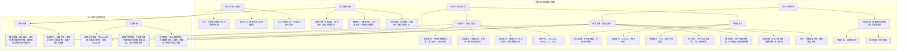

```mermaid
graph TD
    subgraph 机械学习基础核心框架
        A[机器学习核心概念] --> A1[定义：让机器从数据中学习规律并预测]
        A --> A2[核心目标：构建可泛化的预测模型]
        A --> A3[与人工智能关系：AI的核心技术分支]
        
        B[数学基础支撑] --> B1[线性代数：向量运算、矩阵变换（模型参数载体）]
        B --> B2[概率统计：概率分布、贝叶斯定理（不确定性建模）]
        B --> B3[优化基础：损失函数、梯度下降（模型训练核心）]
        
        C[机器学习核心范式] --> C1[监督学习（重点突破）]
        C1 --> C11[核心逻辑：用带标签数据训练，学习输入→输出映射]
        C1 --> C12[分类算法：逻辑回归、决策树（解决类别预测）]
        C1 --> C13[回归算法：线性回归、多项式回归（解决数值预测）]
        C1 --> C14[关键评估：Accuracy、Recall、F1、AUC]
        C --> C2[非监督学习]
        C2 --> C21[核心逻辑：无标签数据，挖掘内在结构]
        C2 --> C22[聚类算法：K-Means（样本分组）]
        C2 --> C23[降维算法：PCA（减少特征维度）]
        
        D[核心训练机制] --> D1[梯度下降（重点突破）]
        D1 --> D11[核心目标：最小化损失函数，优化模型参数]
        D1 --> D12[数学推导：基于导数求梯度，沿负梯度方向更新参数]
        D1 --> D13[迭代逻辑：反复计算梯度、更新参数，直至收敛]
        D1 --> D14[变体：批量梯度下降、随机梯度下降]
        D --> D2[损失函数：衡量模型预测值与真实值的偏差]
        D2 --> D21[分类任务：交叉熵损失]
        D2 --> D22[回归任务：均方误差]
    end

    subgraph 学习关联与实践导向
        E[知识衔接] --> E1[数学基础→核心算法：线性代数支撑模型参数，概率统计支撑预测不确定性]
        E --> E2[监督学习→梯度下降：监督学习定义损失函数，梯度下降优化参数]
        
        F[实践衔接] --> F1[监督学习实操：用Python实现分类/回归模型，搭配sklearn库]
        F --> F2[梯度下降实操：手动推导简单线性回归的梯度更新过程，可视化参数变化]
        F --> F3[项目衔接：结合课程项目，完成数据清洗→建模→用梯度下降调优的全流程]
    end

    A --> E
    B --> E
    C1 --> E2
    D1 --> E2
    C --> F1
    D1 --> F2
    C1 --> F3
    D1 --> F3
```