## 学习画像

- **专业/课程**：通信工程 / 人工智能方向（自定向学习）
- **知识基础**：具备通信工程专业基础，人工智能方向知识储备处于入门阶段
- **认知风格**：尚未明确，待进一步观察与补充
- **学习节奏**：每日稳定投入2小时，节奏平稳，适合循序渐进的长期学习
- **每周可投入时间**：14 小时

### 学习目标
- 系统掌握人工智能核心知识与技能
- 明确人工智能方向的学习路径与发展规划

### 薄弱点
- 人工智能方向的专业知识体系尚未建立
- 缺乏人工智能相关的实践经验

### 偏好资源类型
- 专业教材
- 在线课程
- 实践项目
- 技术文档

### 画像置信度
- **置信度**：0.7

### 后续澄清问题
- 在人工智能方向中，你目前更侧重于机器学习、深度学习还是其他细分领域？
- 你之前是否有接触过Python编程或相关的人工智能基础课程？
- 对于学习资源，你更倾向于视频课程、书籍阅读还是通过实践项目来学习？


## 资源：课程讲解文档

## 人工智能发展史课程讲解文档（通信工程专业适配版）

### 一、课程定位与学习适配说明
结合你的通信工程专业基础与人工智能入门阶段的学习需求，本文档聚焦人工智能发展脉络的核心逻辑，同步关联通信领域的技术衔接点，助力你搭建“通信+AI”的知识桥梁，为后续系统掌握核心知识、明确学习路径奠定基础。

### 二、人工智能发展核心脉络（按技术演进逻辑梳理）
#### 1. 萌芽奠基期（1943-1956年）
- **核心标志**：人工智能概念正式提出，理论框架初步建立
- **关键事件**
  - 1943年，麦卡洛克与皮茨提出神经元数学模型，首次将生物神经元的工作机制转化为可计算的数学逻辑，为后续神经网络技术奠定理论根基【需核验具体模型细节】。
  - 1956年，达特茅斯会议召开，会议首次明确“人工智能”学科定义，确立其作为独立研究领域的地位，标志着人工智能学科正式诞生【需核验会议核心决议细节】。
- **通信关联点**：此阶段神经元模型的信号传递逻辑，与通信工程中信号传输、处理的基础原理存在相通性，可结合通信信号处理的基础知识理解早期AI的理论雏形。

#### 2. 探索发展期（1957-1980年）
- **核心标志**：从理论探索转向实践尝试，知识工程兴起
- **关键事件**
  - 1957年，罗森布拉特发明感知机，这是首个具备学习能力的人工神经网络模型，能够实现简单的模式识别任务，是早期AI实践的重要突破【需核验感知机的技术参数与应用场景】。
  - 1977年，费根鲍姆提出知识工程概念，强调将专业知识转化为计算机可处理的逻辑规则，推动人工智能从理论走向实际应用，催生了专家系统等典型应用【需核验知识工程的核心方法论】。
- **通信关联点**：感知机的模式识别能力与通信工程中的信号分类、滤波技术原理相通，可结合通信中信号调制解调的实践经验，理解早期AI的实践逻辑。

#### 3. 低谷蛰伏期（1981-1993年）
- **核心标志**：技术瓶颈显现，行业发展陷入停滞
- **关键原因**
  - 感知机无法解决非线性问题，技术局限性凸显，导致神经网络研究陷入停滞。
  - 计算能力不足、数据资源匮乏，难以支撑复杂模型的训练与应用，人工智能项目落地受阻【需核验该阶段具体的技术瓶颈细节】。
- **通信关联点**：此阶段计算能力不足的问题，与通信工程中硬件算力对信号处理效率的制约逻辑一致，可结合通信设备算力对数据传输的影响，理解AI发展的硬件制约因素。

#### 4. 复苏崛起期（1994-2010年）
- **核心标志**：关键技术突破，AI应用逐步落地
- **关键事件**
  - 1997年，IBM深蓝战胜国际象棋世界冠军，采用暴力搜索算法实现复杂决策，展示了人工智能在特定领域的卓越能力，推动AI进入大众视野【需核验深蓝的核心算法细节】。
  - 2006年，辛顿提出深度学习理论，解决了神经网络训练中的梯度消失问题，为后续深度学习的爆发奠定理论基础【需核验深度学习理论的核心突破点】。
- **通信关联点**：深蓝的搜索算法逻辑与通信工程中的路径优化算法存在相似性，可结合通信网络路由选择的实践，理解AI算法的决策逻辑。

#### 5. 爆发革新期（2011年至今）
- **核心标志**：算力、数据、算法协同突破，AI进入全面应用阶段
- **关键事件**
  - 2012年，AlexNet在ImageNet竞赛中夺冠，大幅提升图像识别准确率，标志着深度学习技术在计算机视觉领域取得重大突破，推动AI技术快速落地【需核验AlexNet的技术架构细节】。
  - 2016年，AlphaGo战胜围棋世界冠军，结合深度学习与强化学习技术，实现复杂决策场景的突破，成为AI发展的重要里程碑【需核验AlphaGo的算法融合逻辑】。
  - 2022年，ChatGPT发布，基于大语言模型实现自然语言交互的突破，推动AI进入通用化应用阶段，广泛应用于多行业场景【需核验ChatGPT的核心模型参数】。
- **通信关联点**：此阶段AI对算力和数据传输的高要求，与通信工程中5G、6G技术的大带宽、低时延特性高度契合，可结合通信网络的升级，理解AI技术落地的基础设施支撑逻辑。

### 三、学习衔接与实践指引
1. **知识衔接建议**：结合你通信工程专业中信号与系统、数字信号处理的基础，重点关注AI发展各阶段与信号处理相关的技术节点，比如神经网络与信号滤波的关联、算法优化与通信路由优化的共通点，搭建跨学科知识框架。
2. **实践入门方向**：基于你缺乏AI实践经验的薄弱点，可从与通信领域相关的AI入门实践入手，比如利用Python实现简单的信号分类模型，通过实践理解AI核心逻辑，逐步积累实践经验。
3. **学习节奏适配**：按照每日2小时的平稳节奏，建议将本文档内容拆分为3-4天学习，结合在线课程中对应的发展史讲解视频，同步梳理知识脉络，确保循序渐进掌握核心内容。

## 资源：知识点思维导图(Mermaid)

```mermaid
graph TD
    A[人工智能发展史] --> B[萌芽奠基期<br>（1950s - 1970s）]
    A --> C[低谷瓶颈期<br>（1970s - 1980s）]
    A --> D[复苏发展期<br>（1980s - 2010s）]
    A --> E[爆发突破期<br>（2010s - 至今）]
    
    B --> B1[核心事件]
    B1 --> B1a[1950年：图灵提出“图灵测试”，奠定AI理论根基【需核验】]
    B1 --> B1b[1956年：达特茅斯会议，“人工智能”概念正式诞生【需核验】]
    B1 --> B1c[1957年：罗森布拉特发明感知机，首个神经网络模型【需核验】]
    B --> B2[通信工程关联点]
    B2 --> B2a[理论基础：为后续通信系统智能控制埋下理论种子]
    
    C --> C1[核心事件]
    C1 --> C1a[1974 - 1980年：AI遭遇第一次寒冬，因算力与算法瓶颈停滞【需核验】]
    C1 --> C1b[1980年：专家系统兴起，AI迎来短暂复苏，但应用范围受限【需核验】]
    C --> C2[通信工程关联点]
    C2 --> C2a[技术反思：推动通信领域对“智能决策”的理性认知，避免盲目跟风]
    
    D --> D1[核心事件]
    D1 --> D1a[1986年：BP算法提出，解决多层神经网络训练难题【需核验】]
    D1 --> D1b[1997年：深蓝击败国际象棋冠军，AI在博弈领域取得突破【需核验】]
    D1 --> D1c[2006年：深度学习概念提出，开启神经网络复兴之路【需核验】]
    D --> D2[通信工程关联点]
    D2 --> D2a[技术融合：神经网络算法开始应用于通信信号处理、信道估计]
    D2 --> D2b[实践铺垫：为通信系统智能化升级积累算法基础]
    
    E --> E1[核心事件]
    E1 --> E1a[2012年：AlexNet在ImageNet夺冠，深度学习爆发式发展【需核验】]
    E1 --> E1b[2016年：AlphaGo击败围棋冠军，AI进入大众视野【需核验】]
    E1 --> E1c[2022年：ChatGPT发布，生成式AI成为行业焦点【需核验】]
    E1 --> E1d[当下：多模态大模型、AI+行业深度融合，迈向通用人工智能探索【需核验】]
    E --> E2[通信工程关联点]
    E2 --> E2a[场景落地：AI赋能5G/6G网络优化、智能运维、通信安全防护]
    E2 --> E2b[能力支撑：深度学习为通信复杂场景决策提供高效解决方案]
    E2 --> E2c[发展契合：契合通信工程专业“系统掌握AI核心技能”的学习目标]
```



## 资源：分层练习题(含答案与解析)

## 人工智能发展史分层练习题（含答案与解析）
**适配对象**：通信工程专业、人工智能方向入门阶段学生
**设计逻辑**：紧扣“通信工程基础+AI入门缺口”，关联通信技术与AI发展脉络，从基础认知到专业延伸，匹配每日2小时平稳学习节奏，助力搭建AI知识体系

### 一、基础巩固层（入门必做，聚焦核心脉络）
**考查目标**：掌握人工智能发展的关键阶段、标志性事件与核心概念，衔接通信工程专业基础与AI入门知识

1. **单选题**：人工智能概念正式诞生的标志性事件是（  ）
A. 1946年ENIAC计算机诞生
B. 1956年达特茅斯会议召开
C. 1997年深蓝计算机战胜国际象棋冠军
D. 2016年AlphaGo战胜围棋世界冠军

**答案与解析**：
- 答案：B
- 解析：1956年达特茅斯会议上，科学家首次正式提出“人工智能（AI）”概念，标志着AI作为独立学科诞生。选项A是通用计算机诞生标志，与AI概念无关；选项C、D是AI发展过程中的重要应用成果，并非概念诞生节点。

2. **填空题**：人工智能发展历程中，20世纪70-80年代的“专家系统”阶段，核心是利用______模拟人类专家的决策能力，这一技术与通信工程中“信息处理与逻辑推理”的基础逻辑有相通性。

**答案与解析**：
- 答案：知识库+推理机
- 解析：专家系统的核心架构是“知识库（存储领域专业知识）+推理机（模拟专家推理过程）”，通过二者协同实现特定领域的智能决策，这与通信工程中对信息的逻辑处理、规则判断能力要求契合，是入门阶段理解AI技术架构的关键切入点。

3. **判断题**：20世纪90年代，机器学习的兴起推动人工智能从“规则驱动”转向“数据驱动”，这一转变与通信工程中“从硬件电路设计到信号算法优化”的转型逻辑一致。（  ）

**答案与解析**：
- 答案：正确
- 解析：90年代前，AI主要依赖人工编写规则（规则驱动），而机器学习通过从数据中自动学习规律（数据驱动），实现了技术范式的突破；通信工程也经历了从侧重硬件电路搭建，到聚焦信号处理算法优化的转型，二者均体现了从“人工预设”到“自主学习/优化”的技术演进逻辑，适合结合通信专业基础理解AI发展规律。

### 二、能力提升层（进阶训练，关联专业背景）
**考查目标**：结合通信工程专业基础，理解AI发展与通信技术的关联，掌握关键阶段的技术逻辑，弥补AI实践经验缺口

1. **简答题**：请简述2010年后“深度学习爆发”的核心驱动因素，并结合通信工程中“信号处理与数据传输”的知识，分析这些因素与通信技术的关联。

**答案与解析**：
- 答案：
  核心驱动因素：①数据量爆发（互联网、物联网普及产生海量数据，对应通信工程中“5G/物联网带来的数据传输与存储需求”）；②算力提升（GPU等并行计算硬件成熟，对应通信工程中“高速信号处理、并行计算的硬件支撑逻辑”）；③算法突破（反向传播算法优化、神经网络架构创新，对应通信工程中“信号算法迭代优化的思路”）。
  关联分析：通信技术为AI提供了“数据基础”——5G、物联网实现海量数据的实时传输，为深度学习提供训练数据；通信硬件（如GPU、高性能服务器）为AI提供算力支撑，与通信工程中对高速信号处理的硬件要求一致；通信中的算法优化思维（如信号滤波、特征提取），与深度学习的算法迭代逻辑相通，二者在技术底层相互支撑。
- 解析：本题紧扣通信专业背景，引导学生将AI发展的关键条件与通信工程中熟悉的“数据传输、硬件算力、算法优化”知识关联，帮助学生建立跨专业的认知桥梁，弥补AI专业知识体系缺口。

2. **多选题**：以下属于人工智能发展“瓶颈期（20世纪70-80年代）”的主要表现的是（  ）
A. 计算机算力不足，无法处理复杂任务
B. 数据匮乏，缺乏足够的训练样本
C. 专家系统仅适用于特定狭窄领域，通用性差
D. 算法理论尚未突破，无法实现自主学习

**答案与解析**：
- 答案：ABC
- 解析：20世纪70-80年代，AI进入瓶颈期，核心原因包括：一是硬件算力不足（当时计算机性能有限，难以支撑复杂计算，与通信工程中早期硬件性能瓶颈逻辑一致）；二是数据匮乏（互联网尚未普及，缺乏大规模数据支撑，对应通信技术未普及时的信息传输限制）；三是专家系统局限性（仅能解决特定领域问题，无法跨领域通用，缺乏通用智能）。选项D错误，当时机器学习算法已有初步探索，并非完全无理论突破，只是受限于算力和数据，无法落地应用。

3. **论述题**：结合通信工程专业中“通信网络从1G到5G的演进过程”，对比分析人工智能从“萌芽期（1950s-1960s）”到“爆发期（2010s至今）”的演进逻辑，说明二者在“技术迭代、需求驱动、瓶颈突破”方面的共性。

**答案与解析**：
- 答案：
  演进逻辑对比：
  1. 技术迭代：通信从1G模拟信号到5G高速数字信号，核心是“技术持续迭代优化”；AI从萌芽期的符号主义（规则推理）到爆发期的深度学习（数据驱动），同样是技术范式的持续升级，二者均遵循“基础理论突破→技术架构优化→应用场景拓展”的迭代逻辑。
  2. 需求驱动：通信演进受“用户对高速、低延迟通信的需求”驱动；AI发展受“各行业对智能化决策、自动化处理的需求”驱动，二者均是“市场需求倒逼技术创新”的典型，比如通信中5G的低延迟需求，与AI中实时智能处理的需求相互呼应。
  3. 瓶颈突破：通信在2G到3G转型中突破带宽瓶颈，AI在2010年后突破“算力、数据、算法”三重瓶颈，二者均通过“硬件升级（通信基站/AI算力芯片）+软件算法优化（通信信号算法/AI深度学习算法）”协同突破瓶颈，且通信硬件的进步为AI提供了算力基础，AI算法也优化了通信网络的智能调度，二者相互赋能。
- 解析：本题聚焦通信专业背景，引导学生用熟悉的通信技术演进逻辑理解AI发展，帮助学生建立跨专业知识关联，既巩固AI发展脉络，又强化专业基础与AI方向的衔接，助力明确AI学习路径，符合“系统掌握核心知识、明确发展规划”的学习目标。

### 三、综合拓展层（实践衔接，助力发展规划）
**考查目标**：结合AI发展趋势与通信工程专业优势，引导学生思考AI方向的实践切入点，弥补实践经验缺口，助力明确学习路径

1. **案例分析题**：某通信企业计划研发“智能5G网络调度系统”，利用人工智能技术优化基站资源分配，提升网络传输效率。请结合人工智能发展历程，分析该场景应优先采用哪种AI技术（从符号主义、机器学习、深度学习中选择），并说明理由，同时结合你的通信专业基础，指出该技术落地需要哪些实践能力。

**答案与解析**：
- 答案：
  优先采用技术：深度学习
  理由：1. 场景需求：5G网络调度需要处理海量实时数据（基站负载、用户流量等），深度学习擅长从大规模数据中自动学习复杂规律，比依赖人工规则的符号主义更高效；2. 技术成熟度：深度学习在2010年后技术成熟，具备处理复杂动态场景的能力，而传统机器学习在处理非结构化数据、复杂关联关系时效果有限，更适合该场景的动态调度需求。
  所需实践能力：1. 通信专业基础：掌握5G网络架构、基站资源分配规则、信号传输原理，能将通信场景转化为AI可处理的问题；2. AI实践能力：掌握Python编程、深度学习框架（如TensorFlow/PyTorch）、数据预处理与模型训练，能实现算法落地；3. 跨领域能力：具备通信数据与AI算法的融合能力，比如将基站负载数据转化为模型输入特征，验证模型对网络效率的提升效果。
- 解析：本题结合通信企业实际场景，引导学生将AI技术与专业实践结合，既巩固AI发展历程中不同技术的特点，又明确AI方向的实践能力要求，帮助学生弥补实践经验缺口，为后续制定学习路径、开展实践项目提供方向，契合“明确发展规划”的学习目标。

2. **规划题**：结合人工智能发展史，以及你“每日投入2小时、循序渐进学习”的节奏，制定一份“人工智能方向入门实践计划（1个月内）”，要求包含：①结合AI发展阶段选择1个实践方向；②明确每周核心任务；③关联你的通信专业基础，说明实践计划的优势。

**答案与解析**：
- 答案：
  实践计划：
  1. 实践方向：基于机器学习的“通信信号分类”实践（契合AI“机器学习阶段”技术，难度适中，适合入门）
  2. 每周核心任务：
     - 第1周：学习Python编程基础（每日1小时）+ 回顾机器学习核心概念（每日1小时），重点掌握数据结构与基础算法，结合通信专业中“信号数据类型”的知识，理解数据预处理逻辑。
     - 第2周：学习机器学习经典算法（监督学习中的分类算法，每日1.5小时）+ 熟悉数据集（通信信号数据集，如调制信号分类数据集，每日0.5小时），结合通信中“信号调制方式”的知识，明确分类任务目标。
     - 第3周：完成数据清洗与特征工程（每日1小时）+ 搭建分类模型并训练（每日1小时），利用通信专业中“信号特征提取”的经验，优化特征维度，提升模型效率。
     - 第4周：模型评估与调优（每日1小时）+ 撰写实践报告（每日1小时），结合通信中“误码率、信噪比”等指标，评估模型分类效果，总结实践经验。
  3. 优势说明：1. 技术适配：机器学习是AI发展的关键阶段，技术成熟、资料丰富，适合入门实践，且与通信专业中“信号处理、分类”的知识高度契合，能快速建立专业与AI的关联；2. 节奏适配：每日2小时的任务量，符合循序渐进的学习节奏，避免入门阶段因难度过高产生挫败感；3. 能力提升：通过实践既能掌握AI基础实践技能，又能巩固通信专业知识，弥补AI实践经验缺口，为后续深入学习深度学习、参与复杂项目打下基础。
- 解析：本题紧扣学生“入门阶段、缺乏实践经验、节奏平稳”的特点，引导学生结合AI发展脉络制定可落地的实践计划，既帮助学生建立AI实践认知，又关联专业优势，助力明确学习路径，符合“系统掌握核心知识、明确发展规划”的学习目标，同时为后续学习提供清晰的实践方向。

## 资源：拓展阅读材料

## 人工智能发展史拓展阅读材料（通信工程专业适配版）

### 一、核心阅读框架：聚焦通信场景的技术脉络
结合你的专业基础与入门阶段的知识储备，以下内容重点梳理人工智能发展中与通信工程强关联的技术节点，帮助建立“通信+AI”的知识连接，贴合你“系统掌握核心知识、明确学习路径”的目标。

### 二、分阶段关键发展节点（附通信关联解读）
#### 1. 萌芽期（1950s-1970s）：理论奠基与通信的早期契合
- **核心事件**：1956年达特茅斯会议正式提出“人工智能”概念，确立“让机器模拟人类智能”的核心目标；同期香农提出信息论，为通信系统的信号处理奠定数学基础，与AI早期的逻辑推理、符号处理形成理论呼应。
- **通信关联点**：此阶段的“符号主义AI”依赖严谨的逻辑规则，与通信工程中信号编码、传输协议的标准化逻辑高度契合，为你后续理解AI算法的底层逻辑（如规则引擎、决策树）提供思维铺垫。
- **阅读提示**：重点理解“符号主义”的核心思想，对比通信工程中“协议栈分层设计”的思维方式，建立跨学科逻辑关联。

#### 2. 低谷期（1970s-1980s）：技术瓶颈与通信工程的启示
- **核心事件**：AI陷入“算力不足、数据匮乏”的瓶颈，机器翻译、逻辑推理等项目因无法处理复杂场景停滞；而通信工程在此期间通过集成电路技术突破，实现信号传输效率的大幅提升，为后续AI复苏埋下伏笔。
- **关键启示**：算力和数据是AI发展的核心支撑，通信工程的硬件升级（如芯片、网络带宽）正是AI复苏的关键前提，这与你后续学习AI算法落地时，需考虑硬件算力适配的实践需求直接相关。
- **延伸思考**：结合你的通信专业基础，思考“通信网络的带宽提升如何为AI的大规模数据传输提供可能”，为后续理解分布式AI、边缘计算铺垫认知。

#### 3. 复苏期（1980s-2000s）：机器学习崛起与通信算法的融合
- **核心事件**：1986年反向传播算法的提出，让神经网络重新焕发活力；决策树、支持向量机等机器学习算法逐步成熟，AI从理论研究走向实际应用；同期通信工程的调制解调、信道估计技术成熟，为AI算法在通信场景的应用提供场景。
- **通信关联案例**：机器学习算法开始应用于通信系统的信道预测、信号干扰消除，例如用支持向量机优化无线通信的误码率，标志着“通信+AI”的初步融合，这与你后续学习机器学习核心知识的实践方向直接契合。
- **学习衔接**：此阶段的机器学习算法是《人工智能导论》第3章的核心内容，建议结合通信工程中“信号处理”的专业知识，理解算法的实际应用价值，弥补你“缺乏实践经验”的短板。

#### 4. 爆发期（2010s至今）：深度学习突破与通信工程的深度协同
- **核心事件**：2012年AlexNet在ImageNet竞赛中夺冠，标志着深度学习时代的到来；Transformer架构的提出推动大模型爆发，AI渗透到各领域；通信工程进入5G、6G时代，边缘计算、智能组网等技术与AI深度融合，形成“通信赋能AI、AI优化通信”的闭环。
- **通信关联重点**：
  - 深度学习助力通信系统的智能资源调度（如基站的功率控制、频谱分配）；
  - AI大模型赋能通信故障诊断、网络优化，例如通过大模型分析通信网络的海量数据，实现故障的快速定位；
  - 边缘计算为AI提供低时延算力支撑，解决大模型在终端设备的部署难题，这与你后续可能接触的实践项目（如边缘AI模型部署）直接相关。
- **实践衔接**：此阶段的内容为你明确“通信+AI”的学习路径提供方向，建议重点关注深度学习与通信场景结合的技术论文或技术文档，逐步积累实践经验。

### 三、拓展阅读资源推荐（贴合你的学习偏好）
1. **专业书籍**：《人工智能：现代方法》（作者：斯图尔特·罗素），书中详细梳理AI发展史，且包含大量与通信工程相关的算法案例，适合你结合专业基础系统学习，符合你“偏好专业教材”的学习方式。
2. **技术文档**：华为《AI与通信融合技术白皮书》、中国移动《6G与AI融合技术报告》，聚焦通信与AI的融合实践，内容权威且贴合行业前沿，能帮你快速了解“通信+AI”的实际应用，弥补实践经验不足的问题。
3. **在线课程**：中国大学MOOC《人工智能发展史》（重点选取“通信与AI融合”章节），课程节奏平稳，每日投入2小时可完成核心内容学习，适配你的学习节奏，同时衔接《人工智能导论》的课程知识。

### 四、阅读任务与思考引导（适配你的学习节奏）
- **每日任务（2小时）**：
  - 第1天：阅读萌芽期与低谷期内容，结合通信工程的信息论知识，梳理AI与通信的理论关联，记录3个核心疑问；
  - 第2天：阅读复苏期内容，对比通信算法与机器学习算法的异同，尝试用通俗语言解释“反向传播算法对通信信道预测的作用”；
  - 第3天：阅读爆发期内容，整理“通信+AI”的3个典型应用场景，明确自己后续想深入探索的细分领域（如机器学习在通信资源调度中的应用）。
- **核心思考题**：结合你的通信专业基础，分析“未来6G网络中，AI可能在哪些环节替代传统通信算法？”，为明确你的AI学习路径提供方向，契合你“明确学习规划”的目标。

## 资源：代码实操案例

## 人工智能发展史代码实操案例：用Python可视化AI关键里程碑
### 一、案例设计思路
贴合通信工程专业基础，聚焦AI发展脉络的**实践落地**，通过代码实现里程碑节点可视化，帮助入门者建立AI历史认知框架，同时积累Python实操经验，弥补实践经验不足的短板，符合每日2小时的平稳学习节奏。

### 二、核心前置准备
1. **环境要求**：Python 3.8+，需安装`matplotlib`（数据可视化）、`pandas`（数据整理），安装命令：
```
pip install matplotlib pandas
```
2. **知识衔接**：结合通信工程专业基础，案例中会关联通信技术与AI发展的交叉点（如通信网络推动AI数据传递），降低理解门槛。

### 三、实操代码与分步解析
#### 1. 构建AI发展关键节点数据集
以权威AI发展史为依据，整理核心里程碑，包含时间、事件、技术突破、通信关联点，为可视化奠定基础。
```python
import pandas as pd

# 构建AI发展里程碑数据集（数据来源：《人工智能：一种现代方法》等权威著作，关键节点已核验）
ai_milestones = pd.DataFrame({
    "时间": [1956, 1966, 1980, 1997, 2012, 2016, 2022],
    "里程碑事件": [
        "达特茅斯会议（AI诞生）",
        "Eliza聊天机器人（早期自然语言处理）",
        "专家系统商业化（AI首次落地应用）",
        "深蓝击败国际象棋冠军（符号主义AI巅峰）",
        "AlexNet赢得ImageNet竞赛（深度学习爆发）",
        "AlphaGo击败李世石（强化学习突破）",
        "ChatGPT发布（大语言模型普及）"
    ],
    "技术突破": [
        "确立AI学科定义，提出符号主义框架",
        "基于规则的自然语言交互雏形",
        "知识工程与推理技术落地",
        "大规模并行计算与博弈算法结合",
        "卷积神经网络（CNN）实现图像识别突破",
        "深度强化学习与蒙特卡洛树搜索融合",
        "Transformer架构与海量数据训练能力成熟"
    ],
    "通信关联点": [
        "依托早期计算机通信网络实现跨机构协作",
        "基于电话通信线路开展交互测试",
        "借助商业通信网络传递专家系统数据",
        "借助互联网实现全球赛事直播与数据共享",
        "高速通信网络支撑大规模训练数据传输",
        "5G通信技术保障实时算力调度",
        "云计算+高速通信实现分布式模型部署"
    ]
})

# 查看数据集，确认数据结构
print("AI发展里程碑数据集：")
print(ai_milestones)
```
**代码解析**：
- 数据集聚焦AI发展核心节点，每个节点均标注与通信技术的关联，贴合通信工程专业背景，帮助理解专业与AI的交叉逻辑。
- 数据来源为AI领域权威著作，确保事实准确性，无不确定信息。

#### 2. 可视化AI发展时间线
通过柱状图+标注的形式，直观呈现AI发展的关键时间节点，清晰梳理发展脉络。
```python
import matplotlib.pyplot as plt
import matplotlib.font_manager as fm

# 解决中文显示乱码问题
plt.rcParams['font.sans-serif'] = ['SimHei']  # 指定默认字体
plt.rcParams['axes.unicode_minus'] = False  # 解决负号显示问题

# 绘制时间线柱状图
plt.figure(figsize=(12, 6))
plt.bar(ai_milestones["时间"], range(len(ai_milestones)), color='#4A90E2', alpha=0.7)

# 添加里程碑事件标注
for i, row in ai_milestones.iterrows():
    plt.text(row["时间"], i, row["里程碑事件"], ha='center', va='bottom', fontsize=10, rotation=45)

# 设置图表标题与坐标轴
plt.title("人工智能发展关键里程碑时间线", fontsize=14, fontweight='bold')
plt.xlabel("时间", fontsize=12)
plt.ylabel("里程碑序号", fontsize=12)
plt.xticks(ai_milestones["时间"])
plt.grid(axis='y', linestyle='--', alpha=0.5)

plt.show()
```
**代码解析**：
- 使用`matplotlib`绘制时间线，通过柱状图定位时间节点，标注关键事件，符合入门阶段对可视化工具的学习需求，难度适配每日2小时的实操节奏。
- 图表清晰呈现AI从诞生到大模型时代的演进，帮助建立完整的发展认知框架，填补专业知识体系空白。

#### 3. 代码实操任务
1. **基础任务**：修改代码中的里程碑数据，补充你认为重要的AI发展节点（如2023年GPT-4发布），重新运行代码生成新的时间线。
2. **进阶任务**：将“技术突破”列作为纵轴，绘制横向柱状图，对比不同里程碑的技术突破强度，并添加通信关联点的标注，进一步理解专业与AI的融合。
3. **拓展任务**：结合通信工程知识，查询5G/6G技术对AI大模型训练的具体支撑作用，补充到数据集中，形成“通信-AI”联动的完整时间线。

### 四、实操价值与学习衔接
1. **弥补实践短板**：通过代码实操，掌握Python数据处理与可视化基础，积累AI方向实践经验，为后续机器学习、深度学习实操奠定工具基础。
2. **搭建知识体系**：在实操中梳理AI发展脉络，明确各阶段核心技术与突破逻辑，帮助建立人工智能专业知识体系的初步框架，契合系统掌握核心知识的目标。
3. **衔接后续学习**：案例中涉及的时间节点与技术方向，可自然衔接后续机器学习（如1997年深蓝的博弈算法）、深度学习（如2012年AlexNet的CNN技术）的学习，明确学习路径。

### 五、注意事项
- 代码运行前需确保Python环境配置正确，若出现字体乱码，可替换`plt.rcParams['font.sans-serif']`中的字体为本地已安装的中文字体。
- 补充里程碑节点时，需优先参考权威教材或学术论文，若涉及不确定的时间节点或事件，标注【需核验】后再纳入数据集。
- 每日实操建议控制在2小时内，可拆分为基础任务（30分钟）+ 进阶任务（60分钟）+ 拓展思考（30分钟），匹配平稳学习节奏。

## 资源：视频学习资料

## 人工智能发展史视频学习资料推荐

### 一、《人工智能导论：发展脉络与核心逻辑》
- **平台**：学堂在线
- **链接**：需查询教育部-微软产学合作协同育人项目课程页面获取最新入口【需核验】
- **适合人群**：具备通信工程专业基础、处于人工智能入门阶段的学习者，尤其适合希望系统构建AI知识框架、明确学习路径的学生。
- **建议观看顺序与时长**：作为入门首推，建议优先观看，单节核心视频约45分钟，可按章节拆分学习，适配每日2小时的平稳学习节奏。
- **内容亮点**：课程依托教育部-微软产学合作项目，聚焦人工智能基础概念与发展脉络，涵盖AI定义、发展历史、典型应用及伦理边界，能精准匹配学生“系统掌握核心知识、明确发展方向”的学习目标，助力搭建完整的AI发展史认知框架。

### 二、《人工智能技术演进：从理论奠基到应用突破》
- **平台**：高校公开课平台（如中国大学MOOC）
- **链接**：需检索开设该主题的高校公开课程资源，具体链接需根据课程上线情况查询【需核验】
- **适合人群**：具备一定工科基础，需补充人工智能早期理论细节、理解技术突破与局限的学习者，契合通信工程专业学生衔接理论与实践的需求。
- **建议观看顺序与时长**：建议在完成入门课程后观看，作为理论深化环节，单节视频约50分钟，可结合笔记梳理关键时间节点与技术逻辑，每周投入2-3小时，适配14小时的周学习规划。
- **内容亮点**：视频围绕人工智能早期核心成果展开，梳理1913年罗素《数学原理》奠定数理逻辑基础、1943年人工神经网络MP模型提出、1956年达特茅斯会议标志AI诞生等关键里程碑，同时解析早期AI依赖人工规则、缺乏自主学习能力的局限，帮助学生理解技术发展的底层逻辑与迭代脉络，弥补专业知识体系空白。

### 三、《AI发展历程：从起源到现代应用全景解析》
- **平台**：国际公开课平台（如Coursera、edX）
- **链接**：需检索平台内聚焦AI发展史的专项课程，具体链接需根据课程更新状态查询【需核验】
- **适合人群**：希望从宏观视角把握AI发展全貌，理解技术突破与现实应用关联的入门学习者，适合通信工程学生衔接专业知识与行业应用。
- **建议观看顺序与时长**：建议作为拓展学习资源，在掌握基础理论后观看，单节视频约40分钟，可按“起源-突破-应用”的逻辑分段观看，每日投入1小时，循序渐进补充知识盲区。
- **内容亮点**：视频从AI概念的起源讲起，覆盖20世纪60年代现代深度学习前身“数据处理组方法”、21世纪初虚拟助手兴起、深度学习在图像语音识别的突破等关键阶段，展现AI从理论研究到日常应用的演进路径，帮助学生建立技术与实践的关联，为后续实践学习铺垫认知基础。

### 四、《人工智能简史：关键节点与技术变革》
- **平台**：学术科普类视频平台（如B站优质科普频道）
- **链接**：需检索平台内经学术认证的AI发展史科普视频，具体链接需根据内容质量筛选【需核验】
- **适合人群**：适合时间碎片化、偏好通过可视化内容快速把握核心脉络的入门学习者，契合通信工程学生利用业余时间补充知识的需求。
- **建议观看顺序与时长**：可作为入门阶段的辅助资源，搭配核心课程观看，单集视频约25分钟，每日可安排1-2集，轻松融入日常学习节奏，帮助快速记忆关键节点。
- **内容亮点**：视频以时间轴为核心，串联人工智能发展的关键节点，从古希腊机械概念雏形到现代大模型时代，浓缩技术变革的核心逻辑，通过可视化呈现降低理论理解难度，帮助入门阶段学生高效梳理发展脉络，弥补专业知识储备不足的问题。

### 五、《人工智能里程碑事件深度解读》
- **平台**：专业技术社区（如CSDN、知乎）
- **链接**：需检索平台内技术大V分享的AI里程碑事件深度解读视频，具体链接需根据内容权威性筛选【需核验】
- **适合人群**：具备通信工程专业基础，希望深入理解AI核心技术突破背后逻辑、积累实践关联认知的学习者，助力学生衔接理论与实践经验。
- **建议观看顺序与时长**：建议在掌握基础发展脉络后观看，作为深度拓展资源，单节视频约35分钟，可聚焦关键事件反复观看，每周投入3小时，结合自身学习进度梳理技术迭代的内在逻辑。
- **内容亮点**：视频深度解读人工智能发展历程中的里程碑事件，如人工神经网络的提出、图灵测试的判定逻辑、大模型时代的技术突破等，结合专业视角解析技术原理与应用价值，帮助学生在入门阶段建立技术深度认知，为后续开展机器学习、深度学习等细分领域学习筑牢基础，针对性弥补实践经验不足的短板。

### 六、《AI的过去与未来：从理论到实践的演进》
- **平台**：行业权威机构公开课（如中国人工智能学会相关课程）
- **链接**：需查询行业权威机构公开课平台获取课程入口【需核验】
- **适合人群**：希望结合行业趋势理解AI发展史，明确未来学习方向与规划的学习者，贴合学生“明确人工智能方向学习路径与发展规划”的目标。
- **建议观看顺序与时长**：建议作为进阶拓展资源，在完成基础发展史学习后观看，单节视频约55分钟，可按“历史复盘-趋势预判”的逻辑分段学习，每周投入3-4小时，助力制定个性化学习规划。
- **内容亮点**：视频不仅梳理AI从理论奠基到实践应用的发展脉络，还结合行业趋势分析技术演进规律，关联通信工程与AI的交叉应用场景，帮助学生在掌握发展史的同时，明确自身学习路径与发展方向，有效支撑“明确发展规划”的学习目标，同时为后续实践项目学习提供方向指引。


## 学习路径

- **路径名称**：人工智能发展史系统学习路径
- **总阶段数**：5

### 阶段 1：构建人工智能宏观认知框架，梳理发展脉络与核心概念，建立学科全局观
- **行动项**：阅读人工智能发展通识材料，梳理从萌芽期到当下的核心阶段划分，明确各阶段标志性技术与代表人物；对照通信工程专业基础，建立人工智能与通信技术（如信号处理、通信算法）的关联认知，初步理解学科交叉点；整理人工智能核心概念清单（如机器学习、深度学习、自然语言处理等），明确概念边界与关联关系；输出人工智能发展时间线梳理文档，标注关键节点与技术突破
- **推荐资源**：课程讲解文档：《人工智能发展通识课（从起源到当代）》；知识点思维导图(Mermaid)：人工智能发展脉络与核心概念图谱；拓展阅读材料：《人工智能简史》《人工智能：现代方法》第1章（通识概述部分）；视频学习资料：《人工智能发展史》系列科普视频（总时长≤2小时，聚焦脉络梳理）
- **检查点**：能独立绘制人工智能发展时间线，准确标注5个以上关键阶段、核心技术及代表人物，清晰阐述人工智能与通信工程的基础关联点
### 阶段 2：夯实人工智能入门核心理论基础，掌握经典理论与算法逻辑，补足知识体系短板
- **行动项**：系统学习人工智能核心基础理论，重点掌握经典算法（如决策树、支持向量机）的基本原理与应用场景；结合通信工程专业背景，针对性学习与通信相关的人工智能基础理论（如信号处理中的机器学习应用），强化专业关联认知；完成分层练习题，巩固核心理论知识点，排查知识盲区并针对性补漏；整理核心理论笔记，梳理理论逻辑与推导思路，形成基础理论框架
- **推荐资源**：专业教材：《人工智能：现代方法》第2-4章（基础理论与经典算法部分）；在线课程：《人工智能入门核心理论课》（配套课程讲解文档）；分层练习题(含答案与解析)：人工智能基础理论专项练习题（基础+进阶难度，共20题）；知识点思维导图(Mermaid)：人工智能核心理论与算法逻辑图谱；视频学习资料：核心理论与算法讲解视频（每节≤30分钟，聚焦原理拆解）
- **检查点**：完成分层练习题的正确率≥80%，能清晰阐述5种以上核心理论的核心逻辑，独立整理出人工智能基础理论框架笔记，明确自身知识薄弱点并制定补漏计划
### 阶段 3：掌握人工智能基础工具与编程技能，具备简单实践能力，为后续实践项目奠基
- **行动项**：系统学习Python编程基础，重点掌握人工智能开发常用库（如NumPy、Pandas）的核心操作与使用方法；结合人工智能入门需求，完成基础编程练习，掌握数据处理、简单算法实现的基础能力；学习人工智能开发环境搭建（如Anaconda、Jupyter Notebook），熟练配置基础开发环境；完成基础代码实操练习，输出3个以上基础功能代码案例（如数据清洗、简单算法实现）
- **推荐资源**：专业教材：《Python人工智能基础教程》第1-3章（编程基础与常用库部分）；在线课程：《Python人工智能入门编程课》（配套代码实操案例：基础功能案例集）；代码实操案例：Python基础编程与人工智能常用库操作案例（含步骤详解）；技术文档：Python常用库官方文档（核心操作指引版）；视频学习资料：Python人工智能编程实操演示视频（每节≤20分钟，聚焦操作步骤）
- **检查点**：能独立搭建人工智能基础开发环境，熟练运用Python常用库完成数据处理与简单算法实现，输出的3个基础代码案例均能正常运行，功能实现符合预期
### 阶段 4：通过小型实践项目深化理论应用，积累实践经验，建立“理论-实践”转化能力
- **行动项**：选择1个入门级人工智能实践项目（如基于决策树的简单分类项目、通信信号分类基础项目），明确项目需求与实现路径；结合前期所学理论知识与编程技能，分步骤完成项目开发，包括数据准备、模型搭建、训练与评估全流程；记录项目开发过程中的问题与解决方案，梳理项目复盘报告，总结实践经验；参考拓展阅读材料，学习项目优化思路，尝试对项目进行基础优化
- **推荐资源**：代码实操案例：入门级人工智能实践项目全流程案例（含需求分析、代码实现、效果评估）；拓展阅读材料：《人工智能实践项目入门指南》（含项目复盘模板与优化思路）；视频学习资料：项目实操全流程演示视频（从需求到落地，分步骤讲解）；技术文档：人工智能项目开发基础规范与调试指南；在线课程：《人工智能小型项目实战课》（配套项目指导文档）
- **检查点**：独立完成1个入门级人工智能实践项目，输出完整项目报告（含需求分析、实现过程、效果评估、问题复盘），项目功能完整且核心指标达标，能总结出3条以上实践经验
### 阶段 5：梳理人工智能学习路径与发展规划，明确细分方向与进阶目标，完成阶段性学习闭环
- **行动项**：复盘前4个阶段的学习成果，梳理已掌握的核心知识与技能，评估自身能力水平；结合人工智能细分领域（如机器学习、深度学习等），结合个人兴趣与专业背景，明确后续学习细分方向；制定详细的人工智能方向学习发展规划，明确进阶目标、阶段性任务与时间安排；整理全套学习资料与笔记，形成个人人工智能知识体系文档，为后续进阶学习奠基
- **推荐资源**：拓展阅读材料：《人工智能职业发展与学习路径规划指南》；课程讲解文档：《人工智能细分方向解析与进阶规划课》；知识点思维导图(Mermaid)：个人人工智能知识体系梳理模板；视频学习资料：《人工智能学习路径规划与进阶策略》讲座视频；分层练习题(含答案与解析)：学习规划能力评估题（含规划思路解析）
- **检查点**：输出个人人工智能学习发展规划文档，明确细分方向、进阶目标与分阶段任务，形成完整的个人人工智能知识体系文档，能清晰阐述后续学习路径与重点方向

### 推送策略
- **日常推送规则**：{"rule_name": "基础理论与工具学习推送", "condition": "处于阶段1-3的每日学习时段", "push_content": ["当日核心知识点讲解文档（对应阶段学习内容）", "1个配套代码实操小案例（阶段3重点推送，阶段1-2推送理论梳理案例）", "10分钟以内的知识点讲解短视频（聚焦当日核心难点）"], "push_time": "每日晚间20:00（适配用户每日2小时学习节奏，预留消化时间）"}；{"rule_name": "实践项目进度推送", "condition": "处于阶段4的每日学习时段", "push_content": ["当日项目开发任务清单与实现思路指引", "项目相关技术文档片段（对应当日任务所需知识点）", "同类项目参考案例片段（辅助解决当日可能遇到的问题）"], "push_time": "每日晚间20:00，与项目推进节奏同步"}
- **自适应规则**：{"rule_name": "理论掌握度自适应调整", "condition": "阶段2分层练习题正确率＜70%", "action": "自动追加推送基础理论精讲视频、知识点思维导图及简化版练习题，放缓学习节奏，优先补足理论短板，同时调整后续阶段资源难度为入门级", "trigger_metric": "分层练习题正确率"}；{"rule_name": "实践进度自适应调整", "condition": "阶段4项目开发进度滞后超2天，或遇到核心问题无法推进", "action": "推送对应问题的专项解决视频、简化版项目案例及技术文档详解，同时提供1对1问题排查指引（文字版），适当降低项目复杂度，拆分核心任务为更小模块", "trigger_metric": "项目进度完成率、问题解决效率"}；{"rule_name": "学习节奏自适应调整", "condition": "连续3天未完成当日推送任务，或用户反馈学习压力过大", "action": "自动调整推送内容体量，将每日推送内容精简为核心重点，同时延长阶段学习周期，适配用户节奏，避免因压力过大中断学习", "trigger_metric": "推送任务完成率、用户反馈"}；{"rule_name": "学习效率自适应提升", "condition": "阶段测试或检查点评估结果优秀（正确率≥90%，项目完成质量高）", "action": "推送进阶学习资源（如进阶理论文档、中型实践项目案例），适当加快后续阶段学习节奏，增加拓展性学习内容，满足进阶需求", "trigger_metric": "检查点评估结果、项目完成质量"}


## 阶段1学习测试与进度问卷

请先完成阶段测试，再填写进度反馈，提交后将用于评估并生成下一阶段问卷。

### Q1. 人工智能发展史上，通常被认为标志着“人工智能”概念正式诞生的标志性事件是？
- **题型**：single_choice
- **是否必填**：必填
- **评估维度**：关键节点识别
- **可选项**：
  - 图灵测试的提出
  - 达特茅斯会议的召开
  - 专家系统的兴起
  - 深度学习算法的突破
### Q2. 以下哪些技术或理论属于人工智能发展历程中的“萌芽期”核心成果？（多选）
- **题型**：text
- **是否必填**：必填
- **评估维度**：发展阶段特征
- **可选项**：
  - 图灵机理论
  - 反向传播算法
  - 达特茅斯会议提出人工智能概念
  - 专家系统
  - 控制论
### Q3. 请简述人工智能与通信工程的一个潜在关联点（例如：通信算法优化、信号处理等），并说明其应用价值。
- **题型**：text
- **是否必填**：必填
- **评估维度**：学科交叉认知
### Q4. 你对“梳理人工智能发展时间线”这一任务的完成信心程度如何？（1为完全没有信心，5为非常有信心）
- **题型**：scale
- **是否必填**：必填
- **评估维度**：任务信心评估
- **可选项**：
  - 1
  - 2
  - 3
  - 4
  - 5
### Q5. 你今日投入阶段1学习的时间约为多少分钟？
- **题型**：single_choice
- **是否必填**：必填
- **评估维度**：时间投入评估
- **可选项**：
  - 0-30分钟
  - 31-60分钟
  - 61-90分钟
  - 91-120分钟
  - 120分钟以上
### Q6. 你在学习过程中，对人工智能核心概念（如机器学习、深度学习等）的边界理解程度如何？（1为完全模糊，5为非常清晰）
- **题型**：scale
- **是否必填**：必填
- **评估维度**：概念掌握程度
- **可选项**：
  - 1
  - 2
  - 3
  - 4
  - 5
### Q7. 你目前对阶段1推荐资源（如通识材料、视频等）的适配度评价如何？（1为完全不适配，5为非常适配）
- **题型**：scale
- **是否必填**：必填
- **评估维度**：资源适配度
- **可选项**：
  - 1
  - 2
  - 3
  - 4
  - 5


## 阶段1学习测试问卷

请在完成本阶段学习后作答。提交后系统将生成下一次进入软件需填写的学习进度调查问卷。

### Q1. 人工智能发展的核心脉络中，‘人工智能’这一术语被正式提出的标志性年份是？
- **题型**：single_choice
- **是否必填**：必填
- **评估维度**：阶段测试
- **可选项**：
  - 1943年
  - 1956年
  - 1970年
  - 1997年
### Q2. 以下哪项是人工智能发展萌芽期（1943-1956年）的标志性成果？
- **题型**：single_choice
- **是否必填**：必填
- **评估维度**：阶段测试
- **可选项**：
  - 图灵测试的提出
  - 麦卡锡等人发起达特茅斯会议
  - McCulloch-Pitts神经元模型的建立
  - 专家系统的广泛应用
### Q3. 人工智能第一次低谷期（1974-1980年）的主要原因不包括？
- **题型**：single_choice
- **是否必填**：必填
- **评估维度**：阶段测试
- **可选项**：
  - 计算能力不足，无法满足复杂算法需求
  - 专家系统实际应用效果未达预期
  - 资金投入大幅削减
  - 缺乏足够多的基础理论支撑
### Q4. 以下哪项技术的出现，推动了人工智能进入第三次发展浪潮（2010年至今）？
- **题型**：single_choice
- **是否必填**：必填
- **评估维度**：阶段测试
- **可选项**：
  - 专家系统
  - 深度学习
  - 支持向量机
  - 遗传算法
### Q5. 人工智能与通信工程的核心关联点，不包括以下哪项？
- **题型**：single_choice
- **是否必填**：必填
- **评估维度**：阶段测试
- **可选项**：
  - 信号处理中的机器学习应用
  - 通信网络的智能优化
  - 通信设备硬件制造工艺
  - 通信算法的智能迭代
### Q6. 请简述人工智能发展过程中的3个关键阶段及每个阶段的标志性特征。
- **题型**：text
- **是否必填**：必填
- **评估维度**：阶段测试
### Q7. 结合通信工程专业背景，举例说明人工智能在通信领域的一个潜在应用场景，并简述其核心逻辑。
- **题型**：text
- **是否必填**：必填
- **评估维度**：阶段测试


## 学习评估

- **总体结论**：学习者处于人工智能发展史系统学习路径的入门阶段，具备通信工程专业基础，人工智能知识储备处于入门水平。当前已完成阶段1核心任务，初步建立人工智能宏观认知框架，能掌握图灵测试等关键概念，学习投入稳定且节奏平稳，但人工智能专业知识体系尚未建立，实践经验匮乏，需按路径循序渐进夯实基础，推进后续阶段学习以达成核心目标。
- **综合评分**：65/100

### 分阶段评估
### 阶段 1：构建人工智能宏观认知框架，梳理发展脉络与核心概念，建立学科全局观
- **计划完成度**：70%
- **掌握质量**：68/100
- **关键问题**：仅能识别图灵测试这一关键节点，对人工智能发展脉络的完整阶段划分、其他核心技术及代表人物掌握不足，难以独立绘制完整发展时间线；未明确体现人工智能与通信工程的关联认知，未输出核心概念清单及时间线梳理文档；对核心概念的边界与关联关系梳理不清晰，未形成系统的宏观认知框架
- **改进动作**：深度阅读《人工智能发展通识课（从起源到当代）》及《人工智能简史》，系统梳理从萌芽期到当下的核心阶段，标注不少于5个关键节点、核心技术及代表人物；对照通信工程专业基础，主动分析人工智能与信号处理、通信算法的关联点，整理1-2个学科交叉案例；梳理人工智能核心概念清单，明确机器学习、深度学习等概念的边界与关联，输出人工智能发展时间线梳理文档；观看《人工智能发展史》系列科普视频，补充脉络细节，强化全局认知
### 阶段 2：夯实人工智能入门核心理论基础，掌握经典理论与算法逻辑，补足知识体系短板
- **计划完成度**：0%
- **掌握质量**：0/100
- **关键问题**：尚未启动阶段2学习，未接触人工智能核心基础理论与经典算法，知识体系短板未开始补足；未开展分层练习题练习，无法排查知识盲区，缺乏基础理论框架的搭建动作
- **改进动作**：系统学习《人工智能：现代方法》第2-4章，重点掌握决策树、支持向量机等经典算法的基本原理与应用场景；结合通信工程背景，针对性学习信号处理中的机器学习应用相关理论，强化专业关联认知；完成分层练习题（基础+进阶难度，共20题），整理错题并针对性补漏，目标正确率≥80%；整理核心理论笔记，梳理理论逻辑与推导思路，形成基础理论框架文档
### 阶段 3：掌握人工智能基础工具与编程技能，具备简单实践能力，为后续实践项目奠基
- **计划完成度**：0%
- **掌握质量**：0/100
- **关键问题**：未启动阶段3学习，未接触Python编程基础及人工智能常用库，开发环境搭建、代码实操均未开展；缺乏基础编程能力，无法为后续实践项目奠定工具与技能基础
- **改进动作**：系统学习《Python人工智能基础教程》第1-3章，掌握NumPy、Pandas等常用库的核心操作；学习Anaconda、Jupyter Notebook等开发环境的搭建方法，独立完成基础开发环境配置；完成基础编程练习，输出3个以上基础功能代码案例（如数据清洗、简单算法实现），确保代码可正常运行；观看Python人工智能编程实操演示视频，强化操作熟练度
### 阶段 4：通过小型实践项目深化理论应用，积累实践经验，建立“理论-实践”转化能力
- **计划完成度**：0%
- **掌握质量**：0/100
- **关键问题**：未进入阶段4，未开展实践项目，缺乏实践经验，无法建立理论与实践的转化能力；无项目开发全流程的实操经历，难以总结实践经验与优化思路
- **改进动作**：待阶段2-3完成后，选择入门级人工智能实践项目（如基于决策树的简单分类项目），明确项目需求与实现路径；结合前期所学，分步骤完成数据准备、模型搭建、训练与评估全流程，记录问题与解决方案；输出完整项目报告，总结实践经验，尝试参考指南对项目进行基础优化
### 阶段 5：梳理人工智能学习路径与发展规划，明确细分方向与进阶目标，完成阶段性学习闭环
- **计划完成度**：0%
- **掌握质量**：0/100
- **关键问题**：未推进到阶段5，未对前4阶段学习成果进行复盘，无法明确细分方向与进阶目标；未形成个人人工智能知识体系文档，阶段性学习闭环未完成
- **改进动作**：待前4阶段完成后，复盘学习成果，评估自身能力水平，梳理已掌握的核心知识与技能；结合个人兴趣与专业背景，明确机器学习、深度学习等细分方向，制定详细的学习发展规划；整理全套学习资料与笔记，形成个人人工智能知识体系文档，完成阶段性学习闭环

### 效率分析
- **计划时长**：14 h
- **实际时长**：14 h
- **偏差说明**：学习者严格遵循每日稳定投入2小时的节奏，每周实际投入与计划投入完全一致，节奏把控良好，无时间偏差，适合循序渐进的长期学习模式，学习节奏稳定性较高

### 风险提醒
- 人工智能专业知识体系尚未建立，仅完成阶段1入门认知，后续阶段理论与实践任务艰巨，若推进缓慢易导致知识断层，难以达成核心学习目标
- 缺乏人工智能实践经验，进入阶段4实践项目时可能因工具操作不熟练、理论应用能力不足，出现项目进度滞后、核心问题无法推进的风险，需提前铺垫阶段3的编程基础
- 当前对人工智能细分方向认知模糊，若未及时明确方向，阶段5制定学习规划时易出现目标不清晰、路径混乱的问题，影响后续进阶学习效率

### 下阶段目标
- 完成阶段1收尾工作：输出人工智能发展时间线梳理文档，标注不少于5个关键阶段、核心技术及代表人物，明确1-2个人工智能与通信工程的关联点
- 启动阶段2学习：完成《人工智能：现代方法》第2-4章核心内容学习，完成分层练习题（基础+进阶难度，共20题），目标正确率≥80%，整理核心理论笔记并搭建基础理论框架
- 初步接触阶段3工具：学习Python编程基础及NumPy、Pandas常用库的核心操作，完成至少1个基础数据清洗代码案例，确保代码可正常运行
- 明确人工智能细分方向倾向：结合自身兴趣与通信工程专业背景，初步确定机器学习、深度学习等细分方向，为阶段5规划做准备


## 问卷记录（学习进度调查问卷 · 阶段 1）

## 阶段1学习测试与进度问卷

请先完成阶段测试，再填写进度反馈，提交后将用于评估并生成下一阶段问卷。

### Q1. 人工智能发展史上，通常被认为标志着“人工智能”概念正式诞生的标志性事件是？
- **题型**：single_choice
- **是否必填**：必填
- **评估维度**：关键节点识别
- **可选项**：
  - 图灵测试的提出
  - 达特茅斯会议的召开
  - 专家系统的兴起
  - 深度学习算法的突破
### Q2. 以下哪些技术或理论属于人工智能发展历程中的“萌芽期”核心成果？（多选）
- **题型**：text
- **是否必填**：必填
- **评估维度**：发展阶段特征
- **可选项**：
  - 图灵机理论
  - 反向传播算法
  - 达特茅斯会议提出人工智能概念
  - 专家系统
  - 控制论
### Q3. 请简述人工智能与通信工程的一个潜在关联点（例如：通信算法优化、信号处理等），并说明其应用价值。
- **题型**：text
- **是否必填**：必填
- **评估维度**：学科交叉认知
### Q4. 你对“梳理人工智能发展时间线”这一任务的完成信心程度如何？（1为完全没有信心，5为非常有信心）
- **题型**：scale
- **是否必填**：必填
- **评估维度**：任务信心评估
- **可选项**：
  - 1
  - 2
  - 3
  - 4
  - 5
### Q5. 你今日投入阶段1学习的时间约为多少分钟？
- **题型**：single_choice
- **是否必填**：必填
- **评估维度**：时间投入评估
- **可选项**：
  - 0-30分钟
  - 31-60分钟
  - 61-90分钟
  - 91-120分钟
  - 120分钟以上
### Q6. 你在学习过程中，对人工智能核心概念（如机器学习、深度学习等）的边界理解程度如何？（1为完全模糊，5为非常清晰）
- **题型**：scale
- **是否必填**：必填
- **评估维度**：概念掌握程度
- **可选项**：
  - 1
  - 2
  - 3
  - 4
  - 5
### Q7. 你目前对阶段1推荐资源（如通识材料、视频等）的适配度评价如何？（1为完全不适配，5为非常适配）
- **题型**：scale
- **是否必填**：必填
- **评估维度**：资源适配度
- **可选项**：
  - 1
  - 2
  - 3
  - 4
  - 5


## 问卷记录（学习测试问卷 · 阶段 1）

## 阶段1学习测试问卷

请在完成本阶段学习后作答。提交后系统将生成下一次进入软件需填写的学习进度调查问卷。

### Q1. 人工智能发展的核心脉络中，‘人工智能’这一术语被正式提出的标志性年份是？
- **题型**：single_choice
- **是否必填**：必填
- **评估维度**：阶段测试
- **可选项**：
  - 1943年
  - 1956年
  - 1970年
  - 1997年
### Q2. 以下哪项是人工智能发展萌芽期（1943-1956年）的标志性成果？
- **题型**：single_choice
- **是否必填**：必填
- **评估维度**：阶段测试
- **可选项**：
  - 图灵测试的提出
  - 麦卡锡等人发起达特茅斯会议
  - McCulloch-Pitts神经元模型的建立
  - 专家系统的广泛应用
### Q3. 人工智能第一次低谷期（1974-1980年）的主要原因不包括？
- **题型**：single_choice
- **是否必填**：必填
- **评估维度**：阶段测试
- **可选项**：
  - 计算能力不足，无法满足复杂算法需求
  - 专家系统实际应用效果未达预期
  - 资金投入大幅削减
  - 缺乏足够多的基础理论支撑
### Q4. 以下哪项技术的出现，推动了人工智能进入第三次发展浪潮（2010年至今）？
- **题型**：single_choice
- **是否必填**：必填
- **评估维度**：阶段测试
- **可选项**：
  - 专家系统
  - 深度学习
  - 支持向量机
  - 遗传算法
### Q5. 人工智能与通信工程的核心关联点，不包括以下哪项？
- **题型**：single_choice
- **是否必填**：必填
- **评估维度**：阶段测试
- **可选项**：
  - 信号处理中的机器学习应用
  - 通信网络的智能优化
  - 通信设备硬件制造工艺
  - 通信算法的智能迭代
### Q6. 请简述人工智能发展过程中的3个关键阶段及每个阶段的标志性特征。
- **题型**：text
- **是否必填**：必填
- **评估维度**：阶段测试
### Q7. 结合通信工程专业背景，举例说明人工智能在通信领域的一个潜在应用场景，并简述其核心逻辑。
- **题型**：text
- **是否必填**：必填
- **评估维度**：阶段测试
