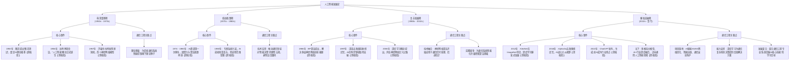

```mermaid
graph TD
    A[人工智能发展史] --> B[萌芽奠基期<br>（1950s - 1970s）]
    A --> C[低谷瓶颈期<br>（1970s - 1980s）]
    A --> D[复苏发展期<br>（1980s - 2010s）]
    A --> E[爆发突破期<br>（2010s - 至今）]
    
    B --> B1[核心事件]
    B1 --> B1a[1950年：图灵提出“图灵测试”，奠定AI理论根基【需核验】]
    B1 --> B1b[1956年：达特茅斯会议，“人工智能”概念正式诞生【需核验】]
    B1 --> B1c[1957年：罗森布拉特发明感知机，首个神经网络模型【需核验】]
    B --> B2[通信工程关联点]
    B2 --> B2a[理论基础：为后续通信系统智能控制埋下理论种子]
    
    C --> C1[核心事件]
    C1 --> C1a[1974 - 1980年：AI遭遇第一次寒冬，因算力与算法瓶颈停滞【需核验】]
    C1 --> C1b[1980年：专家系统兴起，AI迎来短暂复苏，但应用范围受限【需核验】]
    C --> C2[通信工程关联点]
    C2 --> C2a[技术反思：推动通信领域对“智能决策”的理性认知，避免盲目跟风]
    
    D --> D1[核心事件]
    D1 --> D1a[1986年：BP算法提出，解决多层神经网络训练难题【需核验】]
    D1 --> D1b[1997年：深蓝击败国际象棋冠军，AI在博弈领域取得突破【需核验】]
    D1 --> D1c[2006年：深度学习概念提出，开启神经网络复兴之路【需核验】]
    D --> D2[通信工程关联点]
    D2 --> D2a[技术融合：神经网络算法开始应用于通信信号处理、信道估计]
    D2 --> D2b[实践铺垫：为通信系统智能化升级积累算法基础]
    
    E --> E1[核心事件]
    E1 --> E1a[2012年：AlexNet在ImageNet夺冠，深度学习爆发式发展【需核验】]
    E1 --> E1b[2016年：AlphaGo击败围棋冠军，AI进入大众视野【需核验】]
    E1 --> E1c[2022年：ChatGPT发布，生成式AI成为行业焦点【需核验】]
    E1 --> E1d[当下：多模态大模型、AI+行业深度融合，迈向通用人工智能探索【需核验】]
    E --> E2[通信工程关联点]
    E2 --> E2a[场景落地：AI赋能5G/6G网络优化、智能运维、通信安全防护]
    E2 --> E2b[能力支撑：深度学习为通信复杂场景决策提供高效解决方案]
    E2 --> E2c[发展契合：契合通信工程专业“系统掌握AI核心技能”的学习目标]
```