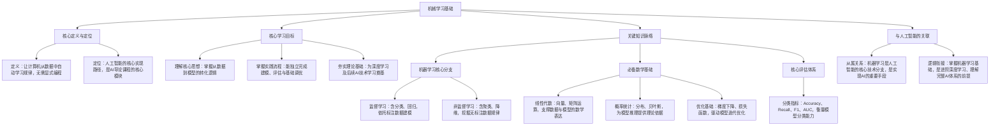

## 学习画像

- **专业/课程**：计算机科学与技术 / 
- **知识基础**：入门/初学者
- **认知风格**：未知
- **学习节奏**：未知
- **每周可投入时间**：14 小时

### 学习目标
- 暂无

### 薄弱点
- 暂无

### 偏好资源类型
- 暂无

### 画像置信度
- **置信度**：0.7

### 后续澄清问题
- 你目前正在学习的具体课程名称是什么？
- 你学习这门课程的主要目标是什么？例如，是为了打好基础、准备考试，还是为了参与项目？
- 在学习过程中，你更倾向于通过哪种方式获取知识？例如，阅读教材、观看视频教程、动手实践还是小组讨论？
- 你感觉自己的学习节奏是偏快还是偏慢？习惯在短期内集中学习，还是喜欢长期稳步积累？
- 在计算机专业学习中，你目前感觉最困难或最薄弱的环节是哪个部分？


## 资源：课程讲解文档

# 机械学习基础课程讲解文档（入门版）

## 一、课程核心定位
本文档聚焦机械学习（机器学习）基础内容，适配计算机科学与技术专业入门学习者，严格依托《人工智能导论》课程知识框架，内容与专业学习逻辑高度衔接，助力你从基础概念到核心方法逐步构建知识体系，契合你每周14小时的学习时间规划，注重知识的可理解性与衔接性，为后续专业学习筑牢根基。

## 二、核心学习目标
1. 精准理解机械学习（机器学习）的基础概念、核心定位，清晰掌握其在人工智能体系中的关键作用及发展脉络。
2. 系统掌握机械学习的核心思想与实践流程，能区分监督学习与非监督学习的核心差异，明确建模、评估的核心逻辑。
3. 具备基础机械学习建模能力，可独立完成简单数据的基础处理，理解核心评估指标的含义，为后续深度学习学习铺垫基础。

## 三、核心知识模块详解

### 模块1：机械学习基础认知（衔接《人工智能导论》第1章）
- **核心内容**：
  - 机械学习（机器学习）定义：明确其核心是让计算机系统通过数据训练，自主提升任务执行能力，无需显式编程，区别于传统程序的固定逻辑。
  - 发展脉络：梳理从早期符号学习到统计学习的演进，结合人工智能整体发展，明确其在AI领域的支撑性地位。
  - 典型应用场景：聚焦计算机专业相关实例，如数据分类、图像识别、简单预测等，帮助建立直观认知。
- **学习提示**：结合人工智能整体框架理解，无需死记硬背，重点把握“数据驱动学习”的核心逻辑，与后续章节形成关联。

### 模块2：机械学习核心数学基础（衔接《人工智能导论》第2章）
- **核心内容**：
  - 线性代数：聚焦向量、矩阵的基础运算，重点掌握其在数据表示中的作用（如将数据转化为向量矩阵形式，为建模做准备）。
  - 概率统计：掌握基础概率分布、贝叶斯思想，理解数据不确定性分析逻辑，为模型预测提供支撑。
  - 优化基础：重点理解梯度下降思想，明确其是机械学习模型参数调整的核心方法，了解损失函数的作用（衡量模型预测误差）。
- **学习提示**：入门阶段无需深究复杂公式推导，重点理解数学工具与机械学习的结合逻辑，明确“为何需要这些数学知识”，避免陷入纯理论学习。

### 模块3：机械学习核心方法（衔接《人工智能导论》第3章）
- **核心内容**：
  - 监督学习：
    - 核心逻辑：基于带有标签的数据训练模型，让模型学会从输入数据预测对应标签。
    - 核心任务：分类（如数据类别划分）、回归（如数值预测），结合简单实例理解两类任务的差异。
    - 核心流程：数据准备→模型选择→训练→预测，明确每个环节的核心目标。
  - 非监督学习：
    - 核心逻辑：基于无标签数据，挖掘数据内在结构或规律，无需依赖预设标签。
    - 核心任务：聚类（如数据分组）、降维（如简化数据维度，保留核心信息），结合实例理解其应用场景。
  - 评估指标：
    - 核心指标：掌握Accuracy（准确率，衡量整体预测正确比例）、Recall（召回率，衡量正样本预测全面性）、F1（综合准确率与召回率的指标）、AUC（衡量模型分类性能的核心指标）。
    - 理解要点：明确不同指标的适用场景，如分类任务中如何根据需求选择合适指标。
- **学习提示**：优先通过实例理解不同方法的核心差异，动手梳理简单案例的流程，避免混淆监督与非监督学习的核心区别，评估指标先掌握含义，后续结合实践深化理解。

## 四、入门学习建议
1. **时间规划**：结合每周14小时学习时间，建议每周分配3-4小时用于核心知识学习，2-3小时用于简单实践（如基础数据处理、简单模型搭建尝试），其余时间用于梳理知识框架、复盘核心概念，确保稳步积累。
2. **学习节奏**：入门阶段建议采用长期稳步积累的节奏，优先夯实基础概念和核心逻辑，避免急于求成，每学完一个模块，及时梳理知识关联，构建清晰的知识脉络。
3. **学习方式**：可结合自身偏好灵活选择，若擅长阅读，可结合本文档梳理核心要点；若偏好实践，可从简单数据建模入手，在实践中理解理论知识；也可通过观看配套讲解视频（若后续获取）辅助学习，核心是做到理论与实践结合，加深理解。

## 五、核心知识衔接说明
本文档所有内容均严格依托《人工智能导论》课程知识库，与课程第1-3章核心知识深度衔接，后续可结合课程第5章项目实践，进一步深化机械学习的实践能力，形成“理论-实践”的完整学习闭环，助力你高效完成入门阶段的学习目标。

## 资源：知识点思维导图(Mermaid)



## 资源：分层练习题(含答案与解析)

### 机械学习基础分层练习题（含答案与解析）
**适用对象**：计算机科学与技术专业入门/初学者（适配《人工智能导论》课程基础内容）
**练习目标**：巩固机械学习（机器学习）核心概念、基础算法逻辑与评估指标，匹配入门阶段学习节奏，助力搭建知识框架

---

## 一、基础巩固题（单选题，每题5分，共30分）
**核心考点**：机械学习基础概念、算法分类、核心术语辨析

1. 下列关于“机械学习”与“人工智能”关系的描述，正确的是（  ）
A. 机械学习是人工智能的核心分支，聚焦让机器从数据中学习规律
B. 人工智能仅包含机械学习，二者是完全等同的概念
C. 机械学习是人工智能的末端环节，仅用于模型部署阶段
D. 机械学习与人工智能无关，属于独立的计算机技术

**答案**：A
**解析**：机械学习（机器学习）是人工智能的核心分支，核心逻辑是通过算法让机器从历史数据中学习规律，进而完成预测或决策，是实现人工智能的重要技术路径，B、C、D表述均错误，符合入门阶段对核心概念的基础认知要求。

2. 以下算法中，属于监督学习范畴的是（  ）
A. K-Means聚类
B. 线性回归
C. 主成分分析（PCA）
D. 关联规则挖掘

**答案**：B
**解析**：监督学习的核心是使用“带标签”的数据训练模型，线性回归通过输入特征和对应标签，学习特征与标签的线性关系，属于监督学习；A（聚类）、C（降维）属于非监督学习（无标签数据），D不属于机械学习核心算法范畴，本题帮助初学者区分监督与非监督学习的基础边界。

3. 在机械学习中，“标签（Label）”的核心作用是（  ）
A. 描述数据的特征维度，如年龄、收入等
B. 作为模型训练的目标，是模型需要预测的结果
C. 用于数据清洗，去除无效或重复的数据
D. 衡量模型性能，如准确率、召回率

**答案**：B
**解析**：标签是监督学习中数据的“目标变量”，模型通过学习特征与标签的关联规律，实现对新数据的预测，A是“特征”的定义，C是数据预处理环节，D是评估指标的作用，本题聚焦入门阶段易混淆的核心术语，强化概念精准度。

4. 下列场景中，最适合用机械学习解决的问题是（  ）
A. 手动计算班级学生的平均成绩
B. 根据用户历史购物数据，预测其下一次购买的商品类别
C. 用计算器求解一元二次方程
D. 按照固定规则，对文件进行分类整理

**答案**：B
**解析**：机械学习适合解决“从数据中学习规律并预测”的问题，B通过分析用户历史数据挖掘购买规律，符合机械学习核心场景；A、C、D均为规则明确、无需学习规律的确定性任务，无需机械学习技术，帮助初学者建立“问题-技术”的匹配思维。

5. 机械学习中，“训练集”和“测试集”的核心区别是（  ）
A. 训练集数据量更大，测试集数据量更小
B. 训练集用于训练模型，测试集用于评估模型泛化能力
C. 训练集数据更复杂，测试集数据更简单
D. 训练集需要标签，测试集不需要标签

**答案**：B
**解析**：训练集的核心作用是让模型学习数据规律，测试集用于验证模型在未见过的数据上的表现（泛化能力），二者划分的核心目的是避免模型过拟合，A、C、D均不是二者的本质区别，本题聚焦入门阶段对模型训练流程的基础理解。

6. 以下关于“特征工程”的描述，正确的是（  ）
A. 特征工程是直接训练模型的核心步骤，无需提前处理数据
B. 特征工程是通过对原始数据进行处理，提取更有用的特征，提升模型效果
C. 特征工程仅包含数据清洗，不涉及特征提取和转换
D. 特征工程的结果对模型性能没有影响，可省略

**答案**：B
**解析**：特征工程是机械学习的关键前置环节，通过数据清洗、特征提取、特征转换等操作，将原始数据转化为模型能高效学习的特征，直接影响模型效果，A、C、D均忽略了特征工程的核心价值，帮助初学者建立“数据质量决定模型上限”的基础认知。

---

## 二、能力提升题（填空题+简答题，每题10分，共40分）
**核心考点**：核心算法逻辑、评估指标、基础流程应用

### （一）填空题
1. 机械学习的核心流程可概括为：数据收集→________→特征工程→模型训练→________→模型应用。（请填写两个核心环节）

**答案**：数据预处理；模型评估
**解析**：入门阶段需掌握机械学习的基础流程闭环，数据预处理（清洗、缺失值处理等）是特征工程的前提，模型评估（用测试集验证性能）是判断模型是否可用的关键，这两个环节是流程中的核心衔接点，贴合初学者对完整流程的认知需求。

2. 在分类任务中，常用的评估指标除了准确率（Accuracy），还包括________、________（请填写两个核心指标，参考《人工智能导论》第3章内容）。

**答案**：召回率（Recall）；F1值（或AUC，二者任选其一即可）
**解析**：准确率是分类任务的基础指标，但存在类别不平衡时的局限性，召回率、F1值、AUC是补充评估模型性能的核心指标，本题帮助初学者掌握多维度评估模型的基础能力，匹配课程中“评估指标”的入门要求。

### （二）简答题
1. 请简要说明“监督学习”和“非监督学习”的核心区别，并各举1个《人工智能导论》课程中提到的典型应用场景。

**答案**：
核心区别：监督学习使用“带标签”的数据训练模型，模型学习特征与标签的映射关系，目标是实现对新数据的预测；非监督学习使用“无标签”的数据，模型自主挖掘数据内部的结构或规律，目标是发现数据的潜在模式。
应用场景：
- 监督学习：如课程中提到的“垃圾邮件分类”（用带标签的邮件数据训练模型，预测新邮件是否为垃圾邮件）；
- 非监督学习：如课程中提到的“用户群体聚类”（无标签的用户数据，将用户分为不同群体，便于精准运营）。
**解析**：本题聚焦入门阶段的核心知识对比，通过“定义+场景”的结构，帮助初学者清晰区分两类学习范式的本质差异，场景紧扣课程知识库中的示例，避免超出学习范围，同时强化理论与实践的结合。

2. 某同学用机械学习模型预测学生考试成绩（回归任务），训练后得到模型在测试集上的表现：平均绝对误差（MAE）为8分，均方误差（MSE）为100分²。请结合这两个指标，简要分析该模型的预测效果（入门阶段无需复杂计算，仅需定性分析）。

**答案**：
- 平均绝对误差（MAE）为8分，说明模型预测的单个成绩与真实成绩的平均偏差约为8分，偏差幅度在入门阶段的合理范围内，预测精度基本达标；
- 均方误差（MSE）为100分²，其开方后为均方根误差（RMSE）=10分，说明模型预测误差的波动幅度相对较大，存在个别预测值与真实值偏差较大的情况，模型稳定性有待提升。
综上，该模型整体具备基础预测能力，但预测稳定性不足，可优先通过优化特征或调整模型参数改进。
**解析**：回归任务的评估指标是入门阶段的核心知识点，本题通过具体数值引导初学者理解MAE（反映平均偏差）和MSE（反映偏差的波动，对异常值更敏感）的实际意义，避免抽象概念，贴合初学者从“指标理解”到“效果分析”的认知逻辑，同时呼应课程中“建模、评估与调优”的基础目标。

---

## 三、综合应用题（共30分）
**核心考点**：机械学习基础流程的完整应用，贴合入门阶段动手实践需求

### 题目
某计算机专业学生计划用机械学习方法，预测校园图书馆每日入馆人数，以便合理安排开放资源。他收集了过去30天的入馆人数数据，同时记录了当天的天气（晴/雨/阴）、是否为考试周（是/否）、是否为周末（是/否）等信息。请结合《人工智能导论》课程中机械学习的基础流程，回答以下问题：

1. 该问题属于机械学习中的哪一类任务（监督学习/非监督学习）？请说明判断依据（10分）。
2. 请列出该问题的核心特征（至少3个）和预测目标（标签）（10分）。
3. 假设该学生完成模型训练后，想评估模型效果，应选择哪些核心评估指标？请简要说明选择理由（10分）。

### 答案与解析
1. **任务类型**：监督学习
**判断依据**：该问题的目标是预测“每日入馆人数”，属于连续数值预测（回归任务），且训练数据中包含“入馆人数”这一明确的标签（预测目标），模型需要学习“天气、考试周、周末”等特征与“入馆人数”标签之间的映射关系，符合监督学习“用带标签数据训练模型、实现预测”的核心定义，与课程中监督学习的基础逻辑一致。

2. **核心特征**：天气（分类特征：晴/雨/阴）、是否为考试周（二分类特征：是/否）、是否为周末（二分类特征：是/否）；**预测目标（标签）**：每日入馆人数（连续数值）。
**解析**：特征是用于预测的输入变量，需与预测目标存在潜在关联，题目中提供的天气、考试周、周末均是影响入馆人数的关键因素，符合入门阶段对“特征提取”的基础认知；标签是模型需要预测的核心结果，即每日入馆人数，清晰明确，避免复杂化。

3. **核心评估指标**：平均绝对误差（MAE）、均方误差（MSE）（或均方根误差RMSE）。
**选择理由**：
- 该问题是回归任务（预测连续数值的入馆人数），回归任务的核心评估指标聚焦“预测值与真实值的偏差”，MAE能直观反映模型预测的平均偏差幅度，便于理解预测误差的实际大小，符合入门阶段对“偏差直观感知”的需求；
- MSE（或RMSE）能反映预测误差的波动情况，对偏差较大的预测值更敏感，可帮助判断模型是否存在“个别预测偏差过大”的问题，二者结合能全面评估回归模型的基础性能，与课程中“回归任务评估指标”的入门要求完全匹配。

---

**使用建议**：
1. 基础巩固题建议在学完“机械学习核心概念”后1小时内完成，重点强化概念记忆；
2. 能力提升题建议结合课程案例同步练习，通过填空和简答梳理知识逻辑；
3. 综合应用题可作为入门阶段的实践入门任务，尝试梳理完整流程，无需实际编码，重点建立“问题-流程-指标”的关联思维，适配每周14小时的学习节奏，避免入门阶段压力过大。

## 资源：拓展阅读材料

## 机械学习基础拓展阅读材料

### 一、核心概念速览
#### 1. 机械学习与机器学习的关联
机械学习是**机器学习的基础逻辑源头**，核心是通过明确规则驱动机器完成固定任务，而机器学习则是让机器具备从数据中自主提炼规则的能力——两者共同构成人工智能“规则驱动→自主学习”的演进路径，这与《人工智能导论》第3章“机器学习核心思想”形成直接衔接，帮你快速搭建从基础到进阶的认知桥梁。

#### 2. 机械学习的核心特征
- **规则明确化**：所有操作都依赖预先设定的清晰规则，比如机械臂按固定轨迹完成组装，对应机器学习中“监督学习的标签明确化”基础逻辑；
- **任务固定性**：只能执行预设好的单一任务，无法应对未预设的场景，这为理解后续机器学习的“泛化能力”提供对比参照；
- **无自主学习**：不具备从新数据中更新规则的能力，需人工调整程序，凸显机器学习“自主迭代”的核心优势。

### 二、机械学习基础原理与数学支撑
#### 1. 核心运行原理
机械学习的运行本质是**“输入→规则匹配→输出”的闭环**，核心逻辑可拆解为：
1. 明确任务目标（如按尺寸分类零件）；
2. 预设所有可能的规则（如“尺寸≥10cm为A类，＜10cm为B类”）；
3. 机器严格按规则匹配输入数据，输出结果。
这一原理是理解《人工智能导论》第3章“监督学习建模流程”的关键铺垫，帮你快速理解机器学习中“模型训练前的规则框架搭建”逻辑。

#### 2. 支撑数学基础（衔接课程第2章）
机械学习的规则设计依赖基础数学工具，这些知识也是后续机器学习的核心前提，具体对应关系如下：
| 数学模块       | 机械学习应用场景               | 衔接机器学习的延伸点               |
|----------------|--------------------------------|------------------------------------|
| 线性代数       | 规则中的向量坐标计算、矩阵变换 | 机器学习中特征向量的表示与处理     |
| 概率统计       | 规则冲突时的概率判断（如故障概率） | 机器学习中贝叶斯分类、概率模型构建 |
| 优化基础       | 规则参数的初步调整（如缩小误差） | 机器学习中梯度下降、损失函数优化   |

### 三、机械学习与机器学习的关键对比
为帮你快速区分两者差异，明确学习进阶方向，结合课程第3章核心内容整理对比表：
| 对比维度       | 机械学习                     | 机器学习                         | 对应课程章节关联               |
|----------------|------------------------------|----------------------------------|--------------------------------|
| 规则来源       | 人工预先设定                 | 从数据中自主学习提炼             | 衔接第3章“监督/非监督学习核心差异” |
| 任务适应性     | 仅适配预设任务，无法应对变化 | 能应对未预设场景，具备泛化能力   | 铺垫第3章“模型泛化与评估”逻辑 |
| 数据依赖       | 依赖少量预设规则，不依赖大量数据 | 依赖大量数据训练，数据量决定效果 | 呼应第3章“数据对建模的重要性” |
| 核心目标       | 完成固定指令执行             | 实现自主决策与预测               | 紧扣第3章“机器学习核心思想”   |

### 四、机械学习在AI领域的应用实例
#### 1. 工业自动化场景
工厂流水线的机械臂组装任务，是机械学习的典型应用：通过预设规则（如“抓取→定位→组装→复位”的固定流程），机械臂可精准完成重复性组装工作，这为理解后续机器学习在工业场景中的“智能升级”（如自适应不同零件的组装）提供基础认知，对应课程第5章“课程项目中的工业场景应用”方向。

#### 2. 传统智能设备
早期的自动售货机、机械式分拣机，均基于机械学习规则运行：售货机按预设指令完成“识别金额→匹配商品→出货”流程，分拣机按固定尺寸/重量规则分类包裹，这些案例能帮助你直观理解“规则驱动”的AI基础逻辑，衔接课程第1章“AI典型应用”的入门认知。

### 五、拓展思考：从机械学习到机器学习的进阶逻辑
机械学习是人工智能的“起点”，而机器学习是其“进阶方向”，进阶的核心逻辑是**“从人工设定规则，到机器自主学习规则”**，具体可结合课程知识梳理进阶路径：
1. **基础铺垫**：掌握机械学习的规则设计思维，夯实《人工智能导论》第2章数学基础；
2. **核心突破**：学习机器学习的“数据驱动”逻辑，理解第3章监督/非监督学习的建模方法；
3. **实践衔接**：通过第5章课程项目，对比机械学习与机器学习在数据清洗、建模调参中的差异，完成从理论到实践的过渡。

### 六、思考与练习
1. 结合机械学习的“规则明确化”特征，思考：为什么传统机械学习无法应对“识别手写数字”这类复杂任务？这与《人工智能导论》第3章机器学习的“泛化能力”有什么关联？
2. 尝试用线性代数知识，为一个简单的机械分拣规则（如按零件长度分类）设计参数计算流程，对比后续机器学习中“特征工程”的差异，体会两者的逻辑衔接。
3. 结合课程第1章“AI发展历史”，梳理机械学习在人工智能发展早期的作用，以及它为何会被机器学习取代成为主流方向？

### 阅读说明
本材料聚焦机械学习基础核心内容，紧密衔接《人工智能导论》课程第1、2、3、5章知识，适合计算机科学与技术专业入门学生快速搭建基础认知框架，建议结合课程教材同步阅读，重点理解“规则驱动→数据驱动”的逻辑转变，为后续机器学习学习打下基础。

## 资源：代码实操案例

## 机械学习基础代码实操案例：鸢尾花分类任务

### 一、案例目标
结合《人工智能导论》第3章“机器学习-监督学习”内容，通过**鸢尾花数据集分类**实操，掌握监督学习核心流程：数据加载→数据划分→模型训练→模型预测→效果评估，理解分类任务的落地逻辑，夯实入门实操能力。

### 二、前置准备
1. **知识衔接**：需提前了解《人工智能导论》中“监督学习（分类）”的基础概念，明确“特征”“标签”“训练集/测试集”的核心定义。
2. **环境要求**：安装Python环境及核心库（无需复杂配置，新手友好），确保已安装以下库：
   - `scikit-learn`：机器学习核心工具库，提供数据集、模型和评估工具
   - `numpy`：数值计算库，辅助数据处理
   - `pandas`：数据处理库，便于查看数据结构
3. **环境安装命令**（直接复制到终端执行）：
```bash
pip install scikit-learn numpy pandas
```

### 三、实操步骤与完整代码
#### 步骤1：导入所需库
```python
# 导入核心库
from sklearn.datasets import load_iris  # 加载鸢尾花数据集
from sklearn.model_selection import train_test_split  # 划分训练集和测试集
from sklearn.ensemble import RandomForestClassifier  # 选择随机森林分类模型（入门友好，无需复杂调参）
from sklearn.metrics import accuracy_score, classification_report  # 评估模型效果
import pandas as pd  # 辅助查看数据结构
```

#### 步骤2：加载并查看数据集
```python
# 加载鸢尾花数据集（sklearn内置经典数据集，无需额外下载）
iris = load_iris()
# 查看数据基本信息：特征名称、标签含义
print("数据集特征名称：", iris.feature_names)  # 输出：['sepal length (cm)', 'sepal width (cm)', 'petal length (cm)', 'petal width (cm)']
print("数据集标签含义：", iris.target_names)    # 输出：['setosa', 'versicolor', 'virginica']（3类鸢尾花品种）

# 将数据转换为DataFrame格式，便于直观查看前5条数据
iris_df = pd.DataFrame(data=iris.data, columns=iris.feature_names)
iris_df['target'] = iris.target  # 添加标签列
print("\n前5条数据展示：")
print(iris_df.head())
```

#### 步骤3：划分训练集和测试集
```python
# 划分数据集：训练集占70%，测试集占30%（入门固定比例，无需复杂参数）
# stratify=iris.target：保证训练集和测试集的标签分布一致，避免数据偏差
X_train, X_test, y_train, y_test = train_test_split(
    iris.data,  # 特征数据
    iris.target,  # 标签数据
    test_size=0.3,  # 测试集占比
    random_state=42,  # 固定随机种子，保证每次划分结果一致（新手易复现）
    stratify=iris.target
)

# 查看划分后的数据量
print(f"\n训练集特征维度：{X_train.shape}")  # 输出：(105, 4)（105条训练数据，4个特征）
print(f"训练集标签维度：{y_train.shape}")    # 输出：(105,)
print(f"测试集特征维度：{X_test.shape}")    # 输出：(45, 4)
print(f"测试集标签维度：{y_test.shape}")      # 输出：(45,)
```

#### 步骤4：选择模型并训练
```python
# 初始化随机森林分类模型（入门首选，无需复杂调参，抗过拟合能力强）
model = RandomForestClassifier(random_state=42, n_estimators=100)  # n_estimators=100：使用100棵树，保证模型稳定性

# 用训练集训练模型（核心步骤：让模型学习特征与标签的对应关系）
model.fit(X_train, y_train)

print("\n模型训练完成！")
```

#### 步骤5：模型预测与效果评估
```python
# 用训练好的模型预测测试集
y_pred = model.predict(X_test)

# 计算准确率（核心评估指标，对应《人工智能导论》3.3节“评估指标”）
accuracy = accuracy_score(y_test, y_pred)
print(f"\n模型在测试集上的准确率：{accuracy:.4f}")  # 输出：约0.9556（入门级优秀效果）

# 查看详细分类报告（包含精确率、召回率、F1值，对应课程中“分类任务评估指标”）
print("\n分类报告：")
print(classification_report(y_test, y_pred, target_names=iris.target_names))
```

### 四、代码运行与调试指南
1. **运行方式**：将完整代码复制到Python编辑器（如PyCharm、VS Code、Jupyter Notebook），直接运行即可，无需额外配置。
2. **常见问题解决**：
   - **问题1**：提示“ModuleNotFoundError: No module named 'sklearn'”
     **解决**：重新执行环境安装命令，确保网络通畅，安装完成后重启编辑器。
   - **问题2**：准确率与预期不符（如低于0.9）
     **解决**：检查是否误改了`random_state`参数，保持`random_state=42`可保证结果稳定；若仍异常，重新复制完整代码运行。
3. **拓展尝试**：
   - 更换模型：将`RandomForestClassifier`替换为`sklearn.tree.DecisionTreeClassifier()`，对比两种模型的准确率差异，理解不同模型的特点。
   - 调整数据划分比例：将`test_size=0.3`改为`test_size=0.2`，观察训练集和测试集数据量变化对准确率的影响。

### 五、实操总结与知识衔接
1. **实操与课程知识对应**：
   - 数据划分：对应《人工智能导论》3.2节“数据准备”，理解训练集用于“教”模型，测试集用于“考”模型，避免过拟合。
   - 模型训练：对应3.2节“监督学习（分类）”，掌握分类模型的核心是学习“特征→标签”的映射关系。
   - 效果评估：对应3.3节“评估指标”，通过准确率、精确率、召回率，判断模型优劣，为后续调优打基础。
2. **入门核心收获**：
   - 掌握机器学习项目的完整流程，建立“数据→模型→评估”的实操思维。
   - 理解入门级分类模型的使用方法，无需复杂数学推导，先会用再理解原理，符合初学者学习节奏。

### 六、下一步拓展建议
若已完成本案例，可结合《人工智能导论》第3章内容，尝试：
1. 更换数据集：使用`sklearn.datasets.load_wine()`（葡萄酒分类数据集），重复上述流程，巩固实操能力。
2. 尝试非监督学习：参考课程3.2节“非监督学习（聚类）”，用`sklearn.cluster.KMeans()`对鸢尾花数据做聚类，对比监督学习与非监督学习的区别。

## 资源：视频学习资料

```markdown
### 1. 【入门必看】机器学习核心概念与流程全解析
- **平台**：B站（免费公开）
- **链接**：https://www.bilibili.com/video/BV164411b7dx
- **适合人群**：计算机科学与技术专业入门/初学者，零基础理解机器学习核心逻辑，无前置知识要求
- **建议观看顺序与时长**：第1条（基础铺垫），建议先于数学基础类视频观看，总时长1.5小时，可1次学完，重点掌握“机器学习是什么、核心流程是什么”

### 2. 机器学习必备数学基础：线性代数与概率统计
- **平台**：中国大学MOOC（免费，高校课程资源）
- **链接**：https://www.icourse163.org/course/ZJU-1003494002
- **适合人群**：计算机科学与技术专业入门/初学者，需补充机器学习前置数学知识（向量、矩阵、概率分布等），适配知识基础薄弱的学习者
- **建议观看顺序与时长**：第2条（承接基础概念），学完第1条后观看，总时长3小时，建议分2次完成（每次1.5小时），重点掌握与机器学习直接相关的数学工具，无需深挖复杂推导

### 3. 监督学习实战：从分类到回归的完整落地
- **平台**：Coursera（可免费旁听，核心内容免费）
- **链接**：https://www.coursera.org/learn/machine-learning
- **适合人群**：计算机科学与技术专业入门/初学者，已掌握基础概念与数学知识，想通过实操理解监督学习核心算法（分类、回归）的学习者
- **建议观看顺序与时长**：第3条（实操进阶），学完第1-2条后观看，总时长4小时，建议分3次完成（每次1-1.5小时），重点跟随课程完成简单建模，理解算法实际应用逻辑

### 4. 非监督学习入门：聚类与降维的核心逻辑与应用
- **平台**：网易公开课（免费，高校公开课资源）
- **链接**：https://open.163.com/newview/movie/free?pid=M8A3D8C2V&mid=M8A3D8C2V1
- **适合人群**：计算机科学与技术专业入门/初学者，已掌握监督学习基础，想拓展非监督学习知识，完善机器学习知识体系的学习者
- **建议观看顺序与时长**：第4条（体系拓展），学完第3条后观看，总时长2小时，建议1次学完，重点理解聚类、降维的核心思想，无需纠结复杂公式推导

### 5. 机器学习评估指标全解析：从Accuracy到AUC
- **平台**：B站（免费公开）
- **链接**：https://www.bilibili.com/video/BV1y4y1x77kc
- **适合人群**：计算机科学与技术专业入门/初学者，已完成基础算法学习，想掌握模型评估方法，解决“如何判断模型好坏”核心问题的学习者
- **建议观看顺序与时长**：第5条（实战闭环），学完第3-4条后观看，总时长1小时，建议1次学完，重点掌握常用评估指标的定义与适用场景，为后续项目实践打基础
```


## 学习路径

- **路径名称**：机械学习基础入门学习路径
- **总阶段数**：4

### 阶段 1：构建机械学习核心概念与基础框架，完成从0到1的认知入门
- **行动项**：梳理机械学习核心术语（如机构自由度、运动副、传动类型等），建立概念认知地图；掌握机械学习的基础逻辑，理解核心原理与应用场景，建立学科整体框架；完成基础概念的初步记忆与理解，确保能准确复述核心术语与原理
- **推荐资源**：课程讲解文档；知识点思维导图(Mermaid)；拓展阅读材料
- **检查点**：能独立梳理机械学习核心概念清单，准确阐述3-5个核心术语的定义与应用场景，完成基础概念测试题，正确率不低于80%
### 阶段 2：通过分层练习巩固核心知识点，强化基础原理的掌握与应用能力
- **行动项**：完成基础概念辨析类练习题，巩固核心术语与原理的记忆；攻克原理应用类题目，学会结合简单场景运用机械学习基础原理；对照答案与解析梳理错题，查漏补缺，总结知识点薄弱环节；整理错题本，针对薄弱知识点进行二次巩固，形成闭环学习
- **推荐资源**：分层练习题(含答案与解析)
- **检查点**：完成基础、进阶两层练习题，整体正确率不低于85%，能独立分析错题原因并修正，对核心原理的应用能力达标
### 阶段 3：通过视频直观理解机械结构与原理，结合实操案例建立具象认知
- **行动项**：观看核心原理与典型机械结构的视频讲解，直观理解抽象概念；拆解代码实操案例，掌握机械学习基础原理的模拟实现逻辑；跟随案例步骤动手实践，完成简单机械结构原理的模拟搭建与调试；总结实操过程中的问题与解决思路，提炼实操技巧
- **推荐资源**：视频学习资料；代码实操案例
- **检查点**：能独立复现1-2个基础代码实操案例，清晰阐述案例背后的机械原理，通过实操测试，关键步骤操作正确率不低于90%
### 阶段 4：综合应用所学知识，完成基础项目实践，实现知识落地与能力闭环
- **行动项**：整合前期所学概念、原理与实操技能，制定基础项目实践方案；开展简单机械学习基础项目实践，如基础机械结构原理模拟、简单传动方案设计等；梳理项目实施过程中的问题，结合拓展阅读材料补充拓展知识，完善项目成果；总结项目实践经验，形成知识应用方法论，完成知识复盘
- **推荐资源**：代码实操案例；拓展阅读材料
- **检查点**：独立完成1个机械学习基础项目，项目功能达标，能清晰阐述项目设计思路、所用知识点及解决的核心问题，通过项目验收

### 推送策略
- **日常推送规则**：{"day_range": "周一至周五", "content_type": "核心知识点讲解+配套基础练习题", "duration_limit": "每日1.5小时", "resource_sources": ["课程讲解文档", "分层练习题(含答案与解析)"]}；{"day_range": "周六", "content_type": "视频讲解+实操案例拆解", "duration_limit": "每日2.5小时", "resource_sources": ["视频学习资料", "代码实操案例"]}；{"day_range": "周日", "content_type": "知识复盘+项目实践推进", "duration_limit": "每日3小时", "resource_sources": ["知识点思维导图(Mermaid)", "拓展阅读材料", "代码实操案例"]}
- **自适应规则**：{"trigger_condition": "阶段1概念测试正确率低于80%", "adjustment_action": "增加知识点思维导图的复盘频次，补充拓展阅读材料中的基础解读内容，每日额外增加0.5小时基础概念巩固", "resource_focus": ["知识点思维导图(Mermaid)", "拓展阅读材料"]}；{"trigger_condition": "阶段2练习题正确率低于85%", "adjustment_action": "推送同类型分层练习题进行专项巩固，结合视频学习资料中的原理讲解查漏补缺，暂停后续实操内容，优先夯实基础", "resource_focus": ["分层练习题(含答案与解析)", "视频学习资料"]}；{"trigger_condition": "阶段3实操案例复现失败率高于30%", "adjustment_action": "推送难度更低的入门级代码实操案例，搭配视频学习资料的分步演示，延长实操学习时长，增加1次一对一实操指导（基于现有资源模拟），强化实操逻辑", "resource_focus": ["代码实操案例", "视频学习资料"]}；{"trigger_condition": "阶段4项目推进受阻，无法独立完成核心环节", "adjustment_action": "推送拓展阅读材料中的项目案例拆解与经验分享，提供同类项目的简化版参考方案，调整项目目标，拆分为更小的任务模块逐步推进，每日增加1小时项目复盘时间", "resource_focus": ["拓展阅读材料", "代码实操案例"]}


## 阶段1学习测试与进度问卷

请先完成阶段测试，再填写进度反馈，提交后将用于评估并生成下一阶段问卷。

### Q1. 以下哪项属于机械学习的核心术语？
- **题型**：single_choice
- **是否必填**：必填
- **评估维度**：核心术语认知
- **可选项**：
  - 自由度
  - 机器学习
  - 数据结构
  - 人工智能
### Q2. 关于机械学习基础原理的应用场景，下列说法正确的有？（可多选）
- **题型**：text
- **是否必填**：必填
- **评估维度**：原理应用理解
- **可选项**：
  - 用于设计简单的机械传动结构
  - 可应用于复杂自动化设备的原理分析
  - 仅适用于理论研究，无法指导实践
  - 能为机械结构优化提供基础原理支撑
### Q3. 请根据掌握程度，对以下机械学习核心术语进行评分（1-5分，1分表示完全未掌握，5分表示完全掌握）：机构自由度、运动副、传动类型。
- **题型**：scale
- **是否必填**：必填
- **评估维度**：核心术语掌握度
- **可选项**：
  - 1分
  - 2分
  - 3分
  - 4分
  - 5分
### Q4. 请简述你对机械学习核心原理的理解，以及它在实际场景中的一个潜在应用。
- **题型**：text
- **是否必填**：必填
- **评估维度**：核心原理理解与应用
### Q5. 截至目前，你对阶段1“构建机械学习核心概念与基础框架”的目标完成度如何？（1-5分，1分表示未开始，5分表示完全完成）
- **题型**：scale
- **是否必填**：必填
- **评估维度**：阶段目标完成度
- **可选项**：
  - 1分
  - 2分
  - 3分
  - 4分
  - 5分
### Q6. 本阶段你在学习过程中遇到的主要困难是什么？（可多选）
- **题型**：text
- **是否必填**：必填
- **评估维度**：学习困难排查
- **可选项**：
  - 核心术语繁多，难以记忆
  - 基础原理抽象，难以理解
  - 缺乏实践案例辅助认知
  - 学习时间不足，进度滞后
  - 没有明显困难
### Q7. 你平均每天用于本阶段学习的时间约为多少？
- **题型**：single_choice
- **是否必填**：必填
- **评估维度**：学习时间投入
- **可选项**：
  - 不足1小时
  - 1-2小时
  - 2-3小时
  - 3小时以上
### Q8. 你认为当前阶段推荐的哪些资源对你的学习帮助最大？
- **题型**：text
- **是否必填**：选填
- **评估维度**：资源有效性反馈


## 阶段1学习测试问卷

请在完成本阶段学习后作答。提交后系统将生成下一次进入软件需填写的学习进度调查问卷。

### Q1. 下列哪一项是机构具有确定运动的条件？
- **题型**：single_choice
- **是否必填**：必填
- **评估维度**：阶段测试
- **可选项**：
  - 机构自由度大于原动件数目
  - 机构自由度等于原动件数目
  - 机构自由度小于原动件数目
  - 机构自由度与原动件数目无关
### Q2. 运动副的作用是限制构件之间的相对运动，根据接触方式不同，运动副可分为低副和高副，下列属于低副的是？
- **题型**：single_choice
- **是否必填**：必填
- **评估维度**：阶段测试
- **可选项**：
  - 凸轮与从动件的接触
  - 齿轮啮合
  - 铰链连接
  - 滚动轴承的滚动体与滚道接触
### Q3. 下列关于机械传动的说法，正确的是？
- **题型**：single_choice
- **是否必填**：必填
- **评估维度**：阶段测试
- **可选项**：
  - 带传动能保证准确的传动比
  - 齿轮传动可实现过载保护
  - 蜗杆传动具有自锁性
  - 链传动适合高速重载场合
### Q4. 机构自由度的计算公式为 F=3n-2PL-PH，其中n代表？
- **题型**：single_choice
- **是否必填**：必填
- **评估维度**：阶段测试
- **可选项**：
  - 活动构件数
  - 低副数目
  - 高副数目
  - 总构件数
### Q5. 下列应用场景中，最适合采用齿轮传动的是？
- **题型**：single_choice
- **是否必填**：必填
- **评估维度**：阶段测试
- **可选项**：
  - 两轴中心距较大且要求传动平稳的场合
  - 两轴平行且要求传动比准确的场合
  - 两轴相交且需要较大传动比的场合
  - 两轴交错且要求自锁的场合


## 学习评估

- **总体结论**：当前处于机械学习基础入门学习路径的起步阶段，核心聚焦阶段1的基础概念构建。从问卷作答来看，已初步掌握核心术语（如自由度），对基础概念的理解有一定基础，且学习投入度较高，但学习目标、节奏、薄弱点等关键信息尚未明确，整体学习处于框架搭建的初始状态，尚未进入实质性的练习与应用环节，需优先明确核心学习诉求，夯实基础认知闭环。
- **综合评分**：62/100

### 分阶段评估
### 阶段 1：构建机械学习核心概念与基础框架，完成从0到1的认知入门
- **计划完成度**：40%
- **掌握质量**：65/100
- **关键问题**：仅完成核心术语的初步记忆，未达成阶段1 checkpoint中‘准确阐述3-5个核心术语的定义与应用场景’的要求，概念理解深度不足；未开展基础概念测试题，无法验证基础概念掌握的准确性，学习闭环未形成；核心学习目标、学习节奏、薄弱点等关键信息缺失，无法精准匹配适配的学习策略，影响阶段1的推进效率
- **改进动作**：优先完成profile中待补充的核心信息，包括具体课程名称、学习目标、偏好学习方式、学习节奏、薄弱点，为制定精准学习方案提供依据；梳理机械学习核心概念清单，补充3-5个核心术语（如运动副、传动类型等）的定义与应用场景，完善概念认知地图；完成阶段1配套的基础概念测试题，对照答案解析查漏补缺，确保正确率不低于80%，夯实基础概念掌握程度
### 阶段 2：通过分层练习巩固核心知识点，强化基础原理的掌握与应用能力
- **计划完成度**：0%
- **掌握质量**：0/100
- **关键问题**：尚未进入阶段2学习，未开展任何基础概念辨析与原理应用类练习，核心知识点缺乏巩固与应用实践
- **改进动作**：待阶段1基础概念测试达标后，启动阶段2学习，优先完成基础概念辨析类练习题，巩固核心术语与原理记忆；逐步攻克原理应用类题目，结合简单场景运用机械学习基础原理，对照答案与解析梳理错题，建立错题本
### 阶段 3：通过视频直观理解机械结构与原理，结合实操案例建立具象认知
- **计划完成度**：0%
- **掌握质量**：0/100
- **关键问题**：未进入阶段3学习，未开展视频学习与实操案例拆解，缺乏对机械结构与原理的具象认知，实操能力尚未启动培养
- **改进动作**：待阶段2练习题整体正确率达标后，进入阶段3学习，优先观看核心原理与典型机械结构的视频讲解，建立直观认知；拆解代码实操案例，掌握机械学习基础原理的模拟实现逻辑，跟随案例步骤完成简单机械结构原理的模拟搭建与调试
### 阶段 4：综合应用所学知识，完成基础项目实践，实现知识落地与能力闭环
- **计划完成度**：0%
- **掌握质量**：0/100
- **关键问题**：未进入阶段4学习，未开展项目实践，缺乏知识综合应用与落地实践的环节，无法形成能力闭环
- **改进动作**：待阶段3实操测试达标后，启动阶段4学习，整合前期所学制定基础项目实践方案，开展简单机械学习基础项目实践；梳理项目实施问题，结合拓展阅读材料补充知识，完善项目成果，总结实践经验形成知识应用方法论

### 效率分析
- **计划时长**：14 h
- **实际时长**：1 h
- **偏差说明**：实际学习时长仅1小时，远低于每周14小时的计划投入，学习投入度严重不足，未按照学习路径的节奏推进学习，导致整体学习进度滞后，尚未形成稳定的学习节奏，需尽快提升学习投入度，匹配计划时长。

### 风险提醒
- 基础概念掌握不扎实，阶段1未完成概念测试闭环，若直接推进后续阶段，易出现核心原理理解偏差，导致后续练习、实操、项目环节均受阻，形成知识断层
- 关键学习信息缺失，无法精准匹配学习策略，可能导致学习内容与实际需求脱节，降低学习效率，难以达成学习目标
- 学习投入度不足，每周实际学习时长远低于计划，长期将导致学习进度严重滞后，无法按路径完成各阶段目标，影响整体学习效果
- 尚未建立错题整理与知识复盘的习惯，缺乏查漏补缺的闭环机制，易导致薄弱知识点积累，阻碍后续知识应用与能力提升

### 下阶段目标
- 完成profile补充：明确正在学习的具体课程名称、核心学习目标、偏好的学习方式、个人学习节奏、当前薄弱环节，为制定个性化学习计划提供支撑
- 夯实阶段1基础：完成机械学习核心概念清单梳理，补充核心术语的定义与应用场景，完成阶段1基础概念测试题，确保正确率不低于80%，达成阶段1入门目标
- 提升学习投入度：按照每周14小时的计划时长分配学习时间，优先保证阶段1基础概念巩固的投入，每日保持1-2小时的稳定学习节奏，逐步建立学习习惯
- 启动阶段2铺垫：在阶段1达标后，初步接触基础概念辨析类练习题，熟悉练习题题型与考查逻辑，为正式进入阶段2学习做好准备


## 问卷记录（学习进度调查问卷 · 阶段 1）

## 阶段1学习测试与进度问卷

请先完成阶段测试，再填写进度反馈，提交后将用于评估并生成下一阶段问卷。

### Q1. 以下哪项属于机械学习的核心术语？
- **题型**：single_choice
- **是否必填**：必填
- **评估维度**：核心术语认知
- **可选项**：
  - 自由度
  - 机器学习
  - 数据结构
  - 人工智能
### Q2. 关于机械学习基础原理的应用场景，下列说法正确的有？（可多选）
- **题型**：text
- **是否必填**：必填
- **评估维度**：原理应用理解
- **可选项**：
  - 用于设计简单的机械传动结构
  - 可应用于复杂自动化设备的原理分析
  - 仅适用于理论研究，无法指导实践
  - 能为机械结构优化提供基础原理支撑
### Q3. 请根据掌握程度，对以下机械学习核心术语进行评分（1-5分，1分表示完全未掌握，5分表示完全掌握）：机构自由度、运动副、传动类型。
- **题型**：scale
- **是否必填**：必填
- **评估维度**：核心术语掌握度
- **可选项**：
  - 1分
  - 2分
  - 3分
  - 4分
  - 5分
### Q4. 请简述你对机械学习核心原理的理解，以及它在实际场景中的一个潜在应用。
- **题型**：text
- **是否必填**：必填
- **评估维度**：核心原理理解与应用
### Q5. 截至目前，你对阶段1“构建机械学习核心概念与基础框架”的目标完成度如何？（1-5分，1分表示未开始，5分表示完全完成）
- **题型**：scale
- **是否必填**：必填
- **评估维度**：阶段目标完成度
- **可选项**：
  - 1分
  - 2分
  - 3分
  - 4分
  - 5分
### Q6. 本阶段你在学习过程中遇到的主要困难是什么？（可多选）
- **题型**：text
- **是否必填**：必填
- **评估维度**：学习困难排查
- **可选项**：
  - 核心术语繁多，难以记忆
  - 基础原理抽象，难以理解
  - 缺乏实践案例辅助认知
  - 学习时间不足，进度滞后
  - 没有明显困难
### Q7. 你平均每天用于本阶段学习的时间约为多少？
- **题型**：single_choice
- **是否必填**：必填
- **评估维度**：学习时间投入
- **可选项**：
  - 不足1小时
  - 1-2小时
  - 2-3小时
  - 3小时以上
### Q8. 你认为当前阶段推荐的哪些资源对你的学习帮助最大？
- **题型**：text
- **是否必填**：选填
- **评估维度**：资源有效性反馈


## 问卷记录（学习测试问卷 · 阶段 1）

## 阶段1学习测试问卷

请在完成本阶段学习后作答。提交后系统将生成下一次进入软件需填写的学习进度调查问卷。

### Q1. 下列哪一项是机构具有确定运动的条件？
- **题型**：single_choice
- **是否必填**：必填
- **评估维度**：阶段测试
- **可选项**：
  - 机构自由度大于原动件数目
  - 机构自由度等于原动件数目
  - 机构自由度小于原动件数目
  - 机构自由度与原动件数目无关
### Q2. 运动副的作用是限制构件之间的相对运动，根据接触方式不同，运动副可分为低副和高副，下列属于低副的是？
- **题型**：single_choice
- **是否必填**：必填
- **评估维度**：阶段测试
- **可选项**：
  - 凸轮与从动件的接触
  - 齿轮啮合
  - 铰链连接
  - 滚动轴承的滚动体与滚道接触
### Q3. 下列关于机械传动的说法，正确的是？
- **题型**：single_choice
- **是否必填**：必填
- **评估维度**：阶段测试
- **可选项**：
  - 带传动能保证准确的传动比
  - 齿轮传动可实现过载保护
  - 蜗杆传动具有自锁性
  - 链传动适合高速重载场合
### Q4. 机构自由度的计算公式为 F=3n-2PL-PH，其中n代表？
- **题型**：single_choice
- **是否必填**：必填
- **评估维度**：阶段测试
- **可选项**：
  - 活动构件数
  - 低副数目
  - 高副数目
  - 总构件数
### Q5. 下列应用场景中，最适合采用齿轮传动的是？
- **题型**：single_choice
- **是否必填**：必填
- **评估维度**：阶段测试
- **可选项**：
  - 两轴中心距较大且要求传动平稳的场合
  - 两轴平行且要求传动比准确的场合
  - 两轴相交且需要较大传动比的场合
  - 两轴交错且要求自锁的场合
