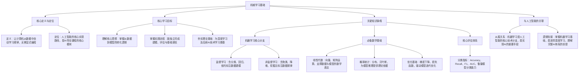

```mermaid
graph TD
    A[机械学习基础] --> B[核心定义与定位]
    A --> C[核心学习目标]
    A --> D[关键知识脉络]
    A --> E[与人工智能的关联]

    B --> B1[定义：让计算机从数据中自动学习规律，无需显式编程]
    B --> B2[定位：人工智能的核心实现路径，是AI导论课程的核心模块]

    C --> C1[理解核心思想：掌握从数据到模型的转化逻辑]
    C --> C2[掌握实践流程：能独立完成建模、评估与基础调优]
    C --> C3[夯实理论基础：为深度学习及后续AI技术学习奠基]

    D --> D1[机器学习核心分支]
    D --> D2[必备数学基础]
    D --> D3[核心评估体系]

    D1 --> D11[监督学习：含分类、回归，依托标注数据建模]
    D1 --> D12[非监督学习：含聚类、降维，挖掘无标注数据规律]
    D2 --> D21[线性代数：向量、矩阵运算，支撑数据与模型的数学表达]
    D2 --> D22[概率统计：分布、贝叶斯，为模型推理提供理论依据]
    D2 --> D23[优化基础：梯度下降、损失函数，驱动模型迭代优化]
    D3 --> D31[分类指标：Accuracy、Recall、F1、AUC，衡量模型分类能力]

    E --> E1[从属关系：机器学习是人工智能的核心技术分支，是实现AI的重要手段]
    E --> E2[逻辑衔接：掌握机器学习基础，是进阶深度学习、理解完整AI体系的前提]
```