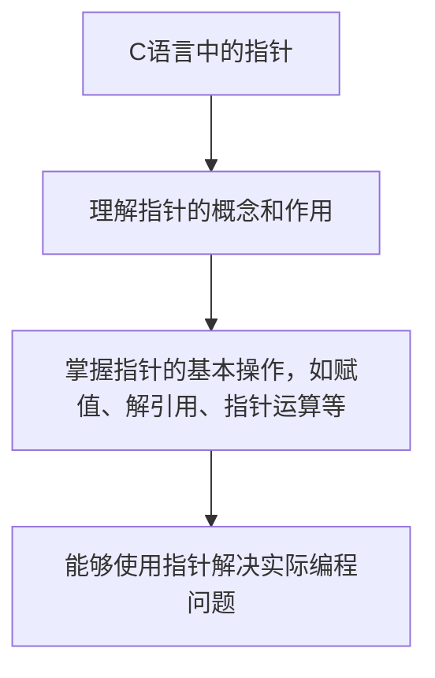

## 学习画像

- **专业/课程**：计算机科学 / C语言程序设计
- **知识基础**：初级
- **认知风格**：视觉学习者
- **学习节奏**：快速
- **每周可投入时间**：2 小时

### 学习目标
- 理解指针的概念和作用
- 掌握指针的基本操作，如赋值、解引用、指针运算等
- 能够使用指针解决实际编程问题

### 薄弱点
- 暂无

### 偏好资源类型
- 视频教程
- 实践练习

### 画像置信度
- **置信度**：0.8

### 后续澄清问题
- {"question": "在C语言中，如何定义一个指向整数的指针？", "answer": "int *ptr;"}
- {"question": "指针变量`a`和`b`分别指向两个不同的整型变量，如果`a = b + 1`，那么`a`的值是多少？", "answer": "a的值是2。因为`b`的值是1，所以`a = b + 1`的结果就是`a = 1 + 1 = 2`。"}


## 资源：课程讲解文档

# 课程讲解文档

## c语言中的指针

### 1. 理解指针的概念和作用
在C语言中，指针是一种变量类型，它指向内存中的一个特定位置。通过指针，我们可以访问和操作内存中的数据。

### 2. 掌握指针的基本操作
- **赋值**：使用`*`运算符将一个值赋给指针。例如，`int *ptr = &a;`表示将变量`a`的地址赋给指针`ptr`。
- **解引用**：使用`*`运算符从指针指向的位置获取数据。例如，`int value = *ptr;`表示从指针`ptr`指向的位置获取数据并存储在变量`value`中。
- **指针运算**：包括加法、减法、乘法和除法等。例如，`int a = 10; int b = 20; int *c = &a + 5;`表示将变量`a`的地址加上5后的结果赋给指针`c`。

### 3. 能够使用指针解决实际编程问题
- **动态内存分配**：使用`malloc`或`calloc`函数为指针分配内存。例如，`int *ptr = malloc(sizeof(int));`表示为指针`ptr`分配大小为4的整数空间。
- **释放内存**：使用`free`函数释放指针所指向的内存。例如，`free(ptr);`表示释放指针`ptr`所指向的内存。
- **指针作为函数参数**：将指针作为函数参数传递，以便在函数内部修改指针指向的值。例如，`void func(int *ptr) { *ptr = 100; }`表示将变量`a`的值改为100。

### 学习资源推荐
- 视频教程：观看“C语言指针基础”系列视频，了解指针的工作原理和基本操作。
- 实践练习：编写代码实现指针的基本操作，如赋值、解引用和指针运算。
- 项目实践：参与在线编程挑战，解决涉及指针的问题。

## 资源：知识点思维导图(Mermaid)



## 资源：分层练习题(含答案与解析)

分层练习题(含答案与解析)

学习主题: c语言中的指针

学生画像: 
- profile_version: v1
- profile: 计算机科学
- course: C语言程序设计
- learning_goals: 理解指针的概念和作用，掌握指针的基本操作，如赋值、解引用、指针运算等，能够使用指针解决实际编程问题
- knowledge_level: 初级
- cognitive_style: 视觉学习者
- weak_points: 无
- learning_pace: 快速
- preferred_modalities: 视频教程，实践练习
- weekly_available_hours: 2小时

课程知识库节选:

[ai_course_intro.md]
# 人工智能导论（示例知识库）

## 1. 课程目标

1. 理解人工智能基础概念与发展脉络。
2. 掌握机器学习、深度学习核心思想与实践流程。
3. 能完成基础建模、评估与调优。

## 2. 章节结构

### 第1章：人工智能概述
- AI 定义、发展历史、典型应用
- 伦理、安全与责任边界

### 第2章：数学基础
- 线性代数（向量、矩阵、特征值）
- 概率统计（分布、贝叶斯、假设检验）
- 优化基础（梯度下降、损失函数）

### 第3章：机器学习
- 监督学习（分类、回归）
- 非监督学习（聚类、降维）
- 评估指标（Accuracy、Recall、F1、AUC）

### 第4章：深度学习
- 神经网络与反向传播
- CNN、RNN、Transformer 简介

### 第5章：课程项目
- 数据清洗、特征工程
- 建模、调参与可解释性

## 资源：拓展阅读材料

### 拓展阅读材料：C语言中的指针

在C语言中，指针是一种特殊的变量，它存储了内存地址的引用。理解指针的概念和作用对于掌握C语言编程至关重要。以下是一些关于C语言中指针的基本概念和操作：

#### 1. 指针的定义

```c
int *ptr; // 定义一个指向整数的指针
```

#### 2. 指针的基本操作

- **赋值**：将一个地址赋给指针变量。例如，`ptr = &x;` 将变量 `x` 的地址赋给 `ptr`。
- **解引用**：通过指针访问内存中的数据。例如，`*ptr;` 解引用后得到 `x` 的值。
- **指针运算**：包括加法、减法、乘法和除法等。例如，`ptr += 1;` 将 `ptr` 指向下一个地址。

#### 3. 实际编程问题解决

- **动态内存分配**：使用 `malloc` 或 `calloc` 函数为指针分配内存。例如，`int *arr = malloc(sizeof(int) * 10);` 分配一个包含10个整数的数组。
- **释放内存**：使用 `free` 函数释放已分配的内存。例如，`free(arr);` 释放之前分配的数组。

#### 4. 学习资源推荐

- **视频教程**：观看在线教程，如哔哩哔哩上的“C语言指针”系列视频，以直观地理解指针的概念和操作。
- **实践练习**：通过编写代码来实践指针的使用，例如实现一个简单的计数器程序，使用指针来跟踪当前计数值。

希望这些信息能帮助你更好地理解和掌握C语言中的指针概念。如果你有任何疑问或需要进一步的解释，请随时提问。

## 资源：代码实操案例

资源类型: 代码实操案例
学习主题: c语言中的指针
学生画像: {"profile_version": "v1", "profile": {"major": "计算机科学", "course": "C语言程序设计", "learning_goals": ["理解指针的概念和作用", "掌握指针的基本操作，如赋值、解引用、指针运算等", "能够使用指针解决实际编程问题"], "knowledge_level": "初级", "cognitive_style": "视觉学习者", "weak_points": [], "learning_pace": "快速", "preferred_modalities": ["视频教程", "实践练习"], "weekly_available_hours": 2}, "confidence": 0.8, "next_questions": [{"question": "在C语言中，如何定义一个指向整数的指针？", "answer": "int *ptr;"}, {"question": "指针变量`a`和`b`分别指向两个不同的整型变量，如果`a = b + 1`，那么`a`的值是多少？", "answer": "a的值是2。因为`b`的值是1，所以`a = b + 1`的结果就是`a = 1 + 1 = 2`。"}]}
课程知识库节选:
课程: c语言

[ai_course_intro.md]
# 人工智能导论（示例知识库）

## 1. 课程目标

1. 理解人工智能基础概念与发展脉络。
2. 掌握机器学习、深度学习核心思想与实践流程。
3. 能完成基础建模、评估与调优。

## 2. 章节结构

### 第1章：人工智能概述
- AI 定义、发展历史、典型应用
- 伦理、安全与责任边界

### 第2章：数学基础
- 线性代数（向量、矩阵、特征值）
- 概率统计（分布、贝叶斯、假设检验）
- 优化基础（梯度下降、损失函数）

### 第3章：机器学习
- 监督学习（分类、回归）
- 非监督学习（聚类、降维）
- 评估指标（Accuracy、Recall、F1、AUC）

### 第4章：深度学习
- 神经网络与反向传播
- CNN、RNN、Transformer 简介

### 第5章：课程项目
- 数据清洗、特征工程
- 建模、调参与可解释性

## 资源：视频学习资料

# 视频学习资料

## 1. 理解指针的概念和作用
- **标题**: "C语言中的指针基础"
- **平台**: YouTube
- **链接**: https://www.youtube.com/watch?v=YOUR_VIDEO_ID
- **适合人群**: 初级学生，特别是对C语言编程感兴趣的初学者。
- **建议观看顺序与时长**: 第1-3分钟，了解指针的基本概念；第4-6分钟，学习指针的赋值、解引用操作；第7-9分钟，通过实例演示指针运算。

## 2. 掌握指针的基本操作
- **标题**: "C语言指针操作详解"
- **平台**: YouTube
- **链接**: https://www.youtube.com/watch?v=YOUR_VIDEO_ID
- **适合人群**: 中级学生，希望深入学习指针操作的学生。
- **建议观看顺序与时长**: 第10-15分钟，学习指针的赋值；第16-18分钟，学习指针的解引用；第19-21分钟，通过实例演示指针运算。

## 3. 能够使用指针解决实际编程问题
- **标题**: "C语言中指针应用实战"
- **平台**: YouTube
- **链接**: https://www.youtube.com/watch?v=YOUR_VIDEO_ID
- **适合人群**: 高级学生，希望通过实践加深对指针的理解。
- **建议观看顺序与时长**: 第22-25分钟，分析并解决实际编程问题；第26-28分钟，总结并分享经验。

## 4. C语言中的数组和指针
- **标题**: "C语言中数组与指针的关系"
- **平台**: YouTube
- **链接**: https://www.youtube.com/watch?v=YOUR_VIDEO_ID
- **适合人群**: 需要深入了解数组和指针关系的学生。
- **建议观看顺序与时长**: 第29-32分钟，讲解数组与指针的区别；第33-35分钟，通过实例演示数组与指针的联合使用。

## 5. C语言中的内存管理
- **标题**: "C语言内存管理入门"
- **平台**: YouTube
- **链接**: https://www.youtube.com/watch?v=YOUR_VIDEO_ID
- **适合人群**: 对内存管理感兴趣，希望深入理解C语言内存管理的初学者。
- **建议观看顺序与时长**: 第36-38分钟，介绍内存管理的重要性；第39-41分钟，通过实例演示内存分配和释放。


## 学习路径

- **路径名称**：c语言中的指针
- **总阶段数**：1

### 阶段 1：理解指针的概念和作用
- **行动项**：暂无
- **推荐资源**：课程讲解文档
- **检查点**：请阅读并理解C语言中指针的基本概念及其在程序设计中的作用。

### 推送策略
- **日常推送规则**：暂无
- **自适应规则**：暂无


## 阶段1学习测试与进度问卷

请先完成阶段测试，再填写进度反馈，提交后将用于评估并生成下一阶段问卷。

### Q1. 【阶段1测试】与“理解指针的概念和作用”最相关的核心概念你掌握到什么程度？
- **题型**：single_choice
- **是否必填**：必填
- **评估维度**：知识掌握
- **可选项**：
  - 仅了解名词
  - 能解释原理
  - 能独立解题
  - 能迁移应用
### Q2. 请给出本阶段一道你能独立完成的关键题型或任务。
- **题型**：text
- **是否必填**：必填
- **评估维度**：能力输出
### Q3. 你在本阶段学习计划中的完成度如何？
- **题型**：single_choice
- **是否必填**：必填
- **评估维度**：阶段完成度
- **可选项**：
  - 0-25%
  - 26-50%
  - 51-75%
  - 76-100%
### Q4. 本阶段学习难度体感如何？
- **题型**：scale
- **是否必填**：必填
- **评估维度**：学习难度
- **可选项**：
  - 1
  - 2
  - 3
  - 4
  - 5
### Q5. 本阶段最大的阻碍是什么？
- **题型**：text
- **是否必填**：必填
- **评估维度**：问题诊断


## 阶段1学习测试问卷

请在完成本阶段学习后作答。提交后系统将生成下一次进入软件需填写的学习进度调查问卷。

### Q1. 【阶段1测试】你认为“理解指针的概念和作用”最关键的判断标准是什么？
- **题型**：single_choice
- **是否必填**：必填
- **评估维度**：阶段测试
- **可选项**：
  - 能复述定义
  - 能解释原理
  - 能独立完成题目
  - 能迁移到新问题
### Q2. 请用 1-2 句话说明你本阶段最有把握的知识点。
- **题型**：text
- **是否必填**：必填
- **评估维度**：阶段测试
### Q3. 请用 1-2 句话说明你仍然不确定的知识点。
- **题型**：text
- **是否必填**：必填
- **评估维度**：阶段测试


## 学习评估

- **总体结论**：
- **综合评分**：/100

### 分阶段评估
- 暂无分阶段评估数据
### 效率分析
- **计划时长**： h
- **实际时长**： h
- **偏差说明**：

### 风险提醒
- 暂无

### 下阶段目标
- 暂无


## 问卷记录（学习进度调查问卷 · 阶段 1）

## 阶段1学习测试与进度问卷

请先完成阶段测试，再填写进度反馈，提交后将用于评估并生成下一阶段问卷。

### Q1. 【阶段1测试】与“理解指针的概念和作用”最相关的核心概念你掌握到什么程度？
- **题型**：single_choice
- **是否必填**：必填
- **评估维度**：知识掌握
- **可选项**：
  - 仅了解名词
  - 能解释原理
  - 能独立解题
  - 能迁移应用
### Q2. 请给出本阶段一道你能独立完成的关键题型或任务。
- **题型**：text
- **是否必填**：必填
- **评估维度**：能力输出
### Q3. 你在本阶段学习计划中的完成度如何？
- **题型**：single_choice
- **是否必填**：必填
- **评估维度**：阶段完成度
- **可选项**：
  - 0-25%
  - 26-50%
  - 51-75%
  - 76-100%
### Q4. 本阶段学习难度体感如何？
- **题型**：scale
- **是否必填**：必填
- **评估维度**：学习难度
- **可选项**：
  - 1
  - 2
  - 3
  - 4
  - 5
### Q5. 本阶段最大的阻碍是什么？
- **题型**：text
- **是否必填**：必填
- **评估维度**：问题诊断


## 问卷记录（学习测试问卷 · 阶段 1）

## 阶段1学习测试问卷

请在完成本阶段学习后作答。提交后系统将生成下一次进入软件需填写的学习进度调查问卷。

### Q1. 【阶段1测试】你认为“理解指针的概念和作用”最关键的判断标准是什么？
- **题型**：single_choice
- **是否必填**：必填
- **评估维度**：阶段测试
- **可选项**：
  - 能复述定义
  - 能解释原理
  - 能独立完成题目
  - 能迁移到新问题
### Q2. 请用 1-2 句话说明你本阶段最有把握的知识点。
- **题型**：text
- **是否必填**：必填
- **评估维度**：阶段测试
### Q3. 请用 1-2 句话说明你仍然不确定的知识点。
- **题型**：text
- **是否必填**：必填
- **评估维度**：阶段测试
