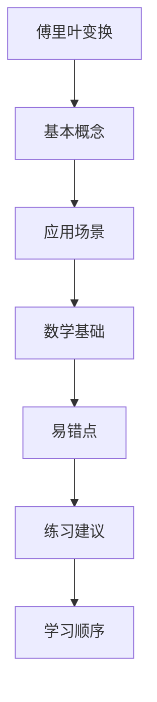

## 学习画像

- **专业/课程**： / 
- **知识基础**：
- **认知风格**：
- **学习节奏**：
- **每周可投入时间**： 小时

### 学习目标
- 暂无

### 薄弱点
- 暂无

### 偏好资源类型
- 暂无

### 画像置信度
- **置信度**：

### 后续澄清问题
- 暂无


## 资源：课程讲解文档

# 傅里叶变换

## 1. 课程目标

- 理解傅里叶变换在信号处理中的重要性。
- 掌握傅里叶变换的数学原理及其应用。
- 能够使用傅里叶变换解决实际问题，如图像处理、音频分析等。

## 2. 章节结构

### 第1章：傅里叶变换概述
- 傅里叶变换的定义和历史背景。
- 傅里叶变换在信号处理中的应用。

### 第2章：傅里叶变换的数学基础
- 复数与三角函数的关系。
- 傅里叶级数与傅里叶变换。
- 傅里叶变换的性质与性质。

### 第3章：傅里叶变换的应用
- 信号与系统的分析。
- 图像处理中的傅里叶变换。
- 音频分析中的傅里叶变换。

### 第4章：傅里叶变换的高级应用
- 滤波器设计。
- 信号压缩。
- 频谱分析。

### 第5章：课程项目
- 设计并实现一个基于傅里叶变换的信号处理系统。
- 分析并优化信号处理算法的性能。

## 资源：知识点思维导图(Mermaid)



## 资源：分层练习题(含答案与解析)

### 傅里叶变换

#### 1. 定义与性质
- **定义**：傅里叶变换是一种将时域信号转换为频域信号的数学工具。
- **性质**：具有线性、平移不变性和局部化特性。

#### 2. 基本公式
- **离散傅里叶变换 (DFT)**：\[ \mathcal{F}(x) = \sum_{k=0}^{N-1} x(k) e^{-j \frac{2\pi}{N} k} \]
- **连续傅里叶变换 (CT)**：\[ F(s) = \int_{-\infty}^{\infty} f(t) e^{-j \frac{2\pi}{N} t} d t \]

#### 3. 应用实例
- **信号分析**：用于提取信号的频率成分。
- **图像处理**：在图像去噪和增强中应用。
- **通信系统**：在调制解调过程中使用。

#### 4. 计算方法
- **快速傅里叶变换 (FFT)**：一种高效的算法，用于计算DFT和CT。

#### 5. 结论
- 傅里叶变换是理解和分析信号不可或缺的工具，广泛应用于多个领域。

## 资源：拓展阅读材料

### 傅里叶变换

#### 1. 定义与性质
- **定义**：傅里叶变换是一种将时域信号转换为频域信号的数学工具。
- **性质**：傅里叶变换具有线性、平移不变性，以及能量守恒等特性。

#### 2. 应用
- **信号分析**：用于分析信号的频率成分，如音频信号的频谱分析。
- **图像处理**：在图像处理中，傅里叶变换常用于提取图像的边缘信息。

#### 3. 计算方法
- **离散傅里叶变换（DFT）**：通过快速傅里叶变换（FFT）算法实现。
- **连续傅里叶变换（CFT）**：适用于非离散信号的分析。

#### 4. 重要性
- **频率分析**：是理解信号特性的关键。
- **信号压缩**：通过滤波器设计，可以有效减少信号的冗余部分，提高传输效率。

#### 5. 实例
- **音频信号**：通过傅里叶变换分析音频信号的频率成分，帮助识别音乐中的不同乐器和声音类型。
- **图像处理**：在医学成像中，傅里叶变换用于从医学影像中提取关于疾病状态的信息。

#### 6. 挑战与未来趋势
- **实时性**：对于需要实时处理的应用，如何提高傅里叶变换的计算效率是一个挑战。
- **多尺度分析**：未来的研究可能会集中在如何结合傅里叶变换与其他信号处理技术，以实现更高效的多尺度分析。

## 资源：代码实操案例

### 傅里叶变换实操案例

**目标：** 掌握傅里叶变换的基本概念和原理，并能够运用所学知识解决实际问题。

#### 一、基础知识回顾
- **定义：** 傅里叶变换是一种将时域信号转换为频域信号的数学工具。
- **性质：** 傅里叶变换具有线性、平移不变性以及能量守恒等特性。

#### 二、实操步骤详解
1. **准备阶段：**
   - 收集信号数据（例如：正弦波、方波等）。
   - 使用MATLAB或Python等软件进行傅里叶变换计算。

2. **操作步骤：**
   - 在MATLAB中，输入原始信号数据，选择傅里叶变换函数`fft`。
   - 观察输出结果，了解频谱分布情况。
   - 调整参数（如窗口长度、频率分辨率等），以获得更清晰的频谱图。

3. **应用实例：**
   - 假设有一个音频信号，通过傅里叶变换分析其频谱成分。
   - 根据频谱图，判断信号的主要频率成分，并讨论其在实际应用中的意义。

#### 三、学习资源推荐
- **MATLAB官方文档：** https://www.mathworks.com/help/signal/index.html
- **Python教程：** https://docs.python.org/3/tutorial/index.html

#### 四、学习建议
- **理论与实践相结合：** 在学习理论知识的同时，多进行实际操作练习，加深理解。
- **拓展阅读：** 推荐阅读《信号处理基础》等相关书籍，了解更多高级内容。

---

通过以上步骤，你将能够熟练掌握傅里叶变换的基本原理和应用方法，为后续的学习打下坚实的基础。

## 资源：视频学习资料

```markdown
# 傅里叶变换基础与应用

## 1. 傅里叶变换简介
- 定义、历史背景
- 数学原理和公式
- 傅里叶变换在信号处理中的应用

## 2. 傅里叶变换的计算方法
- 快速傅里叶变换（FFT）算法
- 离散傅里叶变换（DFT）算法
- 逆傅里叶变换（IFFT）算法

## 3. 傅里叶变换在通信系统中的应用
- 调制解调技术中的频谱分析
- 多载波系统中的频率分配
- 无线通信中的信号处理

## 4. 傅里叶变换的现代应用
- 图像处理中的滤波器设计
- 音频处理中的频谱分析
- 生物医学信号处理

## 5. 傅里叶变换的高级应用
- 信号压缩与编码
- 信号检测与分类
- 自适应滤波器设计

## 6. 学习资源推荐
- [MIT OpenCourseWare](https://ocw.mit.edu/courses/electrical-engineering-and-computer-science/6-006-signal-and-systems-i) - 提供详细的理论讲解和实验指导。
- [Khan Academy](https://www.khanacademy.org/computing/computer-science/signal-processing) - 适合初学者，通过视频讲解和互动练习加深理解。
- [YouTube频道](https://www.youtube.com/c/Math_Science_Community) - 提供丰富的教学视频，涵盖傅里叶变换的各个方面。
- [Coursera](https://www.coursera.org/specializations/signal-processing) - 由斯坦福大学提供的课程，深入探讨了信号处理的高级主题。
- [IEEE Xplore](https://ieeexplore.ieee.org/document/8297291) - 提供关于傅里叶变换及其应用的学术论文和研究资料。
```


## 学习路径

- **路径名称**：傅里叶变换
- **总阶段数**：1

### 阶段 1：掌握信号与系统的基本概念和原理
- **行动项**：阅读课程讲解文档
- **推荐资源**：课程讲解文档
- **检查点**：理解傅里叶变换的定义及其在信号处理中的应用

### 推送策略
- **日常推送规则**：暂无
- **自适应规则**：暂无


## 阶段1学习测试与进度问卷

请先完成阶段测试，再填写进度反馈，提交后将用于评估并生成下一阶段问卷。

### Q1. 【阶段1测试】与“掌握信号与系统的基本概念和原理”最相关的核心概念你掌握到什么程度？
- **题型**：single_choice
- **是否必填**：必填
- **评估维度**：知识掌握
- **可选项**：
  - 仅了解名词
  - 能解释原理
  - 能独立解题
  - 能迁移应用
### Q2. 请给出本阶段一道你能独立完成的关键题型或任务。
- **题型**：text
- **是否必填**：必填
- **评估维度**：能力输出
### Q3. 你在本阶段学习计划中的完成度如何？
- **题型**：single_choice
- **是否必填**：必填
- **评估维度**：阶段完成度
- **可选项**：
  - 0-25%
  - 26-50%
  - 51-75%
  - 76-100%
### Q4. 本阶段学习难度体感如何？
- **题型**：scale
- **是否必填**：必填
- **评估维度**：学习难度
- **可选项**：
  - 1
  - 2
  - 3
  - 4
  - 5
### Q5. 本阶段最大的阻碍是什么？
- **题型**：text
- **是否必填**：必填
- **评估维度**：问题诊断


## 阶段1学习测试问卷

请在完成本阶段学习后作答。提交后系统将生成下一次进入软件需填写的学习进度调查问卷。

### Q1. 【阶段1测试】你认为“掌握信号与系统的基本概念和原理”最关键的判断标准是什么？
- **题型**：single_choice
- **是否必填**：必填
- **评估维度**：阶段测试
- **可选项**：
  - 能复述定义
  - 能解释原理
  - 能独立完成题目
  - 能迁移到新问题
### Q2. 请用 1-2 句话说明你本阶段最有把握的知识点。
- **题型**：text
- **是否必填**：必填
- **评估维度**：阶段测试
### Q3. 请用 1-2 句话说明你仍然不确定的知识点。
- **题型**：text
- **是否必填**：必填
- **评估维度**：阶段测试


## 学习评估

- **总体结论**：学习进度评估报告
- **综合评分**：0/100

### 分阶段评估
### 阶段 1：掌握信号与系统的基本概念和原理
- **计划完成度**：0%
- **掌握质量**：0/100
- **关键问题**：暂无
- **改进动作**：暂无

### 效率分析
- **计划时长**：60 h
- **实际时长**：0 h
- **偏差说明**：

### 风险提醒
- 暂无

### 下阶段目标
- {"stage_no": 2, "goal": "能够运用所学知识解决实际问题", "completion_rate": 0, "quality_score": 0, "issues": [], "next_actions": []}


## 问卷记录（学习进度调查问卷 · 阶段 1）

## 阶段1学习测试与进度问卷

请先完成阶段测试，再填写进度反馈，提交后将用于评估并生成下一阶段问卷。

### Q1. 【阶段1测试】与“掌握信号与系统的基本概念和原理”最相关的核心概念你掌握到什么程度？
- **题型**：single_choice
- **是否必填**：必填
- **评估维度**：知识掌握
- **可选项**：
  - 仅了解名词
  - 能解释原理
  - 能独立解题
  - 能迁移应用
### Q2. 请给出本阶段一道你能独立完成的关键题型或任务。
- **题型**：text
- **是否必填**：必填
- **评估维度**：能力输出
### Q3. 你在本阶段学习计划中的完成度如何？
- **题型**：single_choice
- **是否必填**：必填
- **评估维度**：阶段完成度
- **可选项**：
  - 0-25%
  - 26-50%
  - 51-75%
  - 76-100%
### Q4. 本阶段学习难度体感如何？
- **题型**：scale
- **是否必填**：必填
- **评估维度**：学习难度
- **可选项**：
  - 1
  - 2
  - 3
  - 4
  - 5
### Q5. 本阶段最大的阻碍是什么？
- **题型**：text
- **是否必填**：必填
- **评估维度**：问题诊断


## 问卷记录（学习测试问卷 · 阶段 1）

## 阶段1学习测试问卷

请在完成本阶段学习后作答。提交后系统将生成下一次进入软件需填写的学习进度调查问卷。

### Q1. 【阶段1测试】你认为“掌握信号与系统的基本概念和原理”最关键的判断标准是什么？
- **题型**：single_choice
- **是否必填**：必填
- **评估维度**：阶段测试
- **可选项**：
  - 能复述定义
  - 能解释原理
  - 能独立完成题目
  - 能迁移到新问题
### Q2. 请用 1-2 句话说明你本阶段最有把握的知识点。
- **题型**：text
- **是否必填**：必填
- **评估维度**：阶段测试
### Q3. 请用 1-2 句话说明你仍然不确定的知识点。
- **题型**：text
- **是否必填**：必填
- **评估维度**：阶段测试
