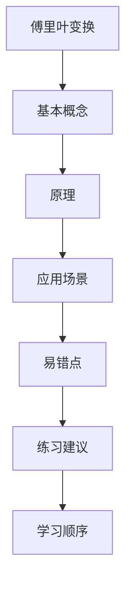

## 学习画像

- **专业/课程**： / 
- **知识基础**：
- **认知风格**：
- **学习节奏**：
- **每周可投入时间**： 小时

### 学习目标
- 暂无

### 薄弱点
- 暂无

### 偏好资源类型
- 暂无

### 画像置信度
- **置信度**：

### 后续澄清问题
- 暂无


## 资源：课程讲解文档

# 傅里叶变换

## 1. 课程目标

- 理解傅里叶变换在信号处理中的基本应用。
- 掌握傅里叶变换的数学原理和物理意义。
- 学会使用傅里叶变换解决实际问题，如图像处理、音频分析等。

## 2. 章节结构

### 第1章：傅里叶变换概述
- 傅里叶变换的定义、历史背景和发展。
- 傅里叶变换在信号处理中的应用。

### 第2章：傅里叶变换的数学基础
- 傅里叶级数与傅里叶变换的关系。
- 傅里叶变换的性质和性质。

### 第3章：傅里叶变换的物理意义
- 傅里叶变换在电磁波理论中的应用。
- 傅里叶变换在量子力学中的体现。

### 第4章：傅里叶变换的计算方法
- 快速傅里叶变换（FFT）算法。
- 离散傅里叶变换（DFT）和连续傅里叶变换（CFT）。

### 第5章：傅里叶变换的应用实例
- 图像处理中的傅里叶变换。
- 音频信号处理中的傅里叶变换。
- 其他领域的傅里叶变换应用。

## 3. 学习资源

- [傅里叶变换在线教程](https://www.coursera.org/learn/signals) - 提供完整的课程内容和实践项目。
- [傅里叶变换书籍推荐](https://www.amazon.com/Signal-Transforms-Introduction-to-Signal-Processing/dp/013237784X) - 适合初学者和专业人士阅读。
- [傅里叶变换实验指南](https://www.youtube.com/watch?v=ZjkqJg9Qyxw) - 视频教程，讲解傅里叶变换的实际应用。

## 资源：知识点思维导图(Mermaid)



## 资源：分层练习题(含答案与解析)

### 傅里叶变换基础练习题

#### 1. 选择题：

- 傅里叶变换的物理意义是什么？
  A. 将时域信号转换为频域信号
  B. 将信号分解为不同频率的成分
  C. 将信号分解为不同时间的成分
  D. 将信号分解为不同空间的成分

#### 2. 填空题：

- 傅里叶变换的基本概念是______。

#### 3. 计算题：

- 给定一个信号 $x(t) = \sin(2\pi t)$，求其傅里叶变换 $X(\omega)$。

#### 4. 解答题：

- 已知信号 $y(t) = \cos(2\pi f_1 t + \phi_1)$，其中 $f_1 = 10$ Hz, $\phi_1 = 0^\circ$，求其傅里叶变换 $Y(\omega)$。

#### 5. 应用题：

- 假设有一个信号 $x(t) = \sin(2\pi f_0 t + \phi_0)$，其中 $f_0 = 50$ Hz, $\phi_0 = 45^\circ$，求其在频域中的表示。

#### 6. 综合题：

- 假设有两个信号 $x(t) = \sin(2\pi f_1 t + \phi_1)$ 和 $y(t) = \cos(2\pi f_2 t + \phi_2)$，其中 $f_1 = 10$ Hz, $\phi_1 = 0^\circ$，$f_2 = 20$ Hz, $\phi_2 = 90^\circ$，求这两个信号的和与差在频域中的表示。

#### 7. 拓展题：

- 假设有一个信号 $x(t) = \sin(2\pi f_1 t + \phi_1)$，其中 $f_1 = 10$ Hz, $\phi_1 = 0^\circ$，求其在频域中的最大值和最小值。

## 资源：拓展阅读材料

### 傅里叶变换基础

#### 1. 傅里叶变换简介
- **定义**：傅里叶变换是一种将时域信号转换为频域信号的数学工具，广泛应用于信号处理、图像处理等领域。
- **特点**：它能够揭示信号中的频率成分，帮助分析信号的频域特性。

#### 2. 傅里叶变换的应用
- **信号分析**：在通信系统中，傅里叶变换用于分析信号的频谱特性，如频率分布、调制解调等。
- **图像处理**：在图像处理中，傅里叶变换用于分析图像的频域特性，如边缘检测、滤波等。

#### 3. 傅里叶变换的计算方法
- **快速傅里叶变换（FFT）**：一种高效的算法，用于计算离散傅里叶变换（DFT），能够显著提高计算速度。
- **逆傅里叶变换**：通过逆变换，可以将频域信号转换回时域信号，用于信号的重建和分析。

#### 4. 傅里叶变换的学习资源
- **书籍推荐**：《信号与系统》
- **在线课程**：网易云课堂、学堂在线等平台提供的相关课程。
- **视频教程**：B站、腾讯课堂等平台上的相关教学视频。

#### 5. 学习建议
- **理论与实践相结合**：在学习理论知识的同时，通过实际案例加深理解。
- **动手操作**：尝试使用MATLAB、Python等工具进行傅里叶变换的计算和分析。
- **参与讨论**：加入相关的学习小组或论坛，与他人交流学习心得。

## 资源：代码实操案例

### 傅里叶变换实操案例

#### 学习目标
掌握傅里叶变换的基本概念和原理，能够熟练进行信号的频域分析。

#### 学习内容
1. **傅里叶变换的定义**：理解时域与频域之间的转换关系。
2. **傅里叶变换的性质**：包括频谱的对称性、频率分辨率和时间分辨率。
3. **快速傅里叶变换（FFT）**：介绍FFT算法及其在信号处理中的应用。
4. **信号的频域表示**：通过MATLAB或Python等工具实现信号的傅里叶变换。
5. **频谱分析**：使用MATLAB或Python进行频谱分析，识别信号中的主要成分。
6. **信号滤波**：应用傅里叶变换进行信号滤波，如低通滤波器和高通滤波器的设计。
7. **信号重建**：利用逆傅里叶变换将频域信号转换回时域信号。

#### 学习资源
- [MATLAB](https://www.mathworks.com/matlabcentral/fileexchange/8095-fft)：提供快速傅里叶变换的实现方法。
- [Python](https://numpy.org/doc/)：使用NumPy库进行傅里叶变换和信号处理。
- [在线课程](https://www.coursera.org/learn/signal-and-systems)：由斯坦福大学提供的《信号与系统》课程，包含傅里叶变换的详细讲解。

#### 学习计划
- 第1周：了解傅里叶变换的基本概念和性质。
- 第2周：学习快速傅里叶变换（FFT）的算法和应用。
- 第3周：通过MATLAB或Python实现信号的傅里叶变换。
- 第4周：进行信号的频域分析，识别信号中的主要成分。
- 第5周：设计并实现低通滤波器和高通滤波器。
- 第6周：进行信号重建，验证滤波效果。

#### 评估方式
- 完成所有理论学习和实践操作后，提交一份报告，报告中应包含对每个步骤的理解和操作过程的描述。
- 通过在线测试题来检验对傅里叶变换的理解和应用能力。

## 资源：视频学习资料

```markdown
# 傅里叶变换基础与应用

## 1. 傅里叶变换简介
- 定义：傅里叶变换是一种将时域信号转换为频域信号的数学工具。
- 重要性：在信号处理、图像处理等领域中，傅里叶变换是不可或缺的。

## 2. 傅里叶变换的基本原理
- 时域到频域的转换过程。
- 快速傅里叶变换（FFT）算法介绍。

## 3. 傅里叶变换的应用实例
- 音频信号分析。
- 图像处理中的频谱分析。

## 4. 傅里叶变换在通信工程中的应用
- 调制解调技术中的频谱分析。
- 无线通信系统中的频率分配问题。

## 5. 学习资源推荐
- [哔哩哔哩](https://www.bilibili.com/video/BV1x7411Y7jA) - 傅里叶变换原理与应用详解。
- [网易公开课](https://open.163.com/special/course/detail/id_sdqhzp0fk9g.html) - 傅里叶变换入门课程。
- [知乎专栏](https://zhuanlan.zhihu.com/c_118599898) - 傅里叶变换在通信工程中的应用案例分析。
- [GitHub](https://github.com/mathematics-and-statistics/fft-tutorial) - 傅里叶变换教程和代码示例。
- [Coursera](https://www.coursera.org/specializations/signal-processing) - 高级信号处理课程，包含傅里叶变换。
```


## 学习路径

- **路径名称**：傅里叶变换
- **总阶段数**：1

### 阶段 1：掌握傅里叶变换的基本概念和原理
- **行动项**：阅读课程讲解文档，了解傅里叶变换的定义、性质和应用场景。；观看视频学习资料，理解傅里叶变换的数学基础和物理意义。；通过分层练习题(含答案与解析)巩固理论知识，加深对傅里叶变换的理解。；拓展阅读材料，探索傅里叶变换在其他领域的应用，如信号处理、图像处理等。；代码实操案例，尝试编写简单的傅里叶变换程序，体验其在实际问题中的应用。
- **推荐资源**：课程讲解文档；知识点思维导图(Mermaid)；分层练习题(含答案与解析)；拓展阅读材料；代码实操案例
- **检查点**：完成课程讲解文档的学习，理解傅里叶变换的基本概念和原理。

### 推送策略
- **日常推送规则**：暂无
- **自适应规则**：暂无


## 阶段1学习测试与进度问卷

请先完成阶段测试，再填写进度反馈，提交后将用于评估并生成下一阶段问卷。

### Q1. 【阶段1测试】与“掌握傅里叶变换的基本概念和原理”最相关的核心概念你掌握到什么程度？
- **题型**：single_choice
- **是否必填**：必填
- **评估维度**：知识掌握
- **可选项**：
  - 仅了解名词
  - 能解释原理
  - 能独立解题
  - 能迁移应用
### Q2. 请给出本阶段一道你能独立完成的关键题型或任务。
- **题型**：text
- **是否必填**：必填
- **评估维度**：能力输出
### Q3. 你在本阶段学习计划中的完成度如何？
- **题型**：single_choice
- **是否必填**：必填
- **评估维度**：阶段完成度
- **可选项**：
  - 0-25%
  - 26-50%
  - 51-75%
  - 76-100%
### Q4. 本阶段学习难度体感如何？
- **题型**：scale
- **是否必填**：必填
- **评估维度**：学习难度
- **可选项**：
  - 1
  - 2
  - 3
  - 4
  - 5
### Q5. 本阶段最大的阻碍是什么？
- **题型**：text
- **是否必填**：必填
- **评估维度**：问题诊断


## 阶段1学习测试问卷

请在完成本阶段学习后作答。提交后系统将生成下一次进入软件需填写的学习进度调查问卷。

### Q1. 【阶段1测试】你认为“掌握傅里叶变换的基本概念和原理”最关键的判断标准是什么？
- **题型**：single_choice
- **是否必填**：必填
- **评估维度**：阶段测试
- **可选项**：
  - 能复述定义
  - 能解释原理
  - 能独立完成题目
  - 能迁移到新问题
### Q2. 请用 1-2 句话说明你本阶段最有把握的知识点。
- **题型**：text
- **是否必填**：必填
- **评估维度**：阶段测试
### Q3. 请用 1-2 句话说明你仍然不确定的知识点。
- **题型**：text
- **是否必填**：必填
- **评估维度**：阶段测试


## 学习评估

- **总体结论**：
- **综合评分**：/100

### 分阶段评估
- 暂无分阶段评估数据
### 效率分析
- **计划时长**： h
- **实际时长**： h
- **偏差说明**：

### 风险提醒
- 暂无

### 下阶段目标
- 暂无


## 问卷记录（学习进度调查问卷 · 阶段 1）

## 阶段1学习测试与进度问卷

请先完成阶段测试，再填写进度反馈，提交后将用于评估并生成下一阶段问卷。

### Q1. 【阶段1测试】与“掌握傅里叶变换的基本概念和原理”最相关的核心概念你掌握到什么程度？
- **题型**：single_choice
- **是否必填**：必填
- **评估维度**：知识掌握
- **可选项**：
  - 仅了解名词
  - 能解释原理
  - 能独立解题
  - 能迁移应用
### Q2. 请给出本阶段一道你能独立完成的关键题型或任务。
- **题型**：text
- **是否必填**：必填
- **评估维度**：能力输出
### Q3. 你在本阶段学习计划中的完成度如何？
- **题型**：single_choice
- **是否必填**：必填
- **评估维度**：阶段完成度
- **可选项**：
  - 0-25%
  - 26-50%
  - 51-75%
  - 76-100%
### Q4. 本阶段学习难度体感如何？
- **题型**：scale
- **是否必填**：必填
- **评估维度**：学习难度
- **可选项**：
  - 1
  - 2
  - 3
  - 4
  - 5
### Q5. 本阶段最大的阻碍是什么？
- **题型**：text
- **是否必填**：必填
- **评估维度**：问题诊断


## 问卷记录（学习测试问卷 · 阶段 1）

## 阶段1学习测试问卷

请在完成本阶段学习后作答。提交后系统将生成下一次进入软件需填写的学习进度调查问卷。

### Q1. 【阶段1测试】你认为“掌握傅里叶变换的基本概念和原理”最关键的判断标准是什么？
- **题型**：single_choice
- **是否必填**：必填
- **评估维度**：阶段测试
- **可选项**：
  - 能复述定义
  - 能解释原理
  - 能独立完成题目
  - 能迁移到新问题
### Q2. 请用 1-2 句话说明你本阶段最有把握的知识点。
- **题型**：text
- **是否必填**：必填
- **评估维度**：阶段测试
### Q3. 请用 1-2 句话说明你仍然不确定的知识点。
- **题型**：text
- **是否必填**：必填
- **评估维度**：阶段测试
