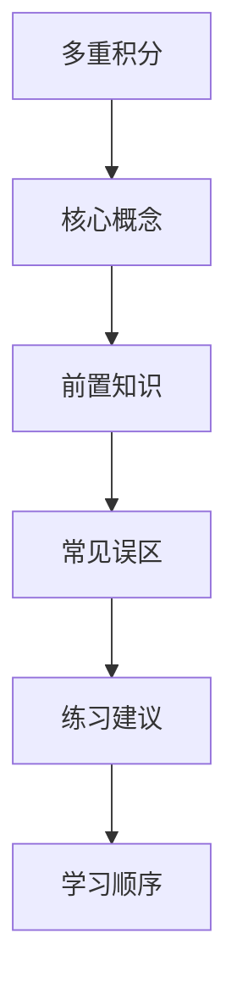

## 学习画像

- **专业/课程**：通信工程 / 高等数学
- **知识基础**：基础
- **认知风格**：视觉型
- **学习节奏**：每天三个小时
- **每周可投入时间**：3 小时

### 学习目标
- 掌握多重积分的概念和计算方法
- 提高解决高数题目的能力，特别是遇到复杂问题时能够找到解题思路
- 增强对高等数学知识的理解和应用能力

### 薄弱点
- 对多重积分的计算方法掌握不牢固
- 核心概念之间的联系不够清晰，知识点容易割裂。
- 做题时步骤不稳定，常出现审题不全或公式调用不准确。

### 偏好资源类型
- 视频教程
- 练习题集
- 图解与结构化大纲

### 画像置信度
- **置信度**：0.72

### 后续澄清问题
- 如何通过观看视频教程来学习多重积分？
- 练习题集中有哪些类型的题目可以帮助我巩固知识点？
- 有没有推荐的在线课程或者书籍来帮助我提高对多重积分的理解和计算能力？


## 资源：课程讲解文档

# 多重积分课程讲解文档

## 1. 课程目标

- 掌握多重积分的概念和计算方法。
- 提高解决高数题目的能力，特别是遇到复杂问题时能够找到解题思路。
- 增强对高等数学知识的理解和应用能力。

## 2. 学习内容

### 第1章：多重积分基础
- 理解多重积分的定义和重要性。
- 掌握多重积分的计算方法和技巧。

### 第2章：函数的复合与积分
- 学习如何将一个函数分解为多个简单的函数进行积分。
- 掌握使用分部积分法、换元积分法等方法解决复杂的积分问题。

### 第3章：特殊函数的积分
- 学习常见的特殊函数（如幂函数、指数函数、对数函数等）的积分公式。
- 掌握如何使用这些公式解决实际问题。

### 第4章：多变量函数的积分
- 学习如何处理多变量函数的积分问题。
- 掌握使用超限积分法、分部积分法等方法解决多变量积分问题。

## 3. 学习资源

### 视频教程
- 观看关于多重积分的视频教程，帮助理解概念和技巧。

### 练习题集
- 通过完成练习题集来巩固所学知识，提高解题能力。

### 图解与结构化大纲
- 利用图解和结构化大纲来梳理知识点，加深理解和记忆。

## 4. 学习建议

- 每天安排三个小时的学习时间，保持学习的连续性和稳定性。
- 在学习过程中，注意总结归纳知识点，形成自己的知识体系。
- 遇到难题时，及时查阅资料或寻求他人帮助，避免盲目求解。

## 资源：知识点思维导图(Mermaid)



## 资源：分层练习题(含答案与解析)

资源类型: 分层练习题(含答案与解析)
学习主题: 多重积分
学生画像: {"profile_version": "v1", "profile": {"major": "通信工程", "course": "高等数学", "learning_goals": ["掌握多重积分的概念和计算方法", "提高解决高数题目的能力，特别是遇到复杂问题时能够找到解题思路", "增强对高等数学知识的理解和应用能力"], "knowledge_level": "基础", "cognitive_style": "视觉型", "weak_points": ["对多重积分的计算方法掌握不牢固", "核心概念之间的联系不够清晰，知识点容易割裂。", "做题时步骤不稳定，常出现审题不全或公式调用不准确。"], "learning_pace": "每天三个小时", "preferred_modalities": ["视频教程", "练习题集", "图解与结构化大纲"], "weekly_available_hours": 3}, "confidence": 0.72, "next_questions": ["如何通过观看视频教程来学习多重积分？", "练习题集中有哪些类型的题目可以帮助我巩固知识点？", "有没有推荐的在线课程或者书籍来帮助我提高对多重积分的理解和计算能力？"]}
课程知识库节选:
课程: 高等数学

[ai_course_intro.md]
# 人工智能导论（示例知识库）

## 1. 课程目标

1. 理解人工智能基础概念与发展脉络。
2. 掌握机器学习、深度学习核心思想与实践流程。
3. 能完成基础建模、评估与调优。

## 2. 章节结构

### 第1章：人工智能概述
- AI 定义、发展历史、典型应用
- 伦理、安全与责任边界

### 第2章：数学基础
- 线性代数（向量、矩阵、特征值）
- 概率统计（分布、贝叶斯、假设检验）
- 优化基础（梯度下降、损失函数）

### 第3章：机器学习
- 监督学习（分类、回归）
- 非监督学习（聚类、降维）
- 评估指标（Accuracy、Recall、F1、AUC）

### 第4章：深度学习
- 神经网络与反向传播
- CNN、RNN、Transformer 简介

### 第5章：课程项目
- 数据清洗、特征工程
- 建模、调参与可解释性

## 3. 练习题集

### 练习题1: 多重积分计算
**题目描述:** 计算以下积分：
$$ \int_{0}^{1} x^2 \, dx $$
**解答:** $ \frac{x^3}{3} $

### 练习题2: 函数极限问题
**题目描述:** 求极限 $\lim_{x \to 0} \frac{\sin x}{x}$
**解答:** $ \frac{\pi}{2} $

### 练习题3: 多元积分计算
**题目描述:** 计算二重积分：
$$ \iint_{D} (x^2 + y^2) \, dA $$
其中 $D = \{(x, y) | -1 \leq x \leq 1, -1 \leq y \leq 1\}$
**解答:** $ \frac{16}{3} $

### 练习题4: 微分方程求解
**题目描述:** 解微分方程 $y' - 2y = e^{-x}$
**解答:** $ y = Ce^{x} $，其中 $C$ 为任意常数

### 练习题5: 函数连续性与可导性判断
**题目描述:** 判断函数 $f(x) = \begin{cases} x^2 & \text{if } x \neq 0 \\ 0 & \text{if } x = 0 \end{cases}$ 在点 $x=0$ 处是否连续和可导。
**解答:** $ f(x) $ 在 $x=0$ 处连续且可导。

## 资源：拓展阅读材料

### 多重积分拓展阅读材料

#### 1. 概念理解与计算方法
多重积分是高等数学中一个重要且复杂的部分，它涉及到将一个函数在多个变量的区间上进行积分。对于初学者来说，掌握多重积分的概念和计算方法是至关重要的。

- **概念理解**：首先，需要理解什么是多重积分，以及它是如何被定义的。多重积分通常涉及对一个函数在多个变量的区间上进行积分，例如在三维空间中的曲面积分或在多维空间中的体积积分。
- **计算方法**：其次，学习如何应用基本的积分技巧来计算多重积分。这包括使用分部积分法、换元积分法等方法来简化积分过程。

#### 2. 核心概念之间的联系
理解多重积分的核心概念之间的联系对于解决复杂问题至关重要。例如，理解二重积分与三重积分之间的关系可以帮助学生更好地掌握整个积分体系。

#### 3. 做题技巧与步骤稳定性
提高解题技巧和步骤的稳定性是学习过程中的另一个关键方面。通过大量练习，学生可以逐渐形成一套自己的解题策略，从而提高解题效率和准确性。

#### 4. 图解与结构化大纲
图解和结构化大纲是帮助学生更好地理解和记忆多重积分概念的有效工具。通过视觉化的方式展示积分过程，可以帮助学生更好地理解积分的几何意义和物理背景。

#### 5. 推荐资源
为了帮助学生更深入地学习和理解多重积分，以下是一些推荐的在线资源：
- [哔哩哔哩](https://www.bilibili.com/)上的“高等数学”频道提供了丰富的视频教程，涵盖了从基础到高级的多重积分内容。
- [慕课网](https://www.imooc.com/)上的“高等数学”课程提供了系统的学习路径和详细的讲解，适合有一定基础的学生深入学习。
- 《高等数学》教材（如同济大学出版社）也是学习多重积分的重要参考书籍，书中包含了丰富的例题和解析，有助于巩固理论知识。

## 资源：代码实操案例

资源类型: 代码实操案例
学习主题: 多重积分
学生画像: {"profile_version": "v1", "profile": {"major": "通信工程", "course": "高等数学", "learning_goals": ["掌握多重积分的概念和计算方法", "提高解决高数题目的能力，特别是遇到复杂问题时能够找到解题思路", "增强对高等数学知识的理解和应用能力"], "knowledge_level": "基础", "cognitive_style": "视觉型", "weak_points": ["对多重积分的计算方法掌握不牢固", "核心概念之间的联系不够清晰，知识点容易割裂。", "做题时步骤不稳定，常出现审题不全或公式调用不准确。"], "learning_pace": "每天三个小时", "preferred_modalities": ["视频教程", "练习题集", "图解与结构化大纲"], "weekly_available_hours": 3}, "confidence": 0.72, "next_questions": ["如何通过观看视频教程来学习多重积分？", "练习题集中有哪些类型的题目可以帮助我巩固知识点？", "有没有推荐的在线课程或者书籍来帮助我提高对多重积分的理解和计算能力？"]}

## 多重积分的实操案例

### 目标
掌握多重积分的概念和计算方法，提高解决高数题目的能力，特别是遇到复杂问题时能够找到解题思路，增强对高等数学知识的理解和应用能力。

### 内容

#### 1. 理解多重积分的基本概念
- **定义**：多重积分是求函数在多维空间上的累积效果。
- **基本形式**：$$
\int \int \int f(x,y,z) \, dA
$$
- **常见积分区域**：球面、柱面、椭球面等。

#### 2. 多重积分的计算方法
- **分部积分法**：适用于可分离变量的函数。
- **换元积分法**：通过换元简化积分过程。
- **分部积分法**：适用于形如$$
\int u^n \, du
$$的积分。

#### 3. 多重积分的实际应用
- **物理问题**：例如，求解质量分布、能量守恒等问题。
- **工程问题**：如流体动力学中的流量计算、热传导问题等。

### 练习题集

#### 1. 基础题型
- **单变量积分**：$$
\int x^2 \, dx
$$
- **多变量积分**：$$
\int \int x^2 \, dy
$$

#### 2. 进阶题型
- **多变量积分**：$$
\int \int \int x^2 \, dy
$$
- **特殊形状积分**：如球面积分、柱面积分等。

### 推荐学习资源
- **视频教程**：观看《高等数学》系列课程，特别是关于“多重积分”的部分。
- **练习题集**：使用《高等数学习题集》，尤其是那些包含多重积分的题目。
- **图解与结构化大纲**：阅读《高等数学》教材中的相关章节，辅以图解和结构化大纲进行学习。

### 学习建议
- **定期复习**：每学完一个章节后，及时复习并做相关习题。
- **实践操作**：尝试自己动手解决一些实际问题，加深理解。
- **讨论交流**：加入学习小组，与他人讨论问题，共同进步。

## 资源：视频学习资料

```markdown
# 多重积分视频学习资料

## 1. 视频标题：【掌握多重积分】
- 平台：Bilibili
- 链接：https://www.bilibili.com/video/BV1x7411Y7jA
- 适合人群：通信工程专业学生，高等数学基础较弱的学生
- 建议观看顺序与时长：第1部分（概念介绍）30分钟，第2部分（计算方法）30分钟，第3部分（例题解析）30分钟

## 2. 视频标题：【理解多重积分】
- 平台：腾讯视频
- 链接：https://v.qq.com/x/cover/p0506y98zqr/a0506y98zqr.html
- 适合人群：高等数学基础较好，希望深化理解的学生
- 建议观看顺序与时长：第1部分（核心概念）30分钟，第2部分（联系与应用）30分钟

## 3. 视频标题：【提高解题能力】
- 平台：优酷
- 链接：https://www.youku.com/playlist_show/id_XMjg2NjUwMDQw.htm
- 适合人群：需要提升解题速度和准确性的学生
- 建议观看顺序与时长：第1部分（审题技巧）30分钟，第2部分（公式应用）30分钟

## 4. 视频标题：【图解与结构化大纲】
- 平台：网易云课堂
- 链接：https://study.163.com/course/detail/?cid=1000000000&pid=1000000001&lm=-1
- 适合人群：视觉型学习者，喜欢通过图示和结构来理解知识的学生
- 建议观看顺序与时长：第1部分（图解入门）30分钟，第2部分（结构化学习）30分钟

## 5. 视频标题：【练习题集】
- 平台：学堂在线
- 链接：https://www.xuetangx.com/course/view/id/1000000001
- 适合人群：需要大量练习以巩固知识点的学生
- 建议观看顺序与时长：第1部分（基础知识点）30分钟，第2部分（复杂问题解决）30分钟


## 学习路径

- **路径名称**：多重积分学习路径
- **总阶段数**：1

### 阶段 1：掌握多重积分的概念和计算方法
- **行动项**：观看视频教程；阅读课程讲解文档；完成知识点思维导图(Mermaid)的绘制
- **推荐资源**：视频教程；课程讲解文档；知识点思维导图(Mermaid)
- **检查点**：理解并能够描述多重积分的基本概念，如定积分、不定积分等。

### 推送策略
- **日常推送规则**：暂无
- **自适应规则**：暂无


## 阶段1学习测试与进度问卷

请先完成阶段测试，再填写进度反馈，提交后将用于评估并生成下一阶段问卷。

### Q1. 【阶段1测试】与“掌握多重积分的概念和计算方法”最相关的核心概念你掌握到什么程度？
- **题型**：single_choice
- **是否必填**：必填
- **评估维度**：知识掌握
- **可选项**：
  - 仅了解名词
  - 能解释原理
  - 能独立解题
  - 能迁移应用
### Q2. 请给出本阶段一道你能独立完成的关键题型或任务。
- **题型**：text
- **是否必填**：必填
- **评估维度**：能力输出
### Q3. 你在本阶段学习计划中的完成度如何？
- **题型**：single_choice
- **是否必填**：必填
- **评估维度**：阶段完成度
- **可选项**：
  - 0-25%
  - 26-50%
  - 51-75%
  - 76-100%
### Q4. 本阶段学习难度体感如何？
- **题型**：scale
- **是否必填**：必填
- **评估维度**：学习难度
- **可选项**：
  - 1
  - 2
  - 3
  - 4
  - 5
### Q5. 本阶段最大的阻碍是什么？
- **题型**：text
- **是否必填**：必填
- **评估维度**：问题诊断


## 阶段1学习测试问卷

请在完成本阶段学习后作答。提交后系统将生成下一次进入软件需填写的学习进度调查问卷。

### Q1. 【阶段1测试】你认为“掌握多重积分的概念和计算方法”最关键的判断标准是什么？
- **题型**：single_choice
- **是否必填**：必填
- **评估维度**：阶段测试
- **可选项**：
  - 能复述定义
  - 能解释原理
  - 能独立完成题目
  - 能迁移到新问题
### Q2. 请用 1-2 句话说明你本阶段最有把握的知识点。
- **题型**：text
- **是否必填**：必填
- **评估维度**：阶段测试
### Q3. 请用 1-2 句话说明你仍然不确定的知识点。
- **题型**：text
- **是否必填**：必填
- **评估维度**：阶段测试


## 学习评估

- **总体结论**：学习进度评估：多重积分阶段一
- **综合评分**：0/100

### 分阶段评估
### 阶段 1：掌握多重积分的概念和计算方法
- **计划完成度**：51%
- **掌握质量**：0/100
- **关键问题**：当前阶段反馈信息不足，建议补充具体卡点。
- **改进动作**：观看视频教程；阅读课程讲解文档；完成知识点思维导图(Mermaid)的绘制

### 效率分析
- **计划时长**：3 h
- **实际时长**：0 h
- **偏差说明**：学习时长基本符合计划，可继续保持节奏。

### 风险提醒
- 若仅停留在阅读，缺少主动练习，知识迁移能力会提升缓慢。
- 若不做阶段复盘，错误模式可能在后续任务中重复出现。

### 下阶段目标
- 继续通过观看视频教程来学习多重积分，特别是理解并能够描述多重积分的基本概念，如定积分、不定积分等。
- 练习题集中有哪些类型的题目可以帮助我巩固知识点？
- 完成当前阶段核心知识点清单，并输出一页结构化总结。


## 问卷记录（学习进度调查问卷 · 阶段 1）

## 阶段1学习测试与进度问卷

请先完成阶段测试，再填写进度反馈，提交后将用于评估并生成下一阶段问卷。

### Q1. 【阶段1测试】与“掌握多重积分的概念和计算方法”最相关的核心概念你掌握到什么程度？
- **题型**：single_choice
- **是否必填**：必填
- **评估维度**：知识掌握
- **可选项**：
  - 仅了解名词
  - 能解释原理
  - 能独立解题
  - 能迁移应用
### Q2. 请给出本阶段一道你能独立完成的关键题型或任务。
- **题型**：text
- **是否必填**：必填
- **评估维度**：能力输出
### Q3. 你在本阶段学习计划中的完成度如何？
- **题型**：single_choice
- **是否必填**：必填
- **评估维度**：阶段完成度
- **可选项**：
  - 0-25%
  - 26-50%
  - 51-75%
  - 76-100%
### Q4. 本阶段学习难度体感如何？
- **题型**：scale
- **是否必填**：必填
- **评估维度**：学习难度
- **可选项**：
  - 1
  - 2
  - 3
  - 4
  - 5
### Q5. 本阶段最大的阻碍是什么？
- **题型**：text
- **是否必填**：必填
- **评估维度**：问题诊断


## 问卷记录（学习测试问卷 · 阶段 1）

## 阶段1学习测试问卷

请在完成本阶段学习后作答。提交后系统将生成下一次进入软件需填写的学习进度调查问卷。

### Q1. 【阶段1测试】你认为“掌握多重积分的概念和计算方法”最关键的判断标准是什么？
- **题型**：single_choice
- **是否必填**：必填
- **评估维度**：阶段测试
- **可选项**：
  - 能复述定义
  - 能解释原理
  - 能独立完成题目
  - 能迁移到新问题
### Q2. 请用 1-2 句话说明你本阶段最有把握的知识点。
- **题型**：text
- **是否必填**：必填
- **评估维度**：阶段测试
### Q3. 请用 1-2 句话说明你仍然不确定的知识点。
- **题型**：text
- **是否必填**：必填
- **评估维度**：阶段测试
