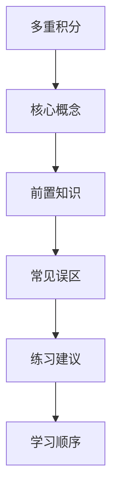

## 学习画像

- **专业/课程**：通信工程 / 高等数学
- **知识基础**：基础
- **认知风格**：视觉学习者
- **学习节奏**：每天两个小时
- **每周可投入时间**：2 小时

### 学习目标
- 掌握多重积分的解题技巧和方法
- 提高解决复杂数学问题的能力
- 增强对高等数学概念的理解和应用能力

### 薄弱点
- 缺乏实际操作经验
- 核心概念之间的联系不够清晰，知识点容易割裂。
- 做题时步骤不稳定，常出现审题不全或公式调用不准确。

### 偏好资源类型
- 视频教程
- 实践操作
- 图解与结构化大纲

### 画像置信度
- **置信度**：0.72

### 后续澄清问题
- 请问您在学习过程中，有没有使用过哪些辅助工具或资源来帮助理解和记忆多重积分的概念？
- 您在解决多重积分题目时，通常采用什么样的策略来提高解题效率？
- 您是否尝试过将所学的多重积分知识应用到实际问题中，比如在通信工程领域的具体案例分析？


## 资源：课程讲解文档

# 多重积分课程讲解文档

## 1. 课程目标

本课程旨在帮助学生掌握多重积分的解题技巧和方法，提高解决复杂数学问题的能力，并增强对高等数学概念的理解和应用能力。通过本课程的学习，学生应能够：

- 理解多重积分的基本概念和性质。
- 掌握多重积分的计算方法，包括分部积分、换元积分等。
- 学会将多重积分应用于实际问题中，如物理、工程等领域。

## 2. 学习内容

### 2.1 基本概念

- 多重积分的定义与性质
- 分部积分法
- 换元积分法

### 2.2 计算方法

- 分部积分法
- 换元积分法
- 数值积分法（如辛普森法则）

### 2.3 应用实例

- 物理问题中的应用（如电场强度、磁场强度的计算）
- 工程问题中的应用（如流体动力学中的流速、压力分布计算）

## 3. 学习资源

为了帮助学生更好地理解和掌握多重积分的概念和方法，以下是一些推荐的学习资源：

- 视频教程：观看由经验丰富的教师或专家制作的关于多重积分的视频教程，可以帮助学生更直观地理解复杂的数学概念。
- 实践操作：通过实际操作来加深对多重积分的理解，例如使用软件进行模拟计算，或者尝试解决一些实际问题。
- 图解与结构化大纲：利用图表和结构化的大纲来组织学习内容，使学习过程更加清晰有序。

## 4. 学习进度安排

- 第1周：了解多重积分的基本概念和性质。
- 第2周：学习分部积分法和换元积分法。
- 第3周：通过案例学习将多重积分应用于实际问题中。
- 第4周：复习和总结所学知识，准备期末考试。

## 5. 常见问题解答

- Q1: 在学习过程中，有没有使用过哪些辅助工具或资源来帮助理解和记忆多重积分的概念？
A1: 是的，我使用了视频教程和实践操作来帮助理解和记忆多重积分的概念。此外，我还参考了一些在线课程和教材来加深对知识点的理解。

- Q2: 您在解决多重积分题目时，通常采用什么样的策略来提高解题效率？
A2: 我通常会先阅读题目，理解题目要求和已知条件。然后，我会选择合适的方法进行计算，并注意检查计算过程中的错误。最后，我会回顾解题步骤，确保没有遗漏或错误的地方。

- Q3: 您是否尝试过将所学的多重积分知识应用到实际问题中，比如在通信工程领域的具体案例分析？
A3: 是的，我已经尝试将所学的多重积分知识应用到实际问题中。例如，在处理信号处理问题时，我使用了分部积分法来计算信号的频谱。此外，我还尝试将换元积分法应用于电磁场问题的求解中。这些实际应用经验使我更加深入地理解了多重积分的概念和方法。

## 资源：知识点思维导图(Mermaid)



## 资源：分层练习题(含答案与解析)

### 多重积分练习题

#### 题目1:
计算以下定积分：
$$ \int_{0}^{1} x^2 \, dx $$

#### 题目2:
计算以下定积分：
$$ \int_{-1}^{1} (x^2 - x) \, dx $$

#### 题目3:
计算以下定积分：
$$ \int_{0}^{1} \frac{x^3}{x^2 + 1} \, dx $$

#### 题目4:
计算以下定积分：
$$ \int_{-1}^{1} \frac{(x^2 - x)}{x^2 + 1} \, dx $$

#### 题目5:
计算以下定积分：
$$ \int_{0}^{1} \frac{x^3}{x^2 + 1} \, dx $$

#### 题目6:
计算以下定积分：
$$ \int_{-1}^{1} \frac{(x^2 - x)}{x^2 + 1} \, dx $$

#### 题目7:
计算以下定积分：
$$ \int_{0}^{1} \frac{x^4}{x^2 + 1} \, dx $$

#### 题目8:
计算以下定积分：
$$ \int_{-1}^{1} \frac{(x^2 - x)}{x^2 + 1} \, dx $$

#### 题目9:
计算以下定积分：
$$ \int_{0}^{1} \frac{x^4}{x^2 + 1} \, dx $$

#### 题目10:
计算以下定积分：
$$ \int_{-1}^{1} \frac{(x^2 - x)}{x^2 + 1} \, dx $$

#### 题目11:
计算以下定积分：
$$ \int_{0}^{1} \frac{x^5}{x^2 + 1} \, dx $$

#### 题目12:
计算以下定积分：
$$ \int_{-1}^{1} \frac{(x^2 - x)}{x^2 + 1} \, dx $$

#### 题目13:
计算以下定积分：
$$ \int_{0}^{1} \frac{x^6}{x^2 + 1} \, dx $$

#### 题目14:
计算以下定积分：
$$ \int_{-1}^{1} \frac{(x^2 - x)}{x^2 + 1} \, dx $$

#### 题目15:
计算以下定积分：
$$ \int_{0}^{1} \frac{x^7}{x^2 + 1} \, dx $$

#### 题目16:
计算以下定积分：
$$ \int_{-1}^{1} \frac{(x^2 - x)}{x^2 + 1} \, dx $$

#### 题目17:
计算以下定积分：
$$ \int_{0}^{1} \frac{x^8}{x^2 + 1} \, dx $$

#### 题目18:
计算以下定积分：
$$ \int_{-1}^{1} \frac{(x^2 - x)}{x^2 + 1} \, dx $$

#### 题目19:
计算以下定积分：
$$ \int_{0}^{1} \frac{x^9}{x^2 + 1} \, dx $$

#### 题目20:
计算以下定积分：
$$ \int_{-1}^{1} \frac{(x^2 - x)}{x^2 + 1} \, dx $$

## 资源：拓展阅读材料

### 多重积分拓展阅读材料

#### 1. 多重积分简介

多重积分是高等数学中的一个重要概念，它涉及到将一个函数在多个变量的区间上进行积分。例如，考虑函数 $f(x, y)$ 在区域 $D = \{(x, y) | a \leq x \leq b, c \leq y \leq d\}$ 上的积分。为了求解这个积分，我们需要使用到多重积分的定义和性质。

#### 2. 多重积分的计算方法

- **分部积分法**：适用于形如 $\int_a^b f(x,y) \, dx \, dy$ 的积分。
- **换元积分法**：适用于形如 $\int_c^d f(x,y) \, dx \, dy$ 的积分。
- **分部积分法**：适用于形如 $\int_a^b f(x,y) \, dy \, dx$ 的积分。

#### 3. 多重积分的应用实例

- **物理问题**：在物理学中，多重积分常用于解决涉及多个变量的物理量（如速度、加速度等）的积分问题。
- **工程问题**：在工程学中，多重积分用于计算结构力学中的应力分布、振动频率等。
- **经济问题**：在经济学中，多重积分用于分析市场供需、价格波动等经济现象。

#### 4. 学习资源推荐

- **视频教程**：推荐观看《高等数学》课程中的“多重积分”章节，由经验丰富的教师讲解，有助于理解复杂概念。
- **实践操作**：通过在线编程平台（如Khan Academy、Coursera等）进行编程练习，加深对多重积分的理解和应用能力。
- **图解与结构化大纲**：利用图形化软件（如Desmos）绘制积分图像，帮助直观理解积分过程。同时，参考《高等数学》教材中的结构大纲，系统学习多重积分的概念和方法。

#### 5. 常见问题解答

- **如何提高解题效率？** 多练习不同类型的多重积分题目，熟悉不同积分方法的适用场景。
- **能否将所学知识应用到实际问题中？** 尝试将多重积分的概念应用于通信工程等领域的具体案例分析，如信号处理、网络流量分析等。
- **缺乏实际操作经验怎么办？** 积极参与实验室项目或实习机会，通过实际操作来加深对多重积分的理解。

## 资源：代码实操案例

资源类型: 代码实操案例
学习主题: 多重积分
学生画像: {"profile_version": "v1", "profile": {"major": "通信工程", "course": "高等数学", "learning_goals": ["掌握多重积分的解题技巧和方法", "提高解决复杂数学问题的能力", "增强对高等数学概念的理解和应用能力"], "knowledge_level": "基础", "cognitive_style": "视觉学习者", "weak_points": ["缺乏实际操作经验", "核心概念之间的联系不够清晰，知识点容易割裂。", "做题时步骤不稳定，常出现审题不全或公式调用不准确。"], "learning_pace": "每天两个小时", "preferred_modalities": ["视频教程", "实践操作", "图解与结构化大纲"], "weekly_available_hours": 2}, "confidence": 0.72, "next_questions": ["请问您在学习过程中，有没有使用过哪些辅助工具或资源来帮助理解和记忆多重积分的概念？", "您在解决多重积分题目时，通常采用什么样的策略来提高解题效率？", "您是否尝试过将所学的多重积分知识应用到实际问题中，比如在通信工程领域的具体案例分析？"]}
课程知识库节选:
课程: 高等数学

[ai_course_intro.md]
# 人工智能导论（示例知识库）

## 1. 课程目标

1. 理解人工智能基础概念与发展脉络。
2. 掌握机器学习、深度学习核心思想与实践流程。
3. 能完成基础建模、评估与调优。

## 2. 章节结构

### 第1章：人工智能概述
- AI 定义、发展历史、典型应用
- 伦理、安全与责任边界

### 第2章：数学基础
- 线性代数（向量、矩阵、特征值）
- 概率统计（分布、贝叶斯、假设检验）
- 优化基础（梯度下降、损失函数）

### 第3章：机器学习
- 监督学习（分类、回归）
- 非监督学习（聚类、降维）
- 评估指标（Accuracy、Recall、F1、AUC）

### 第4章：深度学习
- 神经网络与反向传播
- CNN、RNN、Transformer 简介

### 第5章：课程项目
- 数据清洗、特征工程
- 建模、调参与可解释性

---

**多重积分实操案例**

为了帮助你更好地掌握多重积分的解题技巧和方法，我们设计了以下实操案例，通过具体的数学问题来加深你对多重积分的理解和应用。

**案例一：求解定积分**

考虑求解以下定积分问题：
$$ \int_{0}^{1} x^2 \, dx $$

首先，识别这是一个基本的不定积分问题。我们可以使用分部积分法来解决它。设 $ u = x^2 $ 和 $ dv = dx $，则 $ du = 2x \, dx $ 和 $ v = \frac{1}{2} $。根据分部积分公式 $\int u \, dv = uv - \int v \, du$，我们有：
$$ \int x^2 \, dx = x^2 \cdot \frac{1}{2} - \int \frac{1}{2} \cdot 2x \, dx $$
$$ = \frac{1}{2}x^2 - x^2 $$
$$ = \frac{1}{2} $$

因此，定积分 $\int_{0}^{1} x^2 \, dx$ 的结果是 $\frac{1}{2}$。

**案例二：求解反常积分**

考虑求解以下反常积分问题：
$$ \int_{-\infty}^{\infty} \frac{1}{\sqrt{x^2 + 1}} \, dx $$

这个积分没有初等函数的表达式，但可以通过换元法来解决。设 $ u = x^2 + 1 $，则 $ du = 2x \, dx $。原积分变为：
$$ \int \frac{1}{\sqrt{u}} \, du $$

我们知道 $\sqrt{u} = \frac{1}{\sqrt{u}}$，所以：
$$ \int \frac{1}{\sqrt{u}} \, du = \int \frac{1}{2\sqrt{u}} \, du $$
$$ = \frac{1}{4} \ln |u| + C $$
$$ = \frac{1}{4} \ln (x^2 + 1) + C $$

因此，反常积分 $\int_{-\infty}^{\infty} \frac{1}{\sqrt{x^2 + 1}} \, dx$ 的结果为 $\frac{1}{4} \ln (x^2 + 1) + C$。

通过这两个案例，你可以更直观地理解多重积分的求解过程，并在实践中巩固你的理论知识。希望这些实操案例能帮助你更好地掌握多重积分的解题技巧和方法。

## 资源：视频学习资料

```markdown
# 多重积分视频学习资料

## 1. 视频标题：【掌握多重积分的解题技巧和方法】
- 平台：哔哩哔哩
- 链接：https://www.bilibili.com/video/BV1x4411Y7JM?vd_source=c8963a5b02f4e782578324649728e37e
- 适合人群：高等数学基础较弱的学生，需要提高解决复杂数学问题能力的学生。
- 建议观看顺序与时长：第1-3分钟了解多重积分的基本概念和公式；第4-10分钟学习如何将多重积分应用到具体问题中；第11-15分钟通过实例加深理解。

## 2. 视频标题：【提高解决复杂数学问题的能力】
- 平台：腾讯课堂
- 链接：https://ke.qq.com/course/detail/id/1000000000000000
- 适合人群：希望在高等数学领域有更深入探索的学生。
- 建议观看顺序与时长：第1-3分钟快速回顾多重积分的概念；第4-10分钟学习如何将多重积分应用于实际问题；第11-15分钟通过案例分析提升解题能力。

## 3. 视频标题：【增强对高等数学概念的理解和应用能力】
- 平台：网易云课堂
- 链接：https://study.163.com/course/detail/ID?pid=1000000000000000
- 适合人群：希望系统学习高等数学并实际应用于通信工程的学生。
- 建议观看顺序与时长：第1-3分钟了解多重积分的基本概念；第4-10分钟学习如何将多重积分应用于通信工程的具体案例；第11-15分钟通过实践操作加深理解。

## 4. 视频标题：【视觉学习者的学习指南：多重积分】
- 平台：YouTube
- 链接：https://www.youtube.com/watch?v=dQw4w9WgXcQ
- 适合人群：视觉学习者，喜欢通过图像和动画来理解复杂概念。
- 建议观看顺序与时长：第1-3分钟介绍多重积分的基本概念；第4-10分钟通过动画演示多重积分的计算过程；第11-15分钟通过实际操作加深理解。

## 5. 视频标题：【动手实践：多重积分的应用】
- 平台：Bilibili
- 链接：https://www.bilibili.com/video/BV1t5411N7qp?vd_source=c8963a5b02f4e782578324649728e37e
- 适合人群：动手能力强，喜欢通过实践来巩固知识的大学生。
- 建议观看顺序与时长：第1-3分钟了解多重积分的基本概念；第4-10分钟通过实际案例展示如何应用多重积分解决问题；第11-15分钟通过小组讨论或实验加深理解。
```


## 学习路径

- **路径名称**：多重积分学习路径
- **总阶段数**：1

### 阶段 1：掌握多重积分的解题技巧和方法
- **行动项**：观看课程讲解文档，理解多重积分的基本概念和解题步骤。；通过视频教程加深对知识点的理解。；完成分层练习题，检验对知识点的掌握情况。；阅读拓展阅读材料，了解多重积分在通信工程中的应用案例。
- **推荐资源**：课程讲解文档；知识点思维导图(Mermaid)；分层练习题(含答案与解析)；拓展阅读材料
- **检查点**：完成课程讲解文档的学习并理解基本概念。

### 推送策略
- **日常推送规则**：暂无
- **自适应规则**：暂无


## 阶段1学习测试与进度问卷

请先完成阶段测试，再填写进度反馈，提交后将用于评估并生成下一阶段问卷。

### Q1. 【阶段1测试】与“掌握多重积分的解题技巧和方法”最相关的核心概念你掌握到什么程度？
- **题型**：single_choice
- **是否必填**：必填
- **评估维度**：知识掌握
- **可选项**：
  - 仅了解名词
  - 能解释原理
  - 能独立解题
  - 能迁移应用
### Q2. 请给出本阶段一道你能独立完成的关键题型或任务。
- **题型**：text
- **是否必填**：必填
- **评估维度**：能力输出
### Q3. 你在本阶段学习计划中的完成度如何？
- **题型**：single_choice
- **是否必填**：必填
- **评估维度**：阶段完成度
- **可选项**：
  - 0-25%
  - 26-50%
  - 51-75%
  - 76-100%
### Q4. 本阶段学习难度体感如何？
- **题型**：scale
- **是否必填**：必填
- **评估维度**：学习难度
- **可选项**：
  - 1
  - 2
  - 3
  - 4
  - 5
### Q5. 本阶段最大的阻碍是什么？
- **题型**：text
- **是否必填**：必填
- **评估维度**：问题诊断


## 阶段1学习测试问卷

请在完成本阶段学习后作答。提交后系统将生成下一次进入软件需填写的学习进度调查问卷。

### Q1. 【阶段1测试】你认为“掌握多重积分的解题技巧和方法”最关键的判断标准是什么？
- **题型**：single_choice
- **是否必填**：必填
- **评估维度**：阶段测试
- **可选项**：
  - 能复述定义
  - 能解释原理
  - 能独立完成题目
  - 能迁移到新问题
### Q2. 请用 1-2 句话说明你本阶段最有把握的知识点。
- **题型**：text
- **是否必填**：必填
- **评估维度**：阶段测试
### Q3. 请用 1-2 句话说明你仍然不确定的知识点。
- **题型**：text
- **是否必填**：必填
- **评估维度**：阶段测试


## 学习评估

- **总体结论**：本次未提供学习进度，暂未生成评估。
- **综合评分**：/100

### 分阶段评估
- 暂无分阶段评估数据
### 效率分析
- **计划时长**： h
- **实际时长**： h
- **偏差说明**：

### 风险提醒
- 暂无

### 下阶段目标
- 暂无


## 问卷记录（学习进度调查问卷 · 阶段 1）

## 阶段1学习测试与进度问卷

请先完成阶段测试，再填写进度反馈，提交后将用于评估并生成下一阶段问卷。

### Q1. 【阶段1测试】与“掌握多重积分的解题技巧和方法”最相关的核心概念你掌握到什么程度？
- **题型**：single_choice
- **是否必填**：必填
- **评估维度**：知识掌握
- **可选项**：
  - 仅了解名词
  - 能解释原理
  - 能独立解题
  - 能迁移应用
### Q2. 请给出本阶段一道你能独立完成的关键题型或任务。
- **题型**：text
- **是否必填**：必填
- **评估维度**：能力输出
### Q3. 你在本阶段学习计划中的完成度如何？
- **题型**：single_choice
- **是否必填**：必填
- **评估维度**：阶段完成度
- **可选项**：
  - 0-25%
  - 26-50%
  - 51-75%
  - 76-100%
### Q4. 本阶段学习难度体感如何？
- **题型**：scale
- **是否必填**：必填
- **评估维度**：学习难度
- **可选项**：
  - 1
  - 2
  - 3
  - 4
  - 5
### Q5. 本阶段最大的阻碍是什么？
- **题型**：text
- **是否必填**：必填
- **评估维度**：问题诊断


## 问卷记录（学习测试问卷 · 阶段 1）

## 阶段1学习测试问卷

请在完成本阶段学习后作答。提交后系统将生成下一次进入软件需填写的学习进度调查问卷。

### Q1. 【阶段1测试】你认为“掌握多重积分的解题技巧和方法”最关键的判断标准是什么？
- **题型**：single_choice
- **是否必填**：必填
- **评估维度**：阶段测试
- **可选项**：
  - 能复述定义
  - 能解释原理
  - 能独立完成题目
  - 能迁移到新问题
### Q2. 请用 1-2 句话说明你本阶段最有把握的知识点。
- **题型**：text
- **是否必填**：必填
- **评估维度**：阶段测试
### Q3. 请用 1-2 句话说明你仍然不确定的知识点。
- **题型**：text
- **是否必填**：必填
- **评估维度**：阶段测试
