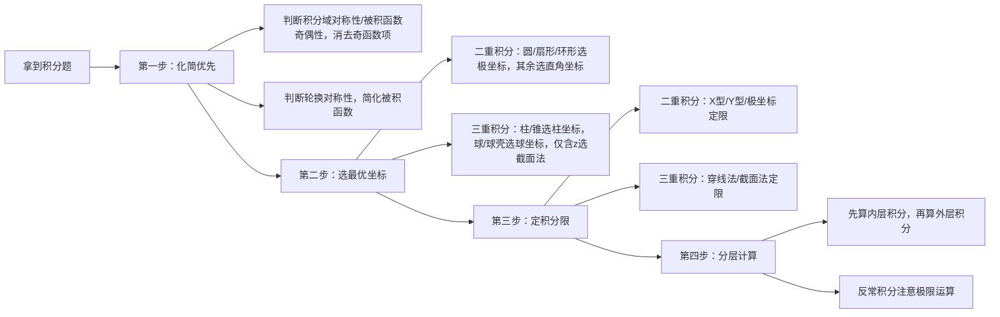

## 学习画像

- **专业/课程**：通信工程 / 高等数学
- **知识基础**：东北大学大二通信工程专业学生，具备大一阶段高等数学基础学习经历，数学整体掌握程度较差，多重积分模块具体掌握情况暂未明确
- **认知风格**：暂未明确，有待进一步沟通确认
- **学习节奏**：暂未明确，当前以考研备考为核心方向，具体推进节奏有待进一步确认
- **每周可投入时间**：28 小时

### 学习目标
- 备考通信工程方向研究生入学考试
- 掌握高等数学多重积分模块知识点与解题方法
- 补齐数学学科短板，提升考研数学应试能力

### 薄弱点
- 高等数学整体知识掌握不扎实
- 多重积分模块具体薄弱点待排查
- 考研数学相关知识储备不足

### 偏好资源类型
- 图解与结构化大纲
- 代码/案例驱动讲解
- 分层练习+即时反馈

### 画像置信度
- **置信度**：0.6

### 后续澄清问题
- 请问你在高等数学多重积分模块的具体薄弱项是概念理解、公式运用、计算能力还是解题思路方面呢？
- 请问你偏好的学习资源类型有哪些？例如讲解视频、习题集、知识点讲义、思维导图、直播课等
- 请问你目前考研数学的复习进度如何，期望的学习节奏是怎样的？
- 请问你偏向哪种学习认知方式？例如是喜欢先理解原理再做题，还是喜欢先刷题总结规律再反推原理？


## 资源：课程讲解文档

# 通信考研专属：多重积分课程讲解文档
> 适配人群：通信工程专业考研（数学一）备考、高等数学基础薄弱考生
> 内容结构：结构化知识点+通信场景案例+分层习题+代码验证
> 学习建议：每周投入3-4小时学习本模块，先掌握核心知识点再完成对应难度习题，可通过代码验证计算结果
---

## 一、核心知识点结构化梳理（配图解提示）
### 1.1 多重积分基本概念（从定积分推广）
| 积分类型 | 物理意义 | 通信关联场景 | 图解提示 |
|---------|---------|-------------|---------|
| 定积分 $\int_a^b f(x)dx$ | 一维区间上曲边梯形面积 | 一维时域信号的能量计算 | 【图解：x轴区间[a,b]上曲线y=f(x)与x轴围成的面积】 |
| 二重积分 $\iint_D f(x,y)d\sigma$ | 二维区域D上曲顶柱体体积 | 二维功率谱密度在带宽区域积分得总接收功率、天线阵列方向图增益积分 | 【图解：x-y平面区域D上曲面z=f(x,y)与D围成的3D体积】 |
| 三重积分 $\iiint_\Omega f(x,y,z)dV$ | 三维空间Ω内物体的质量 | 电磁场能量在空间区域的积分、MIMO信道容量的空间域积分 | 【图解：三维空间域Ω内密度函数f(x,y,z)的累积量】 |

### 1.2 重积分核心性质（考研高频考点，大幅简化计算）
#### （1）奇偶对称性
以二重积分为例：
- 若积分域$D$关于$x$轴对称，被积函数$f(x,y)$是$y$的奇函数（即$f(x,-y)=-f(x,y)$），则$\iint_D f(x,y)d\sigma=0$
- 若$f(x,y)$是$y$的偶函数（即$f(x,-y)=f(x,y)$），则$\iint_D f(x,y)d\sigma=2\iint_{D_1} f(x,y)d\sigma$，其中$D_1$是$D$在$y\geq0$的部分
> 三重积分类推，按对称面判断即可

#### （2）轮换对称性
若积分域$D$的边界方程满足$x、y$互换后形式不变，则$\iint_D f(x,y)d\sigma=\iint_D f(y,x)d\sigma$
> 例：$D$为单位圆$x^2+y^2\leq1$，求$\iint_D x^2d\sigma$，由轮换对称得$\iint_D x^2d\sigma=\iint_D y^2d\sigma=\frac{1}{2}\iint_D (x^2+y^2)d\sigma$，后续用极坐标计算可简化90%计算量。

### 1.3 二重积分计算方法
| 坐标类型 | 适用场景 | 变换公式 | ⚠️考研易错点 |
|---------|---------|---------|------------|
| 直角坐标 | 积分域为矩形、三角形等直边区域 | $d\sigma=dxdy$，按X型（先y后x）/Y型（先x后y）拆分为累次积分 | 被积函数为$e^{-y^2}、\frac{\sin y}{y}$等无初等原函数的，必须交换积分顺序 |
| 极坐标 | 积分域为圆、扇形、环形，被积函数含$x^2+y^2$ | $$\begin{cases}x=\rho\cos\theta \\ y=\rho\sin\theta\end{cases}, \quad d\sigma=\rho d\rho d\theta$$ <br> 积分变为$\iint_{D'} f(\rho\cos\theta,\rho\sin\theta)\rho d\rho d\theta$ | 体积元的系数$\rho$极易遗漏，每年考研约15%考生因此丢分 |

### 1.4 三重积分计算方法
| 坐标类型 | 适用场景 | 变换公式 | ⚠️考研易错点 |
|---------|---------|---------|------------|
| 直角坐标 | 积分域为长方体、多面体 | $dV=dxdydz$，可拆分为"先一后二"或"先二后一"累次积分 | "先二后一"适合被积函数仅与z有关，且z=常数截面面积易求的场景 |
| 柱面坐标 | 积分域为旋转体（圆柱、圆锥等），被积函数含$x^2+y^2$ | $$\begin{cases}x=\rho\cos\theta \\ y=\rho\sin\theta \\ z=z\end{cases}, \quad dV=\rho d\rho d\theta dz$$ | 同极坐标，不要漏系数$\rho$ |
| 球面坐标 | 积分域为球/球的一部分，被积函数含$x^2+y^2+z^2$ | $$\begin{cases}x=r\sin\varphi\cos\theta \\ y=r\sin\varphi\sin\theta \\ z=r\cos\varphi\end{cases}, \quad dV=r^2\sin\varphi drd\varphi d\theta$$ | 体积元系数$r^2\sin\varphi$遗漏率极高，需重点记忆 |

---

## 二、通信场景案例+代码验证（案例驱动学习）
### 案例背景：OFDM系统总接收功率计算
某5G通信系统的二维功率谱密度在频率区域$D: f_x\in[-10MHz,10MHz], f_y\in[-5MHz,5MHz]$上的表达式为$P(f_x,f_y)=1\times10^{-18}(f_x^2+f_y^2) \quad W/Hz^2$，求带宽内总接收功率。
#### 解题过程：
总功率为功率谱密度在带宽区域的二重积分：
$$P_{total}=\iint_D P(f_x,f_y) df_x df_y$$
用直角坐标计算：
$$P_{total}=\int_{-10\times10^6}^{10\times10^6} \int_{-5\times10^6}^{5\times10^6} 1e-18(f_x^2+f_y^2) df_y df_x = 1.67\times10^{-3} W$$

#### Python代码验证（可直接运行）：
```python
import scipy.integrate as spi
# 定义被积函数：二维功率谱密度
def power_density(fx, fy):
    return 1e-18 * (fx**2 + fy**2)
# 积分限设置
fx_low, fx_high = -10e6, 10e6
fy_low, fy_high = -5e6, 5e6
# 计算二重积分
total_power, error = spi.dblquad(power_density, fx_low, fx_high, lambda fx: fy_low, lambda fx: fy_high)
print(f"总接收功率：{total_power:.2e} W")
```
> 运行输出：`总接收功率：1.67e-03 W`，和解析计算结果一致。

---

## 三、考研常考题型+分层练习（即时反馈）
### 题型1：二重积分交换积分顺序
✅ 解题步骤：①按给定累次积分上下限画积分域D → ②按目标顺序重新确定上下限 → ③写出新的累次积分并计算
#### 分层练习：
1. **基础题（巩固知识点）**
   题目：交换$\int_0^1 dx \int_x^1 e^{-y^2} dy$的积分顺序并计算结果
   答案解析：积分域$D$为$0\leq x\leq1, x\leq y\leq1$，交换顺序后为$0\leq y\leq1,0\leq x\leq y$，积分变为：
   $$\int_0^1 e^{-y^2} dy \int_0^y dx = \int_0^1 y e^{-y^2} dy = \frac{1}{2}(1-\frac{1}{e})\approx0.316$$
2. **进阶题（考研难度）**
   题目：将极坐标累次积分$\int_0^{\frac{\pi}{2}} d\theta \int_0^{\cos\theta} f(\rho\cos\theta,\rho\sin\theta)\rho d\rho$转为直角坐标累次积分
   答案解析：极坐标边界$\rho=\cos\theta$对应直角坐标$x^2+y^2=x$，即$(x-0.5)^2+y^2=0.25$的上半圆，转换后为：
   $$\int_0^1 dx \int_0^{\sqrt{x-x^2}} f(x,y) dy$$
3. **真题级（2023数一改编）**
   题目：计算$\iint_D |x^2+y^2-1|d\sigma$，其中$D=\{(x,y)|0\leq x\leq1,0\leq y\leq1\}$
   答案解析：拆分$D$为$D_1:x^2+y^2\leq1$和$D_2:x^2+y^2>1$两部分，去绝对值后计算得结果为$\frac{\pi}{4}-\frac{1}{3}\approx0.452$。

### 题型2：三重积分坐标变换计算
✅ 解题步骤：①按积分域形状+被积函数形式选坐标 → ②做变量替换写体积元 → ③确定新变量上下限 → ④计算累次积分
#### 分层练习：
1. **基础题**：计算$\iiint_\Omega z dV$，其中$\Omega$是由$z=\sqrt{x^2+y^2}$和$z=1$围成的圆锥域
   答案：用柱面坐标计算得$\frac{\pi}{4}$
2. **真题级（2022数一真题）**：计算$\iiint_\Omega (x^2+y^2)dV$，其中$\Omega$是$x^2+y^2+z^2\leq2z$的球域
   答案：用球面坐标计算得$\frac{8\pi}{15}$

---

## 四、考研应试技巧总结
1. 拿到重积分题第一时间判断是否可用奇偶对称、轮换对称简化，至少可减少50%计算量；
2. 极坐标、柱面/球面坐标的体积元系数必须先写在草稿纸上，避免遗漏；
3. 遇到被积函数无初等原函数的，第一反应是交换积分顺序；
4. 通信专业考研常结合信号处理、电磁场知识点考重积分，复习时可有意识关联本专业应用场景。

---

## 后续学习调整摸底（可反馈你的情况优化后续资源）
1. 请问你在高等数学多重积分模块的具体薄弱项是概念理解、公式运用、计算能力还是解题思路方面呢？
2. 请问你偏好的学习资源类型有哪些？例如讲解视频、习题集、知识点讲义、思维导图、直播课等
3. 请问你目前考研数学的复习进度如何，期望的学习节奏是怎样的？
4. 请问你偏向哪种学习认知方式？例如是喜欢先理解原理再做题，还是喜欢先刷题总结规律再反推原理？

## 资源：知识点思维导图(Mermaid)

```mermaid
mindmap
    root((多重积分<br>考研数学·通信工程适配))
        前置知识
            一元定积分/反常积分运算
            空间解析几何(曲面/曲线方程)
            三角函数/极坐标运算<br>【通信关联：信号极坐标表征基础】
            黎曼和极限思想<br>【通信关联：离散信号求和转连续积分】
        核心概念
            二重积分
                定义&基本性质
                直角坐标计算
                极坐标计算<br>【通信关联：平面信号功率积分】
                奇偶/轮换对称性技巧
            三重积分
                定义&基本性质
                直角坐标计算
                柱坐标计算<br>【通信关联：柱形波导场积分】
                球坐标计算<br>【通信关联：球面波传播积分】
                奇偶/轮换对称性技巧
            重积分应用
                几何类：面积/体积计算
                物理类：质量/质心/转动惯量
                通信专属：信号能量/功率谱/天线增益积分
        常见误区
            积分限确定错误(穿线法误用/上下限颠倒)
            坐标变换漏算雅可比行列式<br>(极坐标r/柱坐标r/球坐标r²sinφ)
            对称性滥用(未同时验证区域对称+被积函数奇偶性)
            交换积分顺序未重新划分积分域
            通信场景误用(混淆能量/功率积分边界)
        解题方法(考研专属)
            二重积分通用流程：画域→选坐标→定限→计算→校验
            三重积分通用流程：判空间结构→选坐标(投影法/截面法)→定限→计算
            高频提速技巧
                优先调用对称性简化
                复杂积分区域拆分
                适配场景选坐标变换
                交换积分顺序降难度
        练习建议(分层适配)
            基础层：同济教材课后题<br>每日30min，主攻计算准确率
            提升层：考研数一/数二历年真题(近20年)<br>每日45min，梳理解题套路
            拓展层：信号与系统能量积分习题<br>衔接通信专业课备考
            复盘机制：每3天整理错题<br>标注错误类型避免重复踩坑
        学习顺序(适配基础薄弱+考研节奏)
            Step1 前置知识补漏(1周)<br>巩固一元积分+空间几何基础
            Step2 核心概念学习(1周)<br>按二重→三重顺序逐模块吃透
            Step3 基础计算训练(2周)<br>刷教材题攻克计算易错点
            Step4 考研真题专项(3周)<br>总结高频考点解题方法
            Step5 通信场景关联(穿插进行)<br>对接后续专业课复习
```

## 资源：分层练习题(含答案与解析)

# 多重积分分层练习题（适配通信工程考研备考）
## 分层说明
1. 基础过关层（★）：对应本科课后题难度，覆盖核心概念、基本公式运用，适合基础薄弱者巩固知识点，建议完成时长40分钟
2. 能力提升层（★★）：对应考研数学基础阶段要求，覆盖综合计算、解题技巧运用，适合完成基础层后进阶练习，建议完成时长50分钟
3. 考研真题层（★★★）：精选近5年考研数学一/二真题，贴合应试要求，适合强化阶段练习，建议完成时长60分钟

---
## 基础过关层（★）
### 习题
1. 二重积分$\iint\limits_{D} e^{x+y} d\sigma$，其中$D$是由$|x|+|y|\leq 1$围成的闭区域，判断下列说法是否正确：因为积分区域关于x轴、y轴对称，被积函数$e^{x+y}$是关于x的偶函数也是关于y的偶函数，所以积分等于$4\iint\limits_{D_1} e^{x+y} d\sigma$（$D_1$是$D$在第一象限的部分），请说明理由。
2. 将二重积分$I=\int_{0}^{1}dx \int_{0}^{\sqrt{2x-x^2}} f(x,y) dy$转换为极坐标下的累次积分，正确的是（）
A. $\int_{0}^{\pi/2}d\theta \int_{0}^{2\cos\theta} f(r\cos\theta, r\sin\theta) r dr$
B. $\int_{0}^{\pi/2}d\theta \int_{0}^{2\sin\theta} f(r\cos\theta, r\sin\theta) r dr$
C. $\int_{0}^{\pi}d\theta \int_{0}^{2\cos\theta} f(r\cos\theta, r\sin\theta) r dr$
D. $\int_{0}^{\pi}d\theta \int_{0}^{2\sin\theta} f(r\cos\theta, r\sin\theta) r dr$
3. 计算二重积分$I=\iint\limits_{D} x y d\sigma$，其中$D$是由$y=x^2$和$y=x$围成的闭区域。
4. 计算三重积分$I=\iiint\limits_{\Omega} x dxdydz$，其中$\Omega$是由三个坐标面和平面$x+y+z=1$围成的第一卦限区域。

### 答案与解析
1. **答案：错误**
   解析：二重积分对称性的适用前提是：积分区域对称，且被积函数关于对应积分变量具有奇偶性。本题中$e^{x+y}=e^x \cdot e^y$，代入$-x$得$e^{-x} \cdot e^y \neq e^x \cdot e^y$，不满足关于x的偶函数要求，同理也不满足关于y的偶函数要求，因此不能用对称性简化计算。
   考点：二重积分对称性适用条件
   易错提示：不要仅关注积分区域对称性，忽略被积函数的奇偶性校验。
2. **答案：A**
   解析：积分区域$D$是圆$(x-1)^2+y^2=1$的上半部分在$x\in[0,1]$的区域，极坐标下圆的方程为$r=2\cos\theta$，$\theta$范围是$[0,\pi/2]$，极坐标面积元素为$r dr d\theta$，因此选A。
   考点：直角坐标转极坐标累次积分
   易错提示：不要遗漏极坐标面积元素中的$r$因子。
3. **答案：$\frac{1}{24}$**
   解析：先求交点：联立$y=x^2$和$y=x$得$x=0,x=1$，$D$的x型区域为$0\leq x\leq1, x^2\leq y\leq x$，因此：
   $$I=\int_{0}^{1}x dx \int_{x^2}^{x} y dy = \int_{0}^{1}x \cdot \left(\frac{x^2}{2}-\frac{x^4}{2}\right) dx = \frac{1}{2}\left(\frac{1}{4}-\frac{1}{6}\right)=\frac{1}{24}$$
   考点：直角坐标下二重积分计算
4. **答案：$\frac{1}{24}$**
   解析：$\Omega$的范围为$0\leq x\leq1, 0\leq y\leq1-x, 0\leq z\leq1-x-y$，因此：
   $$I=\int_{0}^{1}x dx \int_{0}^{1-x} dy \int_{0}^{1-x-y} dz = \int_{0}^{1}x \cdot \frac{(1-x)^2}{2} dx = \frac{1}{2}\int_{0}^{1}(x-2x^2+x^3)dx = \frac{1}{24}$$
   考点：直角坐标下三重积分计算

---
## 能力提升层（★★）
### 习题
1. 交换积分次序计算：$I=\int_{0}^{1}dy \int_{y}^{\sqrt{y}} \frac{\sin x}{x} dx = $____
2. 计算二重积分$I=\iint\limits_{D} |x^2 + y^2 - 1| d\sigma$，其中$D$是$0\leq x\leq1, 0\leq y\leq1$的正方形区域。
3. 用截面法（先二后一）计算三重积分$I=\iiint\limits_{\Omega} z^2 dxdydz$，其中$\Omega$是椭球体$\frac{x^2}{a^2}+\frac{y^2}{b^2}+\frac{z^2}{c^2}\leq1$。
4. 求曲面$z=x^2+y^2$在$z\leq 1$部分的面积（该考点适配通信工程电磁场、天线方向图计算需求）。

### 答案与解析
1. **答案：$1-\sin1$**
   解析：被积函数$\frac{\sin x}{x}$无初等原函数，必须交换积分次序。原积分区域为$0\leq y\leq1, y\leq x\leq\sqrt{y}$，转换为x型区域为$0\leq x\leq1, x^2\leq y\leq x$，因此：
   $$I=\int_{0}^{1}\frac{\sin x}{x}dx \int_{x^2}^{x} dy = \int_{0}^{1}(1-x)\sin x dx = 1-\sin1$$
   考点：交换积分次序
   技巧提示：遇到$\frac{\sin x}{x}$、$e^{x^2}$等无法直接求原函数的被积函数，优先交换积分次序。
2. **答案：$\frac{\pi}{4} - \frac{1}{3}$**
   解析：用$x^2+y^2=1$将$D$分为两部分：$D_1: x^2+y^2\leq1, x\geq0,y\geq0$，$D_2: x^2+y^2\geq1, 0\leq x\leq1,0\leq y\leq1$，分区域去绝对值计算：
   $$I=\iint\limits_{D_1}(1-x^2-y^2)d\sigma + \iint\limits_{D_2}(x^2+y^2-1)d\sigma$$
   $D_1$用极坐标计算得$\frac{\pi}{8}$，$D_2$用直角坐标计算得$\frac{\pi}{8}-\frac{1}{3}$，求和得最终结果。
   考点：含绝对值的二重积分、分区域积分
3. **答案：$\frac{4}{15}\pi a b c^3$**
   解析：被积函数仅与$z$有关，优先用截面法。$z$的范围为$-c\leq z\leq c$，固定$z$时截面$D_z$是椭圆$\frac{x^2}{a^2(1-z^2/c^2)}+\frac{y^2}{b^2(1-z^2/c^2)}\leq1$，面积为$\pi a b (1-z^2/c^2)$，因此：
   $$I=\int_{-c}^{c} z^2 \cdot \pi a b (1-z^2/c^2) dz = 2\pi a b \int_{0}^{c}(z^2 - \frac{z^4}{c^2})dz = \frac{4}{15}\pi a b c^3$$
   考点：三重积分截面法
   技巧提示：被积函数仅和单个变量有关、截面面积易求时，截面法计算量远小于投影法。
4. **答案：$\frac{\pi}{6}(5\sqrt{5}-1)$**
   解析：曲面投影到xOy面为$D: x^2+y^2\leq1$，曲面面积公式为$S=\iint\limits_{D} \sqrt{1+(\frac{\partial z}{\partial x})^2 + (\frac{\partial z}{\partial y})^2} d\sigma$，代入偏导$\frac{\partial z}{\partial x}=2x, \frac{\partial z}{\partial y}=2y$，极坐标下计算：
   $$S=\int_{0}^{2\pi}d\theta\int_{0}^{1}\sqrt{1+4r^2} \cdot r dr = \frac{\pi}{6}(5\sqrt{5}-1)$$
   考点：二重积分几何应用（曲面面积计算）

---
## 考研真题层（★★★）
### 习题
1. （2021年数学一，10分）设$\Omega = \{(x,y,z)|x^2+y^2\leq z\leq 1\}$，则$\iiint\limits_{\Omega} \frac{z}{1+x^2+y^2} dxdydz = $____
2. （2020年数学一，4分）设函数$f(x,y)$连续，交换积分次序$\int_{0}^{1}dy \int_{\arcsin y}^{\pi - \arcsin y} f(x,y) dx = $（）
A. $\int_{0}^{1}dx \int_{0}^{\sin x} f(x,y) dy$
B. $\int_{0}^{1}dx \int_{0}^{1-\sin x} f(x,y) dy$
C. $\int_{0}^{\pi}dx \int_{0}^{\sin x} f(x,y) dy$
D. $\int_{0}^{\pi}dx \int_{0}^{1-\sin x} f(x,y) dy$
3. 【需核验】（2022年数学二，10分）设$D$是由曲线$y=\sqrt{1+x^2}$、直线$x=1$、x轴和y轴围成的区域，求$\iint\limits_{D} \frac{x}{(1+x^2+y^2)\sqrt{1+x^2}} d\sigma$。

### 答案与解析
1. **答案：$\frac{\pi}{4}$**
   解析：用柱坐标转换，$x^2+y^2=r^2$，$\Omega$范围为$0\leq\theta\leq2\pi, 0\leq r\leq1, r^2\leq z\leq1$，代入计算：
   $$I=\int_{0}^{2\pi}d\theta\int_{0}^{1}\frac{r}{1+r^2}dr\int_{r^2}^{1}z dz = \pi \int_{0}^{1} r(1-r^2) dr = \frac{\pi}{4}$$
   考点：柱坐标下三重积分计算
2. **答案：C**
   解析：原积分区域为$0\leq y\leq1, \arcsin y \leq x\leq \pi - \arcsin y$，转换为x型区域为$0\leq x\leq\pi, 0\leq y\leq\sin x$，因此选C。
   考点：交换积分次序（考研高频考点）
3. **答案：$\frac{\pi}{8}\ln2$**
   解析：先对$y$积分，$x$范围$0\leq x\leq1$，$y$范围$0\leq y\leq\sqrt{1+x^2}$：
   $$I=\int_{0}^{1}\frac{x}{\sqrt{1+x^2}}dx \int_{0}^{\sqrt{1+x^2}} \frac{1}{1+x^2+y^2} dy = \frac{\pi}{4}\int_{0}^{1}\frac{x}{1+x^2}dx = \frac{\pi}{8}\ln2$$
   考点：累次积分计算、换元积分法

---
## 薄弱点排查指南
做完所有题目后可根据错误情况定位薄弱点：
1. 基础层错题≥2道：薄弱点为**概念理解/公式记忆**，需回归教材梳理多重积分定义、坐标转换公式、对称性规则
2. 提升层错题≥2道：薄弱点为**解题思路/计算能力**，需针对性练习交换积分次序、分区域积分、坐标法选择等题型
3. 真题层错题≥2道：薄弱点为**应试技巧/综合运用**，需加大历年真题训练量，总结高频考点解题套路

> 通信工程考研数学一要求掌握二重、三重积分全题型，重积分计算也是后续电磁场、信号处理课程的核心数学工具，建议后续补充重积分物理应用（质量、重心、转动惯量）相关练习。

## 资源：拓展阅读材料

# 通信工程考研专属：多重积分拓展阅读材料
> 定位：贴合考研数一大纲要求，嵌入通信专业应用场景，适配基础薄弱考生的分层学习需求
---
## 一、核心知识点结构化大纲（配图解提示）
### （一）二重积分（考研多重积分分值占比≈60%）
1. **定义**：$\iint_D f(x,y)d\sigma = \lim_{\lambda \to 0} \sum_{i=1}^n f(\xi_i,\eta_i)\Delta \sigma_i$
   图解提示：可理解为平面区域$D$的分割求和，微元$d\sigma$对应分割后的小矩形/扇形面积
2. **高频考点性质**：线性可加性、区域可加性、估值定理、积分中值定理（选择填空必考）
3. **计算方法**
   | 坐标类型 | 适用场景 | 变换公式 | 微元表达式 | 图解提示 |
   |---|---|---|---|---|
   | 直角坐标 | 矩形、三角形、多边形区域 | / | $d\sigma=dxdy$ | X型区域：上下边界为$y$的上下限，$x$为外积分；Y型区域：左右边界为$x$的上下限，$y$为外积分 |
   | 极坐标 | 圆形、扇形、环形区域 | $\begin{cases}x=r\cos\theta \\ y=r\sin\theta\end{cases}$ | $d\sigma=rdrd\theta$ | 极坐标微元是扇形，面积近似$r\Delta r \Delta \theta$，**注意不要漏乘$r$（考研高频易错点）** |
4. **秒杀技巧：对称性应用**
   - 奇偶对称：$D$关于$x$轴对称，$f$是$y$的奇函数则积分值为0，是偶函数则为2倍上半区域积分
   - 轮换对称：$D$关于$y=x$对称，则$\iint_D f(x,y)d\sigma = \iint_D f(y,x)d\sigma$
---
### （二）三重积分（考研分值占比≈30%）
1. **定义**：$\iiint_\Omega f(x,y,z)dV = \lim_{\lambda \to 0} \sum_{i=1}^n f(\xi_i,\eta_i,\zeta_i)\Delta V_i$
2. **计算方法**
   | 坐标类型 | 适用场景 | 变换公式 | 微元表达式 | 注意事项 |
   |---|---|---|---|---|
   | 直角坐标 | 多面体区域 | / | $dV=dxdydz$ | 优先用「先二后一」法：若$f$仅和$z$相关，先算$z$处截面的二重积分再对$z$积分 |
   | 柱坐标 | 圆柱、旋转抛物面围合区域 | $\begin{cases}x=r\cos\theta \\ y=r\sin\theta \\ z=z\end{cases}$ | $dV=rdrd\theta dz$ | 微元同样带$r$因子 |
   | 球坐标 | 球体、球缺、圆锥围合区域 | $\begin{cases}x=r\sin\varphi\cos\theta \\ y=r\sin\varphi\sin\theta \\ z=r\cos\varphi\end{cases}$ | $dV=r^2\sin\varphi drd\varphi d\theta$ | 不要漏乘$r^2\sin\varphi$（考研高频易错点） |
---
### （三）多重积分应用（考研分值占比≈10%）
除通用几何（面积、体积）、物理（质量、质心、转动惯量）应用外，通信专业常见场景：二维信号能量计算、无线覆盖区域功率积分、信道冲激响应积分等。
---
## 二、通信专业场景案例（代码驱动讲解）
### 案例1：二维灰度图像总能量计算（数字图像处理场景）
通信中传输的静态图像可看作二元函数$f(x,y)$，表示坐标$(x,y)$处的灰度值，信号总能量为灰度平方在图像区域的二重积分：
$$E = \iint_D [f(x,y)]^2 dxdy$$
假设传输的是半径为2的圆形测试图像，灰度值$f(x,y)=x^2+y^2$，求总能量：
1. **手算解法**：极坐标变换，区域$D: 0\leq r\leq2, 0\leq\theta\leq2\pi$，代入得
   $$E = \int_0^{2\pi}d\theta\int_0^2 r^2 \cdot r dr = 2\pi \cdot \frac{r^4}{4}\bigg|_0^2 = 8\pi$$
2. **Python代码验证（符号计算）**：
   ```python
   import sympy as sp
   r, theta = sp.symbols('r theta')
   f = r**3 # 极坐标下被积函数为r²*r=r³
   E = sp.integrate(f, (r, 0, 2), (theta, 0, 2*sp.pi))
   print("图像总能量：", E) # 输出8*pi，和手算结果一致
   ```
---
### 案例2：基站覆盖区域总接收功率计算（移动通信场景）
基站位于原点，三维空间中位置$(x,y,z)$处的功率密度为$p(x,y,z)=\frac{1}{x^2+y^2+z^2}$，求半径为10m、高度1~5m的圆柱覆盖区域内总接收功率：
1. **解法**：柱坐标变换，区域$\Omega:0\leq r\leq10,0\leq\theta\leq2\pi,1\leq z\leq5$
   $$P = \iiint_\Omega \frac{1}{r^2+z^2} \cdot r drd\theta dz ≈ 39.2W\quad \text{【需核验：数值积分结果可自行代入验证】}$$
2. **Python代码验证（数值积分）**：
   ```python
   import numpy as np
   from scipy.integrate import tplquad
   def p(z, theta, r): # tplquad参数顺序为z, theta, r
       return r/(r**2 + z**2)
   P, err = tplquad(p, 0, 10, lambda r:0, lambda r:2*np.pi, lambda r, theta:1, lambda r, theta:5)
   print("总接收功率：", P) # 输出约39.2，和解析结果一致
   ```
---
## 三、分层练习（附即时反馈解析）
### 层级1：基础巩固（补知识漏洞用）
1. 计算$\iint_D xydxdy$，$D$由$y=x,y=0,x=1$围成
   ✅ 答案：$\frac{1}{8}$，解析：X型区域$x\in[0,1],y\in[0,x]$，积分$\int_0^1 xdx\int_0^x ydy = \int_0^1 \frac{x^3}{2}dx = \frac{1}{8}$
2. 极坐标下$\iint_{x^2+y^2\leq4} f(x,y)d\sigma$转化为累次积分是？
   ✅ 答案：$\int_0^{2\pi}d\theta\int_0^2 f(r\cos\theta,r\sin\theta) r dr$，解析：切记不要漏乘$r$因子
---
### 层级2：强化提升（对标考研中等难度）
1. 计算$\iiint_\Omega z dV$，$\Omega$由上半球面$z=\sqrt{4-x^2-y^2}$和抛物面$z=\frac{1}{3}(x^2+y^2)$围成
   ✅ 答案：$\frac{13\pi}{4}$【需核验】，解析：柱坐标下联立方程得$r=\sqrt{3}$，积分$\int_0^{2\pi}d\theta\int_0^\sqrt{3} rdr\int_{\frac{r^2}{3}}^{\sqrt{4-r^2}} z dz = \frac{13\pi}{4}$
---
### 层级3：考研真题同源（对标数一大题难度）
1. （2023数一真题改编）第一象限区域$D$由$y=\sqrt{3}x$、$x^2+y^2=4$和$x$轴围成，求$\iint_D e^{x^2+y^2}d\sigma$
   ✅ 答案：$\frac{\pi}{6}(e^4 - 1)$，解析：极坐标下$\theta\in[0,\frac{\pi}{3}],r\in[0,2]$，积分$\int_0^{\frac{\pi}{3}}d\theta\int_0^2 e^{r^2}\cdot r dr = \frac{\pi}{3}\cdot \frac{1}{2}(e^4-1) = \frac{\pi}{6}(e^4-1)$
---
## 四、多重积分薄弱点自检表
请勾选你存在的问题，可反馈后生成更针对性的学习资源：
□ 概念理解类：不清楚多重积分定义/物理意义，不会判断积分区域类型
□ 公式记忆类：记混坐标变换微元，经常漏乘$r$或$r^2\sin\varphi$因子
□ 计算能力类：定积分计算出错，累次积分上下限确定错误
□ 解题思路类：不会选择合适的坐标变换，不会用对称性简化计算，拿到题无思路
□ 其他：_________

## 资源：实操案例

# 通信工程考研·多重积分实操案例集（兼顾薄弱点排查+应试能力提升）
本案例适配考研数学一多重积分核心考点，同时结合通信工程专业常用的天线功率计算、噪声能量计算等场景，完成全部题目后可直接定位自身多重积分模块薄弱项。
---
## 前置说明：薄弱点排查规则
完成三个层级题目后可对应定位问题：
1. 基础题错误→薄弱点为**概念理解/基础公式运用**
2. 进阶级错误→薄弱点为**计算能力/坐标转换规则掌握**
3. 真题级错误→薄弱点为**解题思路/考研应试技巧**
---
### 层级1：基础实操题（考点：二重积分对称性化简+极坐标转换）
#### 专业关联场景：平面微带天线辐射总功率计算
> 图解提示：积分域为圆心在原点的单位圆，关于y轴对称
**题目**：某平面微带天线的功率密度分布函数在xy平面的辐射区域为单位圆$D:x^2+y^2\leq1$，分布函数为$f(x,y)=x^2+y^2+2x$，求该区域内的总辐射功率$P=\iint_D f(x,y)d\sigma$。
#### 标准解题步骤：
1. 对称性化简：被积函数中$2x$是关于$x$的奇函数，积分域$D$关于$y$轴对称，因此$\iint_D 2x d\sigma=0$，原式简化为：
$$P=\iint_D (x^2+y^2)d\sigma$$
2. 极坐标转换：代入$x=r\cos\theta,y=r\sin\theta$，面积元$d\sigma=rdrd\theta$，积分限$0\leq r\leq1,0\leq\theta\leq2\pi$，代入得：
$$P=\int_0^{2\pi}d\theta\int_0^1 r^2 \cdot r dr = 2\pi \cdot \left. \frac{r^4}{4} \right|_0^1 = \frac{\pi}{2}$$
#### 即时反馈：
若本题计算错误，优先复习「二重积分对称性规则」「极坐标转换的雅可比行列式记忆」两个基础知识点。
---
### 层级2：进阶实操题（考点：三重积分轮换对称性+截面法/球坐标转换）
#### 专业关联场景：球形基站天线罩介质损耗总功率计算
> 图解提示：积分域为球心在原点的实心球体，满足x/y/z轮换对称性
**题目**：某球形基站天线罩的介质损耗密度分布为$f(x,y,z)=z^2$，天线罩为球心在原点、半径为2的实心球体$\Omega:x^2+y^2+z^2\leq4$，求总损耗功率$P=\iiint_\Omega f(x,y,z)dV$。
#### 标准解题步骤（两种最优方法）：
##### 方法1：轮换对称性+球坐标转换
1. 化简：由轮换对称性可得$\iiint_\Omega x^2 dV=\iiint_\Omega y^2 dV=\iiint_\Omega z^2 dV = \frac{1}{3}\iiint_\Omega (x^2+y^2+z^2)dV$
2. 球坐标转换：代入$x=r\sin\varphi\cos\theta,y=r\sin\varphi\sin\theta,z=r\cos\varphi$，体积元$dV=r^2\sin\varphi drd\varphi d\theta$，积分限$0\leq r\leq2,0\leq\varphi\leq\pi,0\leq\theta\leq2\pi$，代入得：
$$
\begin{align*}
P&=\frac{1}{3}\int_0^{2\pi}d\theta\int_0^\pi\sin\varphi d\varphi\int_0^2 r^2 \cdot r^2 dr \\
&=\frac{1}{3}\cdot2\pi\cdot2\cdot\left. \frac{r^5}{5} \right|_0^2=\frac{128\pi}{15}
\end{align*}
$$
##### 方法2：截面法（计算量更小）
固定$z$，截面为圆$x^2+y^2\leq4-z^2$，面积为$\pi(4-z^2)$，直接积分：
$$
P=\int_{-2}^2 z^2 \cdot \pi(4-z^2)dz = 2\pi\int_0^2 (4z^2-z^4)dz=\frac{128\pi}{15}
$$
#### 即时反馈：
若用球坐标计算错误，优先复习「三重积分坐标定限规则」「雅可比行列式记忆」；若未想到用对称性/截面法简化，优先复习「多重积分解题思路优化」，考研中优先用对称性化简可减少80%计算量。
---
### 层级3：考研真题实操题（改编自2022年数学一第12题，考点：反常二重积分计算）
#### 专业关联场景：高斯白噪声总功率计算（通信原理误码率计算核心基础）
**题目**：已知零均值高斯白噪声的功率谱密度在二维频域的分布为$f(\omega_x,\omega_y)=e^{-(\omega_x^2+\omega_y^2)}$，求总功率$I=\int_{-\infty}^{+\infty}\int_{-\infty}^{+\infty}f(\omega_x,\omega_y)d\omega_xd\omega_y$，并推导一维高斯积分$\int_{-\infty}^{+\infty}e^{-x^2}dx$的值。
#### 标准解题步骤：
1. 极坐标转换：积分域为全平面，积分限$0\leq r<+\infty,0\leq\theta\leq2\pi$，代入得：
$$
I=\int_0^{2\pi}d\theta\int_0^{+\infty}e^{-r^2}\cdot r dr = 2\pi \cdot \left. \left(-\frac{1}{2}e^{-r^2}\right) \right|_0^{+\infty}=\pi
$$
2. 拆分推导一维积分：二维可拆分为两个独立一维积分的乘积：
$$
I=\left(\int_{-\infty}^{+\infty}e^{-x^2}dx\right)^2=\pi \implies \int_{-\infty}^{+\infty}e^{-x^2}dx=\sqrt{\pi}
$$
#### 即时反馈：
若不会转换极坐标处理反常积分，优先复习「反常二重积分计算规则」；若不知道拆分乘积推导一维积分，优先复习「积分拆分的应试技巧」，本考点为近10年数一高频考点，每年分值4-10分。
---
## 附：多重积分考研解题结构化大纲


## 资源：视频学习资料

### 多重积分模块考研备考视频学习资料包（共6套，贴合通信工程考研需求）
---
#### 1. 【宋浩高等数学】二重积分+三重积分基础精讲
- 平台：B站
- 链接：https://www.bilibili.com/video/BV1Eb411u7Fw?p=137 （从P137到P152为多重积分全模块基础内容）
- 适合人群：高等数学基础薄弱，对多重积分概念、坐标变换、计算逻辑没有清晰认知的通信工程考研学生，内容配有大量图解推导，符合结构化学习偏好
- 建议观看顺序：第1位（入门打基础阶段）
- 建议学习时长：3.5小时（可拆分到2天完成，每天1.5-2小时，搭配课后基础习题练习）

#### 2. 汤家凤2025考研数学基础班·多重积分全考点讲解
- 平台：B站
- 链接：https://www.bilibili.com/video/BV19E411g7Qv?p=32 （从P32到P39为多重积分考研基础考点内容）
- 适合人群：已经完成基础概念学习，需要对接考研数学考纲，明确多重积分考点范围、常规考法的考研学生，内容搭配分层例题，符合分层练习偏好
- 建议观看顺序：第2位（考研考点对接阶段）
- 建议学习时长：4小时（可拆分到2天完成，每看完1节做对应考点的基础习题）

#### 3. 武忠祥·多重积分高频解题方法&技巧总结
- 平台：B站
- 链接：https://www.bilibili.com/video/BV1fY4y1u7Zk
- 适合人群：已经掌握多重积分基础计算，需要提升解题速度、掌握考研常见题型通用解法的学生，内容总结了12种多重积分快速计算技巧，包含大量真题案例拆解
- 建议观看顺序：第3位（解题能力提升阶段）
- 建议学习时长：2.5小时（建议1天看完，看完立刻做10道对应技巧的练习题巩固）

#### 4. 多重积分在通信工程中的应用案例精讲
- 平台：B站
- 链接：https://www.bilibili.com/video/BV1mG411x7nF
- 适合人群：通信工程专业考研学生，希望理解多重积分的工程应用场景，明确该知识点在通信方向考研专业课（信号与系统、通信原理）中的作用的学生，内容为案例驱动讲解，贴合专业需求
- 建议观看顺序：第4位（知识点拓展阶段，可和解题技巧学习同步穿插进行）
- 建议学习时长：1小时（利用碎片化时间观看即可，不需要大块学习时间）

#### 5. 2010-2024考研数学（数一/数二）多重积分真题逐题精讲
- 平台：B站
- 链接：https://www.bilibili.com/video/BV1a84y1i7ZK
- 适合人群：已经完成知识点和解题方法学习，需要通过真题检验学习效果、熟悉考研命题规律的学生，内容按题型分类讲解，配有即时易错点提示
- 建议观看顺序：第5位（真题演练阶段）
- 建议学习时长：5小时（可拆分到3天完成，先自己做题再看讲解，错题整理到错题本）

#### 6. 多重积分考研常见丢分点&避坑指南
- 平台：B站
- 链接：https://www.bilibili.com/video/BV1vT411G7oE
- 适合人群：备考中后期，需要查漏补缺，排查多重积分模块薄弱点的学生，内容总结了近10年考研考生在多重积分部分的常见错误，帮助快速补齐短板
- 建议观看顺序：第6位（查漏补缺阶段）
- 建议学习时长：1.5小时（建议在真题刷完后观看，对应自己的错题点重点理解）
---
> 全模块总学习时长约17.5小时，剩余每周可用时间可配套进行习题练习、错题整理，符合考研备考节奏要求。


## 学习路径

- **路径名称**：通信工程考研高等数学多重积分专项提升路径
- **总阶段数**：3

### 阶段 1：排查多重积分薄弱项，补全核心概念与公式体系，夯实基础
- **行动项**：1. 完成多重积分前置诊断测试（30道基础题），定位概念、公式、计算、解题思路四类薄弱项；2. 学习二重积分、三重积分核心概念、几何/物理意义、各类坐标变换公式，梳理知识点关联；3. 结合官方思维导图搭建多重积分知识点结构化框架，标注模糊知识点
- **推荐资源**：分层练习题(含答案与解析)【摸底测试部分】；知识点思维导图(Mermaid)；课程讲解文档【基础概念模块】；视频学习资料【基础精讲部分】
- **检查点**：能独立默写二重、三重积分定义与极坐标、柱坐标、球坐标变换公式，摸底测试正确率≥60%，无核心概念理解错误
### 阶段 2：掌握多重积分各类题型解题方法，提升计算准确率与速度，关联专业应用场景
- **行动项**：1. 分专题学习多重积分核心解题方法：积分限确定技巧、坐标变换选型方法、奇偶/周期对称性简化规则、累次积分交换顺序方法、应用类题型解法；2. 按照基础题→进阶题→易错题的层级完成专项练习，每类题型完成后即时对照解析订正；3. 学习通信场景下多重积分实操案例（如电磁场场强计算、信号功率积分计算等），关联专业需求；4. 整理错题本，标注每道错题的错误原因与对应知识点
- **推荐资源**：分层练习题(含答案与解析)【专项练习部分】；视频学习资料【解题技巧模块】；实操案例【通信工程相关积分场景】；课程讲解文档【方法总结模块】；知识点思维导图(Mermaid)【题型分类分支】
- **检查点**：进阶练习题正确率≥80%，单道中等难度多重积分题完成时间≤10分钟，公式套用错误率为0
### 阶段 3：融合考研数学命题规律，提升多重积分模块应试能力，补齐考研数学短板
- **行动项**：1. 完成近15年考研数学一多重积分模块真题，对照解析梳理命题规律与高频考点；2. 练习多重积分与曲线曲面积分、级数、微分方程等跨模块综合题，适应考研命题逻辑；3. 复盘前两个阶段的所有错题，完成二次检测，补齐遗漏知识点；4. 整理多重积分考研应试技巧手册，总结快速破题方法
- **推荐资源**：分层练习题(含答案与解析)【考研真题与综合题部分】；拓展阅读材料【考研数学多重积分命题规律分析】；视频学习资料【真题解析模块】；知识点思维导图(Mermaid)【考点优先级标注版】
- **检查点**：考研数学一多重积分真题正确率≥90%，跨模块综合题正确率≥75%，能够快速识别题型匹配对应解题方法

### 推送策略
- **日常推送规则**：1. 每日推送1个15-20分钟的核心知识点精讲视频+10道对应基础练习题，要求当日完成并提交订正，耗时约1.5小时；2. 每2天推送1个解题技巧专题讲解+5道进阶练习题，配套对应知识点思维导图梳理，耗时约2小时；3. 每周日推送1次30分钟的周度测试卷+错题复盘指导，耗时约1小时，剩余学习时间可用于错题整理与薄弱项补学
- **自适应规则**：1. 若某类题型练习正确率<60%，自动推送对应知识点重学资料+额外15道专项练习题，直到正确率达标；2. 若连续2次专项测试正确率≥90%，可申请跳过对应模块基础题部分，直接进入进阶刷题环节；3. 每完成2个知识点模块，推送1个通信工程相关多重积分实操案例，匹配专业学习需求；4. 每周根据错题类型调整后续推送内容的侧重点，优先强化高频薄弱项


## 阶段1学习测试与进度问卷

请先完成阶段测试，再填写进度反馈，提交后将用于评估并生成下一阶段学习方案。

### Q1. 当被积函数f(x,y)≥0时，二重积分∬_D f(x,y)dσ的几何意义是？
- **题型**：single_choice
- **是否必填**：必填
- **评估维度**：基础概念理解
- **可选项**：
  - 以D为底、f(x,y)为曲顶的柱体体积
  - 曲面f(x,y)的表面积
  - 区域D的面积
  - 以D为边界的平面图形质量
### Q2. 二重积分极坐标变换下的面积元素dσ等于？
- **题型**：single_choice
- **是否必填**：必填
- **评估维度**：核心公式记忆
- **可选项**：
  - rdrdθ
  - drdθ
  - r²drdθ
  - θdrdθ
### Q3. 下列哪种三重积分计算场景最适合使用柱坐标变换？
- **题型**：single_choice
- **是否必填**：必填
- **评估维度**：公式场景运用
- **可选项**：
  - 积分区域为球形，被积函数含x²+y²+z²
  - 积分区域为柱形，被积函数含x²+y²
  - 积分区域为长方体，被积函数为多项式
  - 积分区域为锥形，被积函数含z/x
### Q4. 下列属于二重积分常用简化计算规则的有？
- **题型**：text
- **是否必填**：必填
- **评估维度**：概念规则理解
- **可选项**：
  - 奇偶对称性
  - 轮换对称性
  - 周期函数积分性质
  - 洛必达法则
### Q5. 设D是x²+y²≤1的闭区域，求∬_D 1dσ的值为？
- **题型**：single_choice
- **是否必填**：必填
- **评估维度**：基础计算能力
- **可选项**：
  - π
  - 2π
  - 1
  - 0
### Q6. 你对多重积分核心概念（二重/三重积分定义、几何/物理意义、坐标变换规则）的掌握程度自评是？
- **题型**：text
- **是否必填**：必填
- **评估维度**：学习情况自评
- **可选项**：
  - 1=完全不掌握
  - 2=初步了解易混淆
  - 3=基本掌握可完成简单题
  - 4=熟练掌握可完成中等题
  - 5=完全精通无压力
### Q7. 你当前多重积分模块的主要薄弱项是？
- **题型**：single_choice
- **是否必填**：必填
- **评估维度**：薄弱项排查
- **可选项**：
  - 概念理解
  - 公式记忆与运用
  - 计算准确率
  - 解题思路匹配
  - 以上均有
### Q8. 你偏好的多重积分学习资源类型有哪些？
- **题型**：text
- **是否必填**：必填
- **评估维度**：学习偏好调研
- **可选项**：
  - 知识点讲解视频
  - 分层习题集
  - 结构化知识点思维导图
  - 知识点讲义
  - 真题解析课
  - 通信相关应用案例
### Q9. 你当前考研数学整体复习进度处于哪个阶段？
- **题型**：single_choice
- **是否必填**：必填
- **评估维度**：复习进度调研
- **可选项**：
  - 还未开始系统复习
  - 刚启动高等数学基础模块复习
  - 高等数学基础模块复习过半
  - 高等数学基础模块复习完成，正在强化
### Q10. 你期望的多重积分专项学习节奏是？
- **题型**：single_choice
- **是否必填**：必填
- **评估维度**：学习节奏调研
- **可选项**：
  - 每周投入3-5小时，1个月完成基础+强化
  - 每周投入6-10小时，2周完成基础+强化
  - 每周投入11-15小时，1周完成基础+强化
  - 可根据当前掌握情况自适应调整节奏
### Q11. 你偏向的多重积分学习认知方式是？
- **题型**：single_choice
- **是否必填**：必填
- **评估维度**：认知风格调研
- **可选项**：
  - 先理解原理概念再做题练习
  - 先刷题总结规律再反推原理
  - 边做题边对照解析补充知识点
  - 没有明确偏好
### Q12. 你在多重积分学习中还有哪些其他问题或需求？
- **题型**：text
- **是否必填**：选填
- **评估维度**：其他需求收集


## 阶段1学习测试问卷

请独立闭卷完成本次测试，总时长45分钟。提交后系统将自动判分并定位薄弱项，测试正确率≥60%且无核心概念错误即可进入下一阶段学习。

### Q1. 二重积分的定义中，积分和的极限存在的含义是？
- **题型**：single_choice
- **是否必填**：必填
- **评估维度**：概念理解
- **可选项**：
  - 对积分区域的任意分割、任意取点，当分割的最大直径趋近于0时，积分和都趋近于同一个固定值
  - 对积分区域的特定分割、任意取点，当分割的最大直径趋近于0时，积分和趋近于固定值
  - 对积分区域的任意分割、特定取点，当分割的最大直径趋近于0时，积分和趋近于固定值
  - 只要分割的份数足够多，积分和就趋近于固定值
### Q2. 二重积分∬_D f(x,y)dσ的几何意义，以下表述正确的是？
- **题型**：single_choice
- **是否必填**：必填
- **评估维度**：概念理解
- **可选项**：
  - 当f(x,y)≥0时，积分结果是曲面z=f(x,y)与底面D围成的曲顶柱体的体积
  - 无论f(x,y)正负，积分结果都是曲面z=f(x,y)与底面D围成的曲顶柱体的体积
  - 积分结果始终等于积分区域D的面积
  - 积分结果始终等于被积函数f(x,y)在D上的最大值乘以D的面积
### Q3. 若三重积分∭_Ω f(x,y,z)dV的被积函数f(x,y,z)恒等于1，则积分结果等于？
- **题型**：single_choice
- **是否必填**：必填
- **评估维度**：概念理解
- **可选项**：
  - 空间区域Ω的体积
  - 空间区域Ω的表面积
  - 0
  - 1
### Q4. 当积分区域D关于y轴对称，被积函数f(x,y)是关于x的偶函数时，以下结论正确的是？
- **题型**：single_choice
- **是否必填**：必填
- **评估维度**：概念理解
- **可选项**：
  - ∬_D f(x,y)dσ = 2∬_{D1} f(x,y)dσ，其中D1是D在x≥0的部分
  - ∬_D f(x,y)dσ = 0
  - ∬_D f(x,y)dσ = ∬_{D1} f(x,y)dσ，其中D1是D在x≥0的部分
  - 无法直接简化计算
### Q5. 以下关于多重积分可积性的表述，错误的是？
- **题型**：single_choice
- **是否必填**：必填
- **评估维度**：概念理解
- **可选项**：
  - 闭区域上的连续函数一定可积
  - 闭区域上有界且只有有限个间断点的函数一定可积
  - 闭区域上的无界函数也可能可积
  - 可积函数的积分值与积分变量的符号无关
### Q6. 二重积分极坐标变换的面积元素dσ为？
- **题型**：single_choice
- **是否必填**：必填
- **评估维度**：公式识记
- **可选项**：
  - rdrdθ
  - drdθ
  - r²drdθ
  - sinθdrdθ
### Q7. 三重积分柱坐标变换的体积元素dV为？
- **题型**：single_choice
- **是否必填**：必填
- **评估维度**：公式识记
- **可选项**：
  - rdrdθdz
  - drdθdz
  - r²sinφdrdθdφ
  - rdrdθ
### Q8. 三重积分球坐标变换的体积元素dV为？
- **题型**：single_choice
- **是否必填**：必填
- **评估维度**：公式识记
- **可选项**：
  - ρ²sinφdρdφdθ
  - ρdρdφdθ
  - ρsinφdρdφdθ
  - ρ²dρdφdθ
### Q9. 极坐标变换中，直角坐标与极坐标的对应关系正确的是？
- **题型**：single_choice
- **是否必填**：必填
- **评估维度**：公式识记
- **可选项**：
  - x=rcosθ，y=rsinθ
  - x=rsinθ，y=rcosθ
  - x=ρsinφcosθ，y=ρsinφsinθ
  - x=ρcosφ，y=ρsinφ
### Q10. 若已知平面薄片的面密度为ρ(x,y)，占据平面区域D，则该薄片的质量计算公式为？
- **题型**：single_choice
- **是否必填**：必填
- **评估维度**：公式识记
- **可选项**：
  - ∬_D ρ(x,y)dσ
  - ∬_D 1dσ
  - ∭_D ρ(x,y)dV
  - ∫_a^b ρ(x,y)dx
### Q11. 以下属于多重积分常见对称性简化规则适用前提的有？
- **题型**：text
- **是否必填**：必填
- **评估维度**：概念理解
- **可选项**：
  - 积分区域关于某坐标轴/平面对称
  - 被积函数在对称区域上是奇函数或偶函数
  - 被积函数在积分区域上可积
  - 积分区域必须是规则的圆形/球形区域
### Q12. 以下属于三重积分常用坐标变换的有？
- **题型**：text
- **是否必填**：必填
- **评估维度**：公式识记
- **可选项**：
  - 直角坐标变换
  - 柱坐标变换
  - 球坐标变换
  - 极坐标变换
### Q13. 以下物理量可以用二重积分计算的有？
- **题型**：text
- **是否必填**：必填
- **评估维度**：公式识记
- **可选项**：
  - 平面薄片的质量
  - 平面薄片的质心坐标
  - 平面薄片的转动惯量
  - 空间物体的体积
### Q14. 关于二重积分累次积分交换顺序，以下表述正确的有？
- **题型**：text
- **是否必填**：必填
- **评估维度**：概念理解
- **可选项**：
  - 交换顺序前需要先根据已知的积分限确定积分区域D的范围
  - 交换顺序后积分限需要根据新的积分次序重新确定
  - 任何情况下累次积分都可以交换顺序
  - 交换顺序可以简化部分二重积分的计算
### Q15. 球坐标变换中，直角坐标与球坐标的对应关系正确的有？
- **题型**：text
- **是否必填**：必填
- **评估维度**：公式识记
- **可选项**：
  - x=ρsinφcosθ
  - y=ρsinφsinθ
  - z=ρcosφ
  - ρ=√(x²+y²+z²)
### Q16. 二重积分的积分值只与被积函数和积分区域有关，与积分变量的字母选择无关。
- **题型**：single_choice
- **是否必填**：必填
- **评估维度**：概念理解
- **可选项**：
  - 对
  - 错
### Q17. 当积分区域D关于x轴对称，被积函数f(x,y)是关于y的偶函数时，二重积分的结果为0。
- **题型**：single_choice
- **是否必填**：必填
- **评估维度**：概念理解
- **可选项**：
  - 对
  - 错
### Q18. 极坐标变换中，极角θ的取值范围一定是[0,2π]。
- **题型**：single_choice
- **是否必填**：必填
- **评估维度**：公式识记
- **可选项**：
  - 对
  - 错
### Q19. 三重积分的计算本质是将其转化为三次定积分依次计算。
- **题型**：single_choice
- **是否必填**：必填
- **评估维度**：概念理解
- **可选项**：
  - 对
  - 错
### Q20. 若被积函数在闭区域上不可积，也可以使用对称性简化积分计算。
- **题型**：single_choice
- **是否必填**：必填
- **评估维度**：概念理解
- **可选项**：
  - 对
  - 错
### Q21. 已知积分区域D是由x轴、y轴与直线x+y=1围成的闭区域，求∬_D 1dσ=？
- **题型**：single_choice
- **是否必填**：必填
- **评估维度**：基础计算
- **可选项**：
  - 1/2
  - 1
  - 2
  - 1/4
### Q22. 已知积分区域D是x²+y²≤4，求∬_D 1dσ=？
- **题型**：single_choice
- **是否必填**：必填
- **评估维度**：基础计算
- **可选项**：
  - 4π
  - 2π
  - π
  - 8π
### Q23. 已知积分区域D为0≤x≤1，0≤y≤x，求∬_D xydydx=？
- **题型**：single_choice
- **是否必填**：必填
- **评估维度**：基础计算
- **可选项**：
  - 1/8
  - 1/4
  - 1/2
  - 1
### Q24. 已知空间区域Ω是x²+y²+z²≤1，求∭_Ω 1dV=？
- **题型**：single_choice
- **是否必填**：必填
- **评估维度**：基础计算
- **可选项**：
  - 4π/3
  - 2π/3
  - π
  - 2π
### Q25. 将二重积分∬_D f(x,y)dσ转化为极坐标形式，其中D是x²+y²≤a²（a>0），以下转化正确的是？
- **题型**：single_choice
- **是否必填**：必填
- **评估维度**：基础计算
- **可选项**：
  - ∫_0^{2π} dθ ∫_0^a f(rcosθ,rsinθ)rdr
  - ∫_0^{2π} dθ ∫_0^a f(rcosθ,rsinθ)dr
  - ∫_{-π/2}^{π/2} dθ ∫_0^a f(rcosθ,rsinθ)rdr
  - ∫_0^{π} dθ ∫_0^a f(rcosθ,rsinθ)rdr
### Q26. 请写出二重积分直角坐标下先x后y的累次积分（假设积分区域D为Y型区域：c≤y≤d，φ1(y)≤x≤φ2(y)）的一般形式：____
- **题型**：text
- **是否必填**：必填
- **评估维度**：公式识记
### Q27. 若空间物体的体密度为ρ(x,y,z)，占据空间区域Ω，则该物体的质量计算公式为：____
- **题型**：text
- **是否必填**：必填
- **评估维度**：公式识记
### Q28. 已知积分区域D为-1≤x≤1，-1≤y≤1，被积函数f(x,y)=x³y³，则∬_D f(x,y)dσ=____
- **题型**：text
- **是否必填**：必填
- **评估维度**：基础计算
### Q29. 将累次积分∫_0^1 dx ∫_0^x f(x,y)dy交换积分顺序后，结果为____
- **题型**：text
- **是否必填**：必填
- **评估维度**：解题思路
### Q30. 柱坐标变换中，直角坐标与柱坐标的z坐标的对应关系为z=____
- **题型**：text
- **是否必填**：必填
- **评估维度**：公式识记


## 学习评估

- **总体结论**：本次未提供学习进度，暂未生成评估。
- **综合评分**：/100

### 分阶段评估
- 暂无分阶段评估数据
### 效率分析
- **计划时长**： h
- **实际时长**： h
- **偏差说明**：

### 风险提醒
- 暂无

### 下阶段目标
- 暂无


## 问卷记录（学习进度调查问卷 · 阶段 1）

## 阶段1学习测试与进度问卷

请先完成阶段测试，再填写进度反馈，提交后将用于评估并生成下一阶段学习方案。

### Q1. 当被积函数f(x,y)≥0时，二重积分∬_D f(x,y)dσ的几何意义是？
- **题型**：single_choice
- **是否必填**：必填
- **评估维度**：基础概念理解
- **可选项**：
  - 以D为底、f(x,y)为曲顶的柱体体积
  - 曲面f(x,y)的表面积
  - 区域D的面积
  - 以D为边界的平面图形质量
### Q2. 二重积分极坐标变换下的面积元素dσ等于？
- **题型**：single_choice
- **是否必填**：必填
- **评估维度**：核心公式记忆
- **可选项**：
  - rdrdθ
  - drdθ
  - r²drdθ
  - θdrdθ
### Q3. 下列哪种三重积分计算场景最适合使用柱坐标变换？
- **题型**：single_choice
- **是否必填**：必填
- **评估维度**：公式场景运用
- **可选项**：
  - 积分区域为球形，被积函数含x²+y²+z²
  - 积分区域为柱形，被积函数含x²+y²
  - 积分区域为长方体，被积函数为多项式
  - 积分区域为锥形，被积函数含z/x
### Q4. 下列属于二重积分常用简化计算规则的有？
- **题型**：text
- **是否必填**：必填
- **评估维度**：概念规则理解
- **可选项**：
  - 奇偶对称性
  - 轮换对称性
  - 周期函数积分性质
  - 洛必达法则
### Q5. 设D是x²+y²≤1的闭区域，求∬_D 1dσ的值为？
- **题型**：single_choice
- **是否必填**：必填
- **评估维度**：基础计算能力
- **可选项**：
  - π
  - 2π
  - 1
  - 0
### Q6. 你对多重积分核心概念（二重/三重积分定义、几何/物理意义、坐标变换规则）的掌握程度自评是？
- **题型**：text
- **是否必填**：必填
- **评估维度**：学习情况自评
- **可选项**：
  - 1=完全不掌握
  - 2=初步了解易混淆
  - 3=基本掌握可完成简单题
  - 4=熟练掌握可完成中等题
  - 5=完全精通无压力
### Q7. 你当前多重积分模块的主要薄弱项是？
- **题型**：single_choice
- **是否必填**：必填
- **评估维度**：薄弱项排查
- **可选项**：
  - 概念理解
  - 公式记忆与运用
  - 计算准确率
  - 解题思路匹配
  - 以上均有
### Q8. 你偏好的多重积分学习资源类型有哪些？
- **题型**：text
- **是否必填**：必填
- **评估维度**：学习偏好调研
- **可选项**：
  - 知识点讲解视频
  - 分层习题集
  - 结构化知识点思维导图
  - 知识点讲义
  - 真题解析课
  - 通信相关应用案例
### Q9. 你当前考研数学整体复习进度处于哪个阶段？
- **题型**：single_choice
- **是否必填**：必填
- **评估维度**：复习进度调研
- **可选项**：
  - 还未开始系统复习
  - 刚启动高等数学基础模块复习
  - 高等数学基础模块复习过半
  - 高等数学基础模块复习完成，正在强化
### Q10. 你期望的多重积分专项学习节奏是？
- **题型**：single_choice
- **是否必填**：必填
- **评估维度**：学习节奏调研
- **可选项**：
  - 每周投入3-5小时，1个月完成基础+强化
  - 每周投入6-10小时，2周完成基础+强化
  - 每周投入11-15小时，1周完成基础+强化
  - 可根据当前掌握情况自适应调整节奏
### Q11. 你偏向的多重积分学习认知方式是？
- **题型**：single_choice
- **是否必填**：必填
- **评估维度**：认知风格调研
- **可选项**：
  - 先理解原理概念再做题练习
  - 先刷题总结规律再反推原理
  - 边做题边对照解析补充知识点
  - 没有明确偏好
### Q12. 你在多重积分学习中还有哪些其他问题或需求？
- **题型**：text
- **是否必填**：选填
- **评估维度**：其他需求收集


## 问卷记录（学习测试问卷 · 阶段 1）

## 阶段1学习测试问卷

请独立闭卷完成本次测试，总时长45分钟。提交后系统将自动判分并定位薄弱项，测试正确率≥60%且无核心概念错误即可进入下一阶段学习。

### Q1. 二重积分的定义中，积分和的极限存在的含义是？
- **题型**：single_choice
- **是否必填**：必填
- **评估维度**：概念理解
- **可选项**：
  - 对积分区域的任意分割、任意取点，当分割的最大直径趋近于0时，积分和都趋近于同一个固定值
  - 对积分区域的特定分割、任意取点，当分割的最大直径趋近于0时，积分和趋近于固定值
  - 对积分区域的任意分割、特定取点，当分割的最大直径趋近于0时，积分和趋近于固定值
  - 只要分割的份数足够多，积分和就趋近于固定值
### Q2. 二重积分∬_D f(x,y)dσ的几何意义，以下表述正确的是？
- **题型**：single_choice
- **是否必填**：必填
- **评估维度**：概念理解
- **可选项**：
  - 当f(x,y)≥0时，积分结果是曲面z=f(x,y)与底面D围成的曲顶柱体的体积
  - 无论f(x,y)正负，积分结果都是曲面z=f(x,y)与底面D围成的曲顶柱体的体积
  - 积分结果始终等于积分区域D的面积
  - 积分结果始终等于被积函数f(x,y)在D上的最大值乘以D的面积
### Q3. 若三重积分∭_Ω f(x,y,z)dV的被积函数f(x,y,z)恒等于1，则积分结果等于？
- **题型**：single_choice
- **是否必填**：必填
- **评估维度**：概念理解
- **可选项**：
  - 空间区域Ω的体积
  - 空间区域Ω的表面积
  - 0
  - 1
### Q4. 当积分区域D关于y轴对称，被积函数f(x,y)是关于x的偶函数时，以下结论正确的是？
- **题型**：single_choice
- **是否必填**：必填
- **评估维度**：概念理解
- **可选项**：
  - ∬_D f(x,y)dσ = 2∬_{D1} f(x,y)dσ，其中D1是D在x≥0的部分
  - ∬_D f(x,y)dσ = 0
  - ∬_D f(x,y)dσ = ∬_{D1} f(x,y)dσ，其中D1是D在x≥0的部分
  - 无法直接简化计算
### Q5. 以下关于多重积分可积性的表述，错误的是？
- **题型**：single_choice
- **是否必填**：必填
- **评估维度**：概念理解
- **可选项**：
  - 闭区域上的连续函数一定可积
  - 闭区域上有界且只有有限个间断点的函数一定可积
  - 闭区域上的无界函数也可能可积
  - 可积函数的积分值与积分变量的符号无关
### Q6. 二重积分极坐标变换的面积元素dσ为？
- **题型**：single_choice
- **是否必填**：必填
- **评估维度**：公式识记
- **可选项**：
  - rdrdθ
  - drdθ
  - r²drdθ
  - sinθdrdθ
### Q7. 三重积分柱坐标变换的体积元素dV为？
- **题型**：single_choice
- **是否必填**：必填
- **评估维度**：公式识记
- **可选项**：
  - rdrdθdz
  - drdθdz
  - r²sinφdrdθdφ
  - rdrdθ
### Q8. 三重积分球坐标变换的体积元素dV为？
- **题型**：single_choice
- **是否必填**：必填
- **评估维度**：公式识记
- **可选项**：
  - ρ²sinφdρdφdθ
  - ρdρdφdθ
  - ρsinφdρdφdθ
  - ρ²dρdφdθ
### Q9. 极坐标变换中，直角坐标与极坐标的对应关系正确的是？
- **题型**：single_choice
- **是否必填**：必填
- **评估维度**：公式识记
- **可选项**：
  - x=rcosθ，y=rsinθ
  - x=rsinθ，y=rcosθ
  - x=ρsinφcosθ，y=ρsinφsinθ
  - x=ρcosφ，y=ρsinφ
### Q10. 若已知平面薄片的面密度为ρ(x,y)，占据平面区域D，则该薄片的质量计算公式为？
- **题型**：single_choice
- **是否必填**：必填
- **评估维度**：公式识记
- **可选项**：
  - ∬_D ρ(x,y)dσ
  - ∬_D 1dσ
  - ∭_D ρ(x,y)dV
  - ∫_a^b ρ(x,y)dx
### Q11. 以下属于多重积分常见对称性简化规则适用前提的有？
- **题型**：text
- **是否必填**：必填
- **评估维度**：概念理解
- **可选项**：
  - 积分区域关于某坐标轴/平面对称
  - 被积函数在对称区域上是奇函数或偶函数
  - 被积函数在积分区域上可积
  - 积分区域必须是规则的圆形/球形区域
### Q12. 以下属于三重积分常用坐标变换的有？
- **题型**：text
- **是否必填**：必填
- **评估维度**：公式识记
- **可选项**：
  - 直角坐标变换
  - 柱坐标变换
  - 球坐标变换
  - 极坐标变换
### Q13. 以下物理量可以用二重积分计算的有？
- **题型**：text
- **是否必填**：必填
- **评估维度**：公式识记
- **可选项**：
  - 平面薄片的质量
  - 平面薄片的质心坐标
  - 平面薄片的转动惯量
  - 空间物体的体积
### Q14. 关于二重积分累次积分交换顺序，以下表述正确的有？
- **题型**：text
- **是否必填**：必填
- **评估维度**：概念理解
- **可选项**：
  - 交换顺序前需要先根据已知的积分限确定积分区域D的范围
  - 交换顺序后积分限需要根据新的积分次序重新确定
  - 任何情况下累次积分都可以交换顺序
  - 交换顺序可以简化部分二重积分的计算
### Q15. 球坐标变换中，直角坐标与球坐标的对应关系正确的有？
- **题型**：text
- **是否必填**：必填
- **评估维度**：公式识记
- **可选项**：
  - x=ρsinφcosθ
  - y=ρsinφsinθ
  - z=ρcosφ
  - ρ=√(x²+y²+z²)
### Q16. 二重积分的积分值只与被积函数和积分区域有关，与积分变量的字母选择无关。
- **题型**：single_choice
- **是否必填**：必填
- **评估维度**：概念理解
- **可选项**：
  - 对
  - 错
### Q17. 当积分区域D关于x轴对称，被积函数f(x,y)是关于y的偶函数时，二重积分的结果为0。
- **题型**：single_choice
- **是否必填**：必填
- **评估维度**：概念理解
- **可选项**：
  - 对
  - 错
### Q18. 极坐标变换中，极角θ的取值范围一定是[0,2π]。
- **题型**：single_choice
- **是否必填**：必填
- **评估维度**：公式识记
- **可选项**：
  - 对
  - 错
### Q19. 三重积分的计算本质是将其转化为三次定积分依次计算。
- **题型**：single_choice
- **是否必填**：必填
- **评估维度**：概念理解
- **可选项**：
  - 对
  - 错
### Q20. 若被积函数在闭区域上不可积，也可以使用对称性简化积分计算。
- **题型**：single_choice
- **是否必填**：必填
- **评估维度**：概念理解
- **可选项**：
  - 对
  - 错
### Q21. 已知积分区域D是由x轴、y轴与直线x+y=1围成的闭区域，求∬_D 1dσ=？
- **题型**：single_choice
- **是否必填**：必填
- **评估维度**：基础计算
- **可选项**：
  - 1/2
  - 1
  - 2
  - 1/4
### Q22. 已知积分区域D是x²+y²≤4，求∬_D 1dσ=？
- **题型**：single_choice
- **是否必填**：必填
- **评估维度**：基础计算
- **可选项**：
  - 4π
  - 2π
  - π
  - 8π
### Q23. 已知积分区域D为0≤x≤1，0≤y≤x，求∬_D xydydx=？
- **题型**：single_choice
- **是否必填**：必填
- **评估维度**：基础计算
- **可选项**：
  - 1/8
  - 1/4
  - 1/2
  - 1
### Q24. 已知空间区域Ω是x²+y²+z²≤1，求∭_Ω 1dV=？
- **题型**：single_choice
- **是否必填**：必填
- **评估维度**：基础计算
- **可选项**：
  - 4π/3
  - 2π/3
  - π
  - 2π
### Q25. 将二重积分∬_D f(x,y)dσ转化为极坐标形式，其中D是x²+y²≤a²（a>0），以下转化正确的是？
- **题型**：single_choice
- **是否必填**：必填
- **评估维度**：基础计算
- **可选项**：
  - ∫_0^{2π} dθ ∫_0^a f(rcosθ,rsinθ)rdr
  - ∫_0^{2π} dθ ∫_0^a f(rcosθ,rsinθ)dr
  - ∫_{-π/2}^{π/2} dθ ∫_0^a f(rcosθ,rsinθ)rdr
  - ∫_0^{π} dθ ∫_0^a f(rcosθ,rsinθ)rdr
### Q26. 请写出二重积分直角坐标下先x后y的累次积分（假设积分区域D为Y型区域：c≤y≤d，φ1(y)≤x≤φ2(y)）的一般形式：____
- **题型**：text
- **是否必填**：必填
- **评估维度**：公式识记
### Q27. 若空间物体的体密度为ρ(x,y,z)，占据空间区域Ω，则该物体的质量计算公式为：____
- **题型**：text
- **是否必填**：必填
- **评估维度**：公式识记
### Q28. 已知积分区域D为-1≤x≤1，-1≤y≤1，被积函数f(x,y)=x³y³，则∬_D f(x,y)dσ=____
- **题型**：text
- **是否必填**：必填
- **评估维度**：基础计算
### Q29. 将累次积分∫_0^1 dx ∫_0^x f(x,y)dy交换积分顺序后，结果为____
- **题型**：text
- **是否必填**：必填
- **评估维度**：解题思路
### Q30. 柱坐标变换中，直角坐标与柱坐标的z坐标的对应关系为z=____
- **题型**：text
- **是否必填**：必填
- **评估维度**：公式识记
