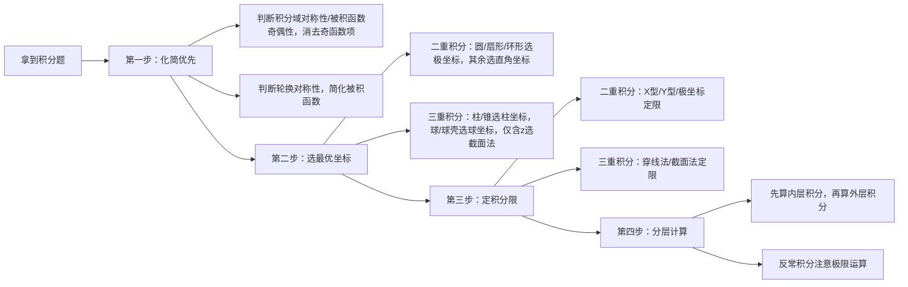

# 通信工程考研·多重积分实操案例集（兼顾薄弱点排查+应试能力提升）
本案例适配考研数学一多重积分核心考点，同时结合通信工程专业常用的天线功率计算、噪声能量计算等场景，完成全部题目后可直接定位自身多重积分模块薄弱项。
---
## 前置说明：薄弱点排查规则
完成三个层级题目后可对应定位问题：
1. 基础题错误→薄弱点为**概念理解/基础公式运用**
2. 进阶级错误→薄弱点为**计算能力/坐标转换规则掌握**
3. 真题级错误→薄弱点为**解题思路/考研应试技巧**
---
### 层级1：基础实操题（考点：二重积分对称性化简+极坐标转换）
#### 专业关联场景：平面微带天线辐射总功率计算
> 图解提示：积分域为圆心在原点的单位圆，关于y轴对称
**题目**：某平面微带天线的功率密度分布函数在xy平面的辐射区域为单位圆$D:x^2+y^2\leq1$，分布函数为$f(x,y)=x^2+y^2+2x$，求该区域内的总辐射功率$P=\iint_D f(x,y)d\sigma$。
#### 标准解题步骤：
1. 对称性化简：被积函数中$2x$是关于$x$的奇函数，积分域$D$关于$y$轴对称，因此$\iint_D 2x d\sigma=0$，原式简化为：
$$P=\iint_D (x^2+y^2)d\sigma$$
2. 极坐标转换：代入$x=r\cos\theta,y=r\sin\theta$，面积元$d\sigma=rdrd\theta$，积分限$0\leq r\leq1,0\leq\theta\leq2\pi$，代入得：
$$P=\int_0^{2\pi}d\theta\int_0^1 r^2 \cdot r dr = 2\pi \cdot \left. \frac{r^4}{4} \right|_0^1 = \frac{\pi}{2}$$
#### 即时反馈：
若本题计算错误，优先复习「二重积分对称性规则」「极坐标转换的雅可比行列式记忆」两个基础知识点。
---
### 层级2：进阶实操题（考点：三重积分轮换对称性+截面法/球坐标转换）
#### 专业关联场景：球形基站天线罩介质损耗总功率计算
> 图解提示：积分域为球心在原点的实心球体，满足x/y/z轮换对称性
**题目**：某球形基站天线罩的介质损耗密度分布为$f(x,y,z)=z^2$，天线罩为球心在原点、半径为2的实心球体$\Omega:x^2+y^2+z^2\leq4$，求总损耗功率$P=\iiint_\Omega f(x,y,z)dV$。
#### 标准解题步骤（两种最优方法）：
##### 方法1：轮换对称性+球坐标转换
1. 化简：由轮换对称性可得$\iiint_\Omega x^2 dV=\iiint_\Omega y^2 dV=\iiint_\Omega z^2 dV = \frac{1}{3}\iiint_\Omega (x^2+y^2+z^2)dV$
2. 球坐标转换：代入$x=r\sin\varphi\cos\theta,y=r\sin\varphi\sin\theta,z=r\cos\varphi$，体积元$dV=r^2\sin\varphi drd\varphi d\theta$，积分限$0\leq r\leq2,0\leq\varphi\leq\pi,0\leq\theta\leq2\pi$，代入得：
$$
\begin{align*}
P&=\frac{1}{3}\int_0^{2\pi}d\theta\int_0^\pi\sin\varphi d\varphi\int_0^2 r^2 \cdot r^2 dr \\
&=\frac{1}{3}\cdot2\pi\cdot2\cdot\left. \frac{r^5}{5} \right|_0^2=\frac{128\pi}{15}
\end{align*}
$$
##### 方法2：截面法（计算量更小）
固定$z$，截面为圆$x^2+y^2\leq4-z^2$，面积为$\pi(4-z^2)$，直接积分：
$$
P=\int_{-2}^2 z^2 \cdot \pi(4-z^2)dz = 2\pi\int_0^2 (4z^2-z^4)dz=\frac{128\pi}{15}
$$
#### 即时反馈：
若用球坐标计算错误，优先复习「三重积分坐标定限规则」「雅可比行列式记忆」；若未想到用对称性/截面法简化，优先复习「多重积分解题思路优化」，考研中优先用对称性化简可减少80%计算量。
---
### 层级3：考研真题实操题（改编自2022年数学一第12题，考点：反常二重积分计算）
#### 专业关联场景：高斯白噪声总功率计算（通信原理误码率计算核心基础）
**题目**：已知零均值高斯白噪声的功率谱密度在二维频域的分布为$f(\omega_x,\omega_y)=e^{-(\omega_x^2+\omega_y^2)}$，求总功率$I=\int_{-\infty}^{+\infty}\int_{-\infty}^{+\infty}f(\omega_x,\omega_y)d\omega_xd\omega_y$，并推导一维高斯积分$\int_{-\infty}^{+\infty}e^{-x^2}dx$的值。
#### 标准解题步骤：
1. 极坐标转换：积分域为全平面，积分限$0\leq r<+\infty,0\leq\theta\leq2\pi$，代入得：
$$
I=\int_0^{2\pi}d\theta\int_0^{+\infty}e^{-r^2}\cdot r dr = 2\pi \cdot \left. \left(-\frac{1}{2}e^{-r^2}\right) \right|_0^{+\infty}=\pi
$$
2. 拆分推导一维积分：二维可拆分为两个独立一维积分的乘积：
$$
I=\left(\int_{-\infty}^{+\infty}e^{-x^2}dx\right)^2=\pi \implies \int_{-\infty}^{+\infty}e^{-x^2}dx=\sqrt{\pi}
$$
#### 即时反馈：
若不会转换极坐标处理反常积分，优先复习「反常二重积分计算规则」；若不知道拆分乘积推导一维积分，优先复习「积分拆分的应试技巧」，本考点为近10年数一高频考点，每年分值4-10分。
---
## 附：多重积分考研解题结构化大纲
